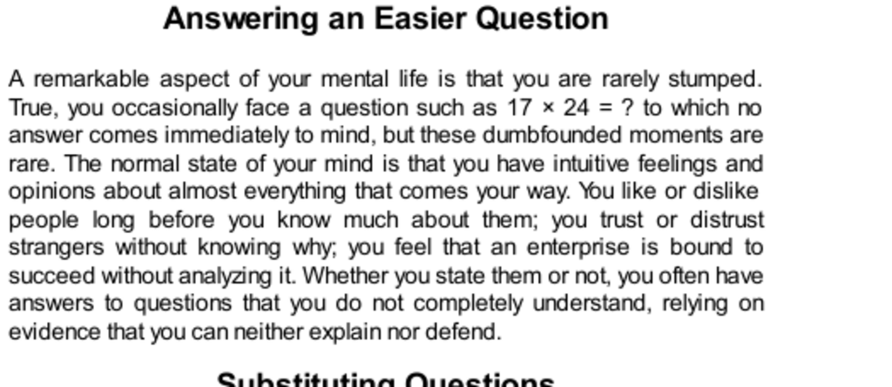

- **Answering an Easier Question**  
  - You rarely get stuck because your mind produces intuitive answers quickly.  
  - Intuitive feelings often arise without full understanding or explicit evidence.  
  - System 1 generates these quick impressions that System 2 may endorse or reject.  
  - Further reading: [Thinking, Fast and Slow - Daniel Kahneman](https://en.wikipedia.org/wiki/Thinking,_Fast_and_Slow)

- **Substituting Questions**  
  - System 1 answers an easier heuristic question when the target question is difficult.  
  - Target questions are the original complex questions intended to be answered.  
  - Heuristic questions are simpler questions answered instead, often unconsciously.  
  - Substitution relies on quick answers that may or may not fit the target question accurately.  
  - The process can be a source of errors but is often effective for complex judgment calls.  
  - Further reading: [Heuristics and Biases - Kahneman & Tversky](https://en.wikipedia.org/wiki/Heuristics_and_biases)

  - **Table 1: Target and Heuristic Questions**  
    - Difficult evaluations like political success or happiness are replaced by easier feelings-based questions.  
    - System 1 uses emotion, mood, or impressions as heuristic substitutes.  
    - System 2 lazily endorses these heuristic answers without deep scrutiny.  
    - Intensity matching maps feelings to numerical or categorical scales for answers.  
    - Further reading: [How to Solve It - George Pólya](https://en.wikipedia.org/wiki/How_to_Solve_It)

- **The 3-D Heuristic**  
  - Visual size judgments are influenced by three-dimensional interpretations rather than literal two-dimensional size.  
  - The perceptual system substitutes 3-D size for 2-D size, causing a size illusion.  
  - This substitution occurs automatically and is difficult to override consciously.  
  - The heuristic biases judgments systematically, reflecting deep perceptual processing.  
  - Further reading: [Müller-Lyer illusion](https://en.wikipedia.org/wiki/Müller-Lyer_illusion)

- **The Mood Heuristic for Happiness**  
  - Self-reports of happiness can be biased by recently activated emotions from related questions.  
  - Asking about a specific life domain before general happiness causes substitution of a heuristic answer.  
  - Mood from the particular domain dominates the response to the general happiness question.  
  - People are not confused about concepts but answer an easier related question unconsciously.  
  - Further reading: [Affect and emotion measurement in surveys](https://en.wikipedia.org/wiki/Affect_(psychology))

- **The Affect Heuristic**  
  - People’s emotional likes and dislikes shape their beliefs about risks and benefits.  
  - Emotional attitudes drive reasoning selectively, confirming preexisting beliefs.  
  - System 2 often serves to justify System 1’s emotions rather than critically evaluate them.  
  - The affect heuristic causes coherence-seeking behavior that limits open examination of information.  
  - Further reading: [Affect heuristic overview - Slovic](https://en.wikipedia.org/wiki/Affect_heuristic)

- **Speaking of Substitution and Heuristics**  
  - Substitution often occurs unconsciously in everyday judgments.  
  - Recognizing substitution can improve decision accuracy by questioning easy heuristic answers.  
  - Heuristics like past performance or interview impressions may misrepresent the true target question.  
  - Awareness of substitution can prevent common biases in social, political, and economic judgments.  
  - Further reading: [Heuristics in Judgment and Decision Making](https://en.wikipedia.org/wiki/Heuristic_(psychology))

- **Characteristics of System 1**  
  - System 1 operates quickly and automatically, generating impressions and feelings with little voluntary control.  
  - It creates coherent patterns in associative memory and links cognitive ease with truth illusions.  
  - System 1 neglects ambiguity, is biased toward belief confirmation, and suppresses doubt.  
  - It performs substitution heuristics, intensity matching, and the mental shotgun process, often leading to biased judgments.  
  - System 1 shows increased sensitivity to changes over states, overweights low probabilities, and exhibits loss aversion.  
  - Further reading: [Dual-process theory](https://en.wikipedia.org/wiki/Dual_process_theory)
