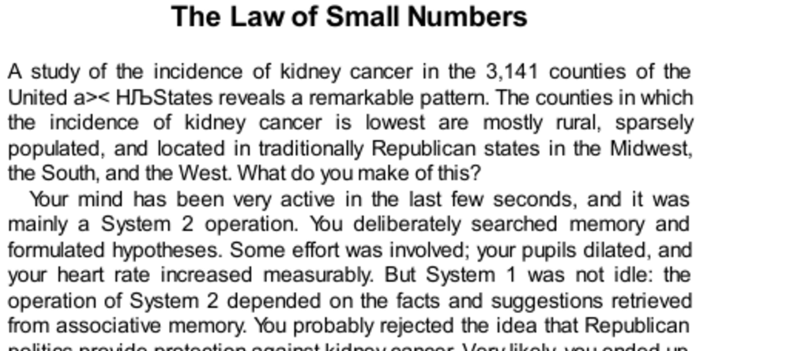

- **The Law of Small Numbers**
  - The incidence of kidney cancer varies widely across U.S. counties but extreme rates occur mostly in sparsely populated rural counties.
  - Small populations lead to greater sampling variability, causing both unusually high and unusually low rates that are statistical artifacts rather than causal effects.
  - System 1 erroneously infers causality from these extreme outcomes, while System 2 struggles with statistical reasoning about probability and sampling.
  - Statisticians Howard Wainer and Harris Zwerling highlight common misleading interpretations of rural cancer rates.
  - Further reading: [Understanding Sampling Variation](https://en.wikipedia.org/wiki/Sampling_(statistics))
- **Sampling Variation and Research Risks**
  - Small sample sizes increase the risk of failing to confirm true hypotheses due to sampling luck.
  - Researchers often choose inadequate sample sizes based on flawed intuition rather than computation, exposing studies to high error rates.
  - A survey showed even mathematically sophisticated researchers misunderstand sampling risk and sample size selection.
  - Proper statistical computation should replace intuitive decisions to reduce wasted research effort.
  - Further reading: [Sample Size Determination](https://en.wikipedia.org/wiki/Sample_size_determination)
- **Belief in the Law of Small Numbers**
  - People mistakenly believe that small samples are representative of populations, assuming the law of large numbers applies to small numbers.
  - The law of small numbers leads to overconfidence and misinterpretation of extreme results from small samples.
  - Researchers and laypeople alike tend to overestimate the reliability of findings from limited data.
  - Formal calculations are necessary to properly account for sampling variability in small samples.
  - Further reading: [Kahneman and Tversky on Cognitive Biases](https://en.wikipedia.org/wiki/Heuristics_and_biases)
- **A Bias of Confidence Over Doubt**
  - People tend to focus on the content of information rather than its reliability or the size of the sample underlying it.
  - System 1 suppresses doubt and ambiguity, favoring coherent and definite stories even when probability is uncertain.
  - System 2 has the capacity for skepticism but requires effort and tends to default to System 1 judgments.
  - This bias causes exaggerated faith in small sample conclusions and fuels cognitive illusions like the halo effect.
  - Further reading: [Dual Process Theory](https://en.wikipedia.org/wiki/Dual_process_theory)
- **Cause and Chance**
  - Humans instinctively seek causal explanations for observed patterns, even when outcomes result from pure chance.
  - Random sequences and processes often produce apparent patterns that mislead observers into believing there must be causes.
  - Examples include misperceptions of randomness in birth sequences, wartime bombings, and sports "hot hands."
  - Misunderstandings of randomness cause errors such as false attribution of skill or fault based on statistical variation.
  - Further reading: [Randomness and Cognitive Bias](https://en.wikipedia.org/wiki/Randomness)
- **Applications of the Law of Small Numbers**
  - Large social investments, such as the Gates Foundation’s funding of small schools, can be misguided by misinterpreting variability in small samples as causal.
  - Both the best and worst performing small schools appear disproportionately often due to larger variance, not superior or inferior quality.
  - Overinterpreting small sample results leads to premature conclusions and poor policy decisions.
  - Recognizing sample size effects helps avoid false causal explanations of chance events.
  - Further reading: [Regression to the Mean](https://en.wikipedia.org/wiki/Regression_toward_the_mean)
- **Speaking of the Law of Small Numbers**
  - Caution is advised against assuming early successes reflect true skill or systematic cause without sufficient data.
  - Experts should consult statisticians to evaluate the likelihood that observed streaks or outcomes are chance events rather than real effects.
  - Delaying conclusions until adequate sample sizes are available helps prevent premature and erroneous inference.
  - Awareness of the law can prevent pressure to reach conclusions based on insufficient evidence in scientific and business contexts.
  - Further reading: [Statistical Significance and P-Hacking](https://en.wikipedia.org/wiki/Statistical_significance)
