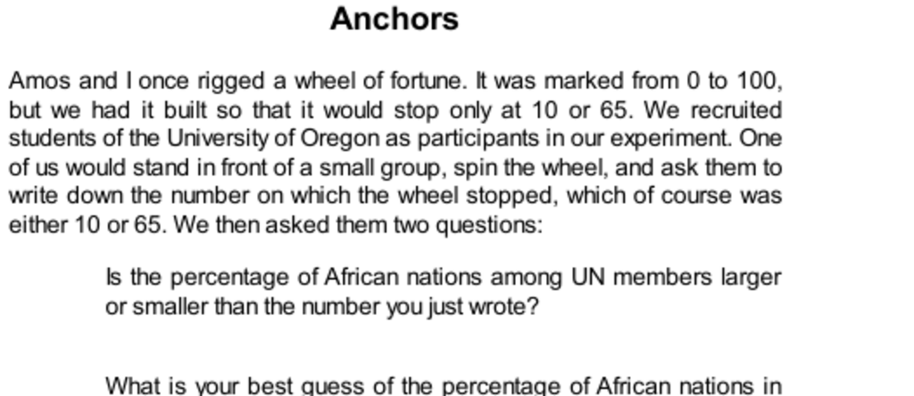

- **Anchors**
  - The anchoring effect shows that estimates are biased toward a previously considered number, even if that number is random or irrelevant.  
  - People exposed to anchors like a rigged wheel of fortune produced significantly different estimates of unrelated quantities.  
  - Anchoring is a robust psychological phenomenon affecting judgments across various contexts.  
  - Further reading: [Anchoring effect - Wikipedia](https://en.wikipedia.org/wiki/Anchoring)
- **Anchoring as Adjustment**
  - Anchoring can result from a deliberate System 2 process involving adjustment starting from an initial anchor.  
  - The adjustment process usually stops prematurely, leading to insufficient correction from the anchor.  
  - Experimental evidence includes psychological studies demonstrating this effect in tasks such as drawing lines and estimating uncertain quantities.  
  - Insufficient adjustment often reflects limitations of cognitive resources or motivation.  
  - Further reading: [Adjustment Heuristic](https://en.wikipedia.org/wiki/Anchoring_and_adjustment_heuristic)
- **Anchoring as Priming Effect**
  - Anchoring sometimes arises from automatic priming by System 1, without conscious adjustment.  
  - Anchors activate related thoughts and concepts in memory, biasing subsequent estimates.  
  - Psychological experiments confirm that different anchors prime distinct semantic networks that influence responses.  
  - This process explains why people are influenced by obviously absurd anchors without conscious awareness.  
  - Further reading: [Priming (psychology)](https://en.wikipedia.org/wiki/Priming_(psychology))
- **The Anchoring Index**
  - The anchoring effect can be quantitatively measured by comparing estimates between high and low anchor groups.  
  - Typical anchoring indices observed in experiments range around 40–55%.  
  - Professionals are susceptible to anchoring effects nearly as much as novices, often unaware of the influence.  
  - Anchoring impacts real-world decisions, including willingness to pay and legal sentencing.  
  - Further reading: [Tversky & Kahneman (1974) Original Paper](https://web.stanford.edu/~kahneman/docs/Publications/anchoring.pdf)
- **Uses and Abuses of Anchors**
  - Anchoring is exploited in marketing strategies such as artificial rationing and pricing tactics.  
  - Initial offers in negotiations serve as anchors, strongly influencing final agreements.  
  - Deliberate cognitive strategies like "thinking the opposite" can help resist anchoring effects.  
  - Policy implications include how caps on damage awards may unintentionally raise lower settlements due to anchoring.  
  - Further reading: [Negotiation and Anchoring](https://hbr.org/2007/02/the-power-of-first-impressions)
- **Anchoring and the Two Systems**
  - Anchoring effects emerge from interactions between System 1 (fast, automatic) and System 2 (slow, deliberate).  
  - System 2 relies on information retrieved by System 1, making it vulnerable to biased data accessibility caused by anchors.  
  - People are generally unaware that anchors affect their judgments and deny their influence.  
  - Anchoring illustrates broader cognitive vulnerabilities to environmental and unconscious priming.  
  - Further reading: [Thinking, Fast and Slow](https://en.wikipedia.org/wiki/Thinking,_Fast_and_Slow) by Daniel Kahneman
- **Speaking of Anchors**
  - Real-world dialogues illustrate anchoring in business, negotiations, and legal contexts.  
  - Anchoring can be deliberately used to influence outcomes or inadvertently distort judgments.  
  - Awareness of anchoring helps identify and counteract its effects in decision-making situations.  
  - Further reading: [Anchoring in Negotiations](https://www.psychologytoday.com/us/blog/mind-my-business/201204/the-art-anchoring)
