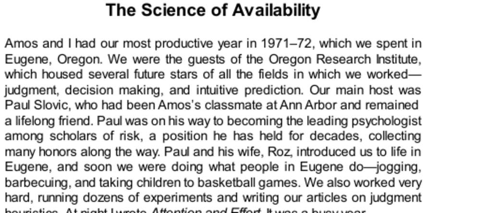

- **The Science of Availability**  
  - **Context and Background of Research**  
    - The main research occurred in Eugene, Oregon, during 1971–72 at the Oregon Research Institute.  
    - Key collaborators included Amos, the author, and Paul Slovic, an expert in risk psychology.  
    - The year involved extensive experimentation, writing, and personal activities typical of Eugene residents.  
    - For deeper understanding, see [Paul Slovic's work on risk perception](https://en.wikipedia.org/wiki/Paul_Slovic).  

  - **Definition and Explanation of the Availability Heuristic**  
    - Availability heuristic is defined as estimating frequency by "the ease with which instances come to mind."  
    - The heuristic substitutes the difficult question of actual frequency with an easier question about retrieval fluency.  
    - People do not need to retrieve actual instances to judge relative frequency; impressions arise from retrieval ease.  
    - Early models did not distinguish between deliberate and automatic processes; modern views recognize involvement of both systems.  
    - Further reading: [Availability heuristic - Wikipedia](https://en.wikipedia.org/wiki/Availability_heuristic).  

  - **Sources of Availability Biases**  
    - Salient or attention-grabbing events increase retrieval ease and cause frequency overestimation.  
    - Dramatic or emotionally vivid events temporarily enhance category availability.  
    - Personal experiences and vivid examples have greater availability than statistical or third-party reports.  
    - Avoiding these biases requires active reflection and questioning of intuitive impressions.  

  - **Availability Bias in Social Contexts**  
    - Spouses and team members tend to overestimate their individual contributions due to availability differences.  
    - Both positive and negative contributions are overestimated, with bias not purely self-serving.  
    - Awareness of the bias can ease social tensions by recognizing that total credits often exceed 100%.  
    - This bias often arises in contexts where credit recognition is contentious or ambiguous.  

- **The Psychology of Availability**  
  - **Impact of Listing Instances on Self-Evaluation**  
    - Asking subjects to list a specified number of examples affects self-ratings through two routes: number retrieved and ease of retrieval.  
    - Listing many instances (e.g., twelve) lowers self-assessment due to increased difficulty and reduced fluency.  
    - Participants who struggled to list negative instances rated themselves more positively, revealing dominance of fluency over quantity.  
    - Related research: [Schwarz, Norbert’s studies on fluency](https://psycnet.apa.org/record/1991-27087-001).  

  - **Role of Cognitive Fluency and Physical Expression**  
    - Carrying out the retrieval task while frowning increases cognitive strain and lowers fluency, reducing self-ratings of assertiveness.  
    - Smiling facilitates easier retrieval and higher self-ratings, linking bodily expression with cognitive ease.  
    - This effect illustrates the embodiment of cognitive processes in judgment heuristics.  

  - **Paradoxical Effects of Retrieval Effort**  
    - Greater effort or difficulty in generating examples can reduce confidence, preference, or perceived frequency despite larger numbers recalled.  
    - Examples include bike usage, decision confidence, event avoidability, and product evaluation.  
    - An exception occurs when content is prioritized over fluency in judgment.  

  - **Disrupting Availability Heuristic via Explanation**  
    - Providing an external explanation for retrieval difficulty (e.g., background music) eliminates reliance on fluency for judgment.  
    - Subjects informed of performance-impairing factors rate themselves similarly regardless of instances listed.  
    - Other irrelevant external cues (text box design, background color) can also neutralize fluency effects.  

  - **Mechanism Underlying Availability Judgments**  
    - Participants have expectations about the rate of fluency decline; surprises from sharper-than-expected drops lead to negative self-assessment.  
    - System 1 generates expectations, experiences surprise, and searches for causes among recent events.  
    - System 2 can adjust expectations dynamically, reducing surprise and thus availability bias.  

  - **Influence of Personal Involvement and Vigilance**  
    - Participants personally involved or concerned with a task rely more on retrieval content and less on retrieval fluency.  
    - Family history of cardiac disease increased vigilance and resulted in less susceptibility to availability bias in risk self-assessment.  
    - Engagement of System 2 increases resistance to fluency-based biases.  

  - **Conditions Increasing Susceptibility to Availability Bias**  
    - Concurrent effortful tasks, positive mood, low depression scores, novice knowledge, high faith in intuition, and feelings of personal power increase reliance on fluency.  
    - Feelings of power notably enhance trust in intuitive judgments, as illustrated by political quotes.  
    - For more on System 1 and System 2, see [Daniel Kahneman’s Thinking, Fast and Slow](https://en.wikipedia.org/wiki/Thinking,_Fast_and_Slow).  

- **Speaking of Availability**  
  - **Everyday Examples of Availability Bias**  
    - Risk perception affected by coincidental events (e.g., plane crashes vs. train travel preference).  
    - Underestimation of risks due to lack of media coverage (e.g., indoor pollution).  
    - Overinterpretation influenced by media exposure (e.g., conspiracy theories from spy movies).  
    - Overconfidence resulting from recent successful experiences that reduce perceived likelihood of failure.  
    - These examples illustrate common cognitive distortions grounded in availability heuristic mechanisms.
