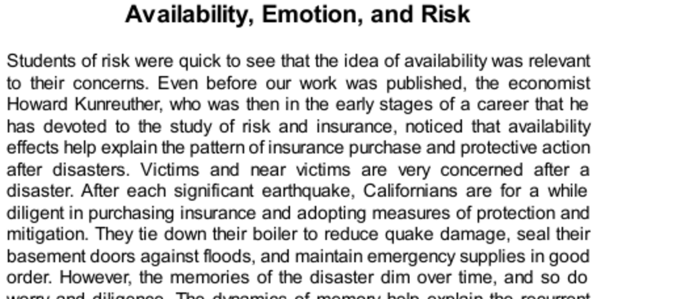

- **Availability, Emotion, and Risk**
  - **Availability and Post-Disaster Behavior**
    - Victims and near-victims show heightened concern and protective actions immediately after disasters.
    - Memory dynamics cause diminishing worry and diligence over time, leading to recurring disaster cycles.
    - Protective measures are often based on the worst disaster experienced, ignoring worse potential events.
    - Historical examples include societies tracking flood high-water marks, assuming no greater floods will occur.
    - Further reading: [Disaster Preparedness and Response](https://www.ready.gov/disasters)
  - **Availability and Affect**
    - Surveys reveal public risk estimations are distorted by media coverage focusing on novel and poignant events.
    - Common causes of death are underestimated or overestimated due to biased media influence.
    - Emotional responses and ease of recall are linked, exacerbating fear for vivid and frightening risks.
    - The affect heuristic leads people to judge risks based on feelings rather than facts, biasing decisions.
    - Further reading: [Affect Heuristic in Risk Perception](https://www.ncbi.nlm.nih.gov/pmc/articles/PMC2926472/)
  - **The Public and the Experts**
    - Experts and the public differ in risk perceptions due to value differences and emotional factors.
    - Experts prioritize measurable outcomes like lives or life-years lost; the public makes finer moral distinctions.
    - Experts' risk assessments are influenced by definitional choices, indicating power dynamics in defining risk.
    - Cass Sunstein advocates expert-led policy insulated from public bias; Slovic emphasizes public insight and emotional input.
    - Further reading: [Risk, Culture, and Policy](https://www.rff.org/publications/books/risk-culture-and-policy/)
  - **Availability Cascades and Policy**
    - Availability cascades are self-reinforcing cycles of media coverage and public concern that distort risk priorities.
    - Examples include Love Canal and the Alar scare, where minor risks triggered disproportionate public and political responses.
    - Probability neglect leads to ignoring or exaggerating small risks, influenced by emotional salience.
    - Terrorism exemplifies availability cascades due to vivid and repeated media coverage despite relatively low casualties.
    - Further reading: [Availability Cascades and Policy](https://www.cambridge.org/core/journals/behavioral-science-policy/article/availability-cascades-and-risk-regulation/4A88E56F99D76E2C27D3F0CE95E37851)
  - **Balancing Experts and Public Emotion**
    - Availability cascades distort resource allocation but can increase attention and funding for neglected risks.
    - Policymakers must address public fear as a real source of suffering, not just objective dangers.
    - Effective risk policy integrates expert knowledge with public emotions and intuitions.
    - Democratic processes complicate reliance solely on experts due to public resistance and political accountability.
    - Further reading: [Risk Communication and Public Participation](https://www.annualreviews.org/doi/10.1146/annurev.polisci.11.053106.153517)
  - **Speaking of Availability Cascades**
    - Availability cascades inflate minor or nonexistent events through media and public amplification.
    - The affect heuristic drives positive or negative biases in public perception of technologies and risks.
    - These phenomena simplify complex tradeoffs, making risks appear more clear-cut than reality.
    - Further reading: [The Affect Heuristic and Risk Perception](https://www.sciencedirect.com/science/article/pii/S136984781100036X)
