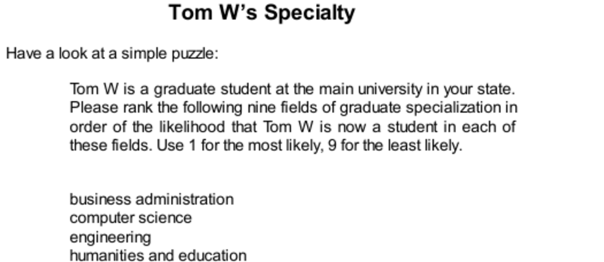

- **Tom W’s Specialty Puzzle**
  - The puzzle asks to rank nine graduate fields by likelihood that Tom W is enrolled, using base-rate information first.
  - The base-rate approach relies on the relative size of enrollments in each field to estimate probabilities.
  - Base rates are the proportions of students in each specialty, making the largest fields more likely defaults.
  - For further detail on base rates, see [Base Rate Fallacy](https://en.wikipedia.org/wiki/Base_rate_fallacy).

- **Personality Sketch of Tom W**
  - The description portrays Tom W as intelligent, orderly, driven for competence, but lacking creativity and social empathy.
  - The sketch activates stereotypes about certain disciplines, such as computer science and engineering.
  - The personality traits align with small graduate fields, designed to conflict with larger fields statistically.
  - For insight into personality assessment, see [Personality Psychology](https://www.apa.org/topics/personality).

- **Similarity Ranking Task**
  - Participants rank fields by how well Tom W’s description fits their stereotypes.
  - Typical rankings place computer science highest, social sciences and humanities lowest.
  - The task engages System 1 thinking, associating traits with stereotypes automatically.
  - See [Heuristics and Biases](https://en.wikipedia.org/wiki/Heuristics_in_judgment_and_decision-making) for related concepts.

- **Predicting by Representativeness**
  - Participants predict likelihood of Tom W’s field based on stereotype similarity, ignoring base rates and evidence quality.
  - Despite statistical knowledge, judgments substitute representativeness for probability, causing bias.
  - The example illustrates failure to integrate base rates and diagnostic reliability in probability assessment.
  - For a comprehensive study, consult [Thinking, Fast and Slow](https://en.wikipedia.org/wiki/Thinking,_Fast_and_Slow).

- **Examples and Consequences of Representativeness Heuristic**
  - The heuristic often aligns with truth where stereotypes correlate with reality (e.g., height and sport).
  - It causes errors when ignoring base rates or when stereotypes misrepresent group sizes.
  - The heuristic leads to excessive belief in unlikely events if described vividly.
  - See [Representativeness Heuristic](https://en.wikipedia.org/wiki/Representativeness_heuristic).

- **Experimental Findings on Base-Rate Neglect**
  - Base-rate neglect is common but can be mitigated by instructions to think statistically or by activating System 2.
  - Experiments with Harvard undergraduates showed facial expressions influencing attention to base rates.
  - System 2 failure may stem from laziness or ignorance, not inability to understand statistics.
  - Explore [Dual Process Theory](https://en.wikipedia.org/wiki/Dual_process_theory) for system explanations.

- **Sins of Representativeness**
  - The two main sins are overpredicting low base-rate events and insensitivity to evidence quality.
  - WYSIATI biases people to accept given information without accounting for its reliability.
  - Ignoring evidence quality leads to incorrect probability estimates, especially with weak or false descriptions.
  - For details on WYSIATI, visit [What You See Is All There Is](https://en.wikipedia.org/wiki/What_You_See_Is_All_There_Is).

- **Bayesian Reasoning and Probability Discipline**
  - Bayes’ rule instructs how to combine base rates with evidence diagnosticity for rational probability judgments.
  - The two essential practices are anchoring on plausible base rates and questioning evidence diagnosticity.
  - Mathematical details are abstracted, but the logic helps reduce judgment errors in uncertain contexts.
  - For an accessible introduction, see [Bayes' Theorem](https://en.wikipedia.org/wiki/Bayes%27_theorem).

- **Practical Advice on Representativeness**
  - Base rates should not be ignored despite attractive individual evidence or vivid stereotypes.
  - Skepticism about evidence quality and effortful self-monitoring improve judgment accuracy.
  - Real-world decisions, such as in sports or hiring, benefit from statistical thinking over intuition.
  - For applied insights, read [Moneyball](https://en.wikipedia.org/wiki/Moneyball).
