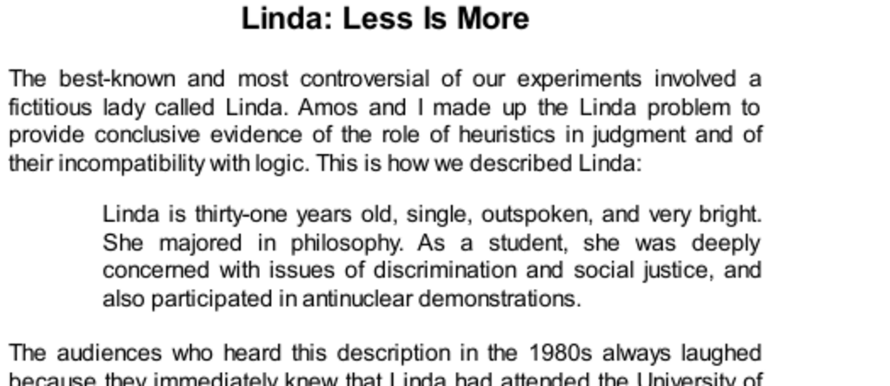

- **The Linda Problem and Representativeness Heuristic**  
  - The Linda problem illustrates how people judge probability based on representativeness rather than logic.  
  - Participants consistently ranked "feminist bank teller" as more probable than "bank teller," violating the conjunction rule.  
  - The problem demonstrates a conflict between intuitions generated by System 1 and logical rules governed by System 2.  
  - For additional context, see [Heuristics and Biases](https://en.wikipedia.org/wiki/Heuristics_in_judgment_and_decision-making) by Kahneman and Tversky.  

- **Experimental Designs and Findings**  
  - Initial between-subjects experiments showed identical rankings by resemblance and probability.  
  - Within-subject designs failed to correct the conjunction fallacy, even when both critical outcomes appeared together.  
  - Even statistically trained participants, including doctoral students, committed the fallacy at high rates (~85%).  
  - See [Conjunction Fallacy](https://en.wikipedia.org/wiki/Conjunction_fallacy) for wider experimental contexts.  

- **Conjunction Fallacy Explanation and Reactions**  
  - The conjunction fallacy occurs when a conjunction of two events is judged more probable than one of the events alone.  
  - People substitute plausibility and coherence for logical probability, which leads to systematic errors.  
  - Critics of the Linda problem often focus on this fallacy to question the heuristic approach to judgment.  
  - Further discussion can be found in [Thinking, Fast and Slow](https://en.wikipedia.org/wiki/Thinking,_Fast_and_Slow) by Daniel Kahneman.  

- **Comparison with Other Probability Judgments**  
  - Plausibility influences probability judgments when detailed, coherent stories are presented.  
  - Simple constructs like "Mark has blond hair" versus "Mark has hair" do not produce the fallacy because no plausibility difference exists.  
  - This highlights the role of intuitive coherence in probability assessment.  

- **Less Is More Phenomenon in Joint and Single Evaluations**  
  - Christopher Hsee’s dinnerware experiment shows "less is more" effects, where smaller sets with better average quality are valued higher in single evaluations.  
  - In joint evaluations, where direct comparison is possible, logical valuation aligns with economic theory.  
  - John List replicated this effect using baseball card auctions, confirming less-is-more in market behavior.  
  - See [Less is More](https://journals.sagepub.com/doi/10.1177/0956797605223734) by Christopher Hsee for further detail.  

- **Relation of Less Is More to the Linda Problem**  
  - The Linda problem parallels the dinnerware problem in structure, involving sum-like variables such as probability and value.  
  - System 1 averages attributes in single evaluation leading to errors; joint evaluation removes the fallacy in economic cases but not reliably in probability judgments.  
  - This difference reveals varying susceptibility of judgment domains to logical correction in joint evaluation.  

- **Other Conjunction Errors Beyond Linda**  
  - Similar errors appear in other contexts, such as tennis match outcomes, where plausibility overrides logical probability.  
  - 72% of participants judged the more specific, less probable event as more likely when it formed a coherent story.  
  - These errors underline the dominance of representativeness over logic in intuitive judgment.  

- **Nonverbal and Frequency Representations to Reduce Errors**  
  - Using sequences of die rolls without verbal probability caused similar conjunction errors due to representativeness.  
  - Presenting probabilities as frequencies (“how many out of 100”) reduces errors by promoting spatial and inclusion reasoning.  
  - Frequency representation helps engage System 2 more effectively and clarifies subset relations.  
  - See [Frequency Formats and Probability](https://www.ncbi.nlm.nih.gov/pmc/articles/PMC2889100/) for methods reducing fallacies.  

- **Limitations of System 2 and Cognitive Laziness**  
  - System 2 often fails to override System 1 intuitions even with explicit priming and opportunity.  
  - Laziness and lack of incentives contribute to the persistence of conjunction fallacies.  
  - Participants often treat probability questions as requests for opinions rather than logical assessments.  
  - This cognitive laziness has broad implications for decision-making and education.  

- **Scientific and Scholarly Controversies Around the Linda Problem**  
  - The Linda problem attracted significant attention and criticism, focusing narrowly on the conjunction fallacy.  
  - Critics argued that subjects interpret "probability" as "plausibility" affecting results and questioned the heuristic model.  
  - The controversy increased public visibility but somewhat reduced scholarly acceptance of heuristic-based judgment theories.  
  - Broader discussions on scientific debate norms are reflected in political and courtroom analogies within the text.  

- **Summary Quotes and Key Takeaways**  
  - "They constructed a very complicated scenario and insisted on calling it highly probable. It is not—it is only a plausible story."  
  - "They added a cheap gift to the expensive product, and made the whole deal less attractive. Less is more in this case."  
  - "In most situations, a direct comparison makes people more careful and more logical. But not always. Sometimes intuition beats logic even when the correct answer stares you in the face."
