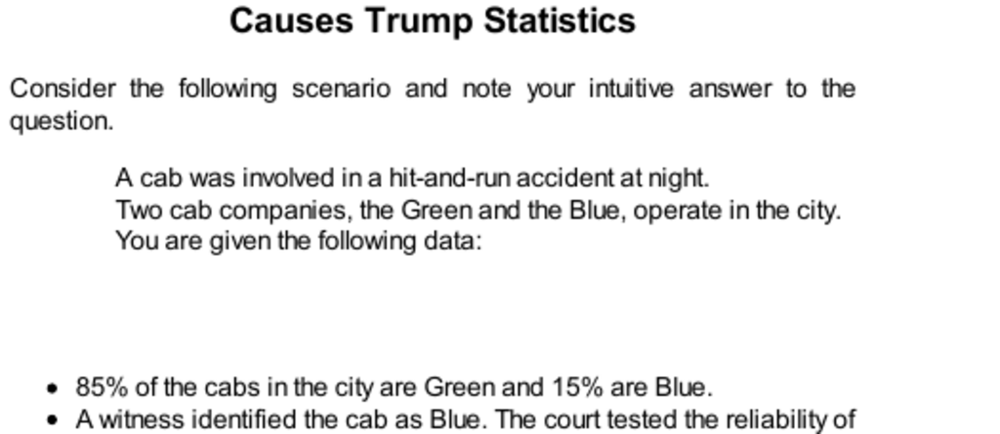

- **Causes Trump Statistics**
  - **Cab problem with base rates and witness testimony**
    - The base rates are 85% Green cabs and 15% Blue cabs in the city.  
    - The witness correctly identifies cab colors 80% of the time and fails 20% of the time.  
    - Bayesian inference shows the probability the cab was Blue is affected by base rates and witness reliability.  
    - Without witness testimony, the probability of Blue is the base rate of 15%.  
    - For foundational understanding, see [Bayes' theorem](https://en.wikipedia.org/wiki/Bayes%27_theorem).
- **Causal Stereotypes**
  - **Variation replacing base rates with accident involvement rates**
    - Green and Blue companies have equal numbers of cabs but Green cabs cause 85% of accidents.  
    - Witness reliability remains the same as in the previous problem.  
    - People weight base rates more when they imply a causal story, such as Green drivers being reckless.  
    - Causal base rates lead to forming stereotypes that affect judgment about individuals.  
    - For stereotype theory, see [Stereotypes](https://en.wikipedia.org/wiki/Stereotype).
  - **Psychological differences in using base rates**
    - Statistical base rates are often underweighted or ignored when specific case information exists.  
    - Causal base rates are treated as properties of individuals, integrating easily with case-specific data.  
    - The stereotype about Green drivers causes people to balance witness testimony and base rate, approximating Bayesian reasoning.  
  - **Social implications of stereotyping**
    - Stereotyping is neutral psychologically but socially complex and often morally discouraged.  
    - Social norms reject causal base rates to avoid erroneous conclusions about individuals.  
    - Neglecting valid stereotypes results in less accurate judgments, a scientifically important cost.  
    - For social impacts, see [Stereotype threat](https://en.wikipedia.org/wiki/Stereotype_threat).
- **Causal Situations**
  - **Ajzen’s experiments on causal vs statistical base rates**
    - Students judged passing probabilities based on class pass rates implying test difficulty (causal base rates).  
    - Noncausal base rates, as in sampled groups, affected judgments less than causal base rates.  
    - Causal base rates are integrated better by System 1 than purely statistical information.  
    - For causal inference, see [Causal inference](https://en.wikipedia.org/wiki/Causal_inference).
- **Can Psychology be Taught?**
  - **Helping experiment by Nisbett and Borgida**
    - Only 4 of 15 participants immediately helped a person having a simulated seizure; many delayed or did not help.  
    - Participants felt reduced responsibility when others could help, demonstrating diffusion of responsibility.  
    - Most people incorrectly predict they or others would act immediately; their beliefs contradict base-rate data.  
  - **Resistance to changing beliefs from statistical evidence**
    - Students know statistical base rates but fail to adjust predictions about individuals accordingly.  
    - Videos showing neutral individuals did not affect predictions, indicating entrenched belief exemption.  
    - Teaching statistics alone fails to change personal or social beliefs effectively.  
  - **Effective teaching using surprising individual cases**
    - Presenting unhelpful behavior by individuals (contradicting expectations) leads students to update general beliefs.  
    - People are more willing to infer general rules from specific cases than the reverse.  
    - Causal stories attached to surprising individual instances facilitate learning better than abstract statistics.  
    - For educational methods, see [Educational psychology](https://en.wikipedia.org/wiki/Educational_psychology).
- **Speaking of Causes and Statistics**
  - **System 1 uses causal stories to integrate information**
    - Statistical information alone is often ignored, but when statistics feed stereotypical narratives, they are readily used.  
    - Contrasting causal and statistical information influences how people perceive and apply base rates.  
    - The combination of statistical facts and causal narratives shapes intuitive judgment processes.  
    - For dual process theory, see [Dual process theory](https://en.wikipedia.org/wiki/Dual_process_theory).
