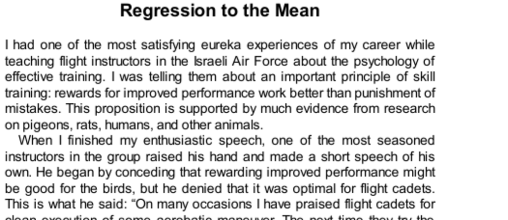

- **Regression to the Mean**  
  - Rewards for improved performance work better than punishment, supported by evidence from various species.  
  - Flight instructors mistakenly interpreted performance fluctuations as causal effects of praise or punishment due to regression to the mean.  
  - Regression to the mean occurs because exceptional performances tend to be followed by performances closer to average due to random fluctuations.  
  - A practical demonstration with coin-throwing illustrated regression without causal influence.  
  - Feedback in life is often misleading because positive behavior tends to be followed by punishment statistically and vice versa.  
  - Further reading: [Regression toward the Mean - Wikipedia](https://en.wikipedia.org/wiki/Regression_toward_the_mean)  

- **Talent and Luck**  
  - Success equals talent plus luck, with great success requiring a little more talent and a lot more luck.  
  - Golfers’ day 1 scores reflect both talent and luck; predicting day 2 must assume talent stable but luck average, leading to regression to the mean.  
  - Regression to the mean causes extreme performances to be followed by more moderate results without causal explanations.  
  - Similar regression patterns appear when predicting earlier events from later outcomes, demonstrating non-causal statistical effects.  
  - Popular explanations for phenomena like the "Sports Illustrated jinx" often misattribute causal reasons to regression effects.  
  - Further reading: [The Role of Luck in Business Success](https://hbr.org/2014/08/the-role-of-luck-in-business-success)  

- **Understanding Regression**  
  - The concept of regression to the mean was discovered by Sir Francis Galton in the late 19th century through hereditary studies.  
  - Regression occurs when correlation between two variables is imperfect, causing predictions to revert towards average.  
  - Correlation coefficients measure shared factors; imperfect correlation inherently produces regression effects.  
  - Misinterpretations of regression often lead to incorrect causal stories, as shown by examples involving intelligence correlations between spouses and sports performance.  
  - Difficulties in grasping regression originate from cognitive biases favoring causal over statistical explanations, complicating learning and application.  
  - Experimental improvements, such as in depressed children, can be explained by regression without assuming treatment efficacy, highlighting the importance of controls.  
  - Regression confounds intuitive predictions in many fields, including sales forecasting and psychological testing.  
  - Further reading: [Sir Francis Galton and Regression](https://www.britannica.com/biography/Francis-Galton)  
  - Further reading: [Correlation and Regression - Khan Academy](https://www.khanacademy.org/math/statistics-probability)
