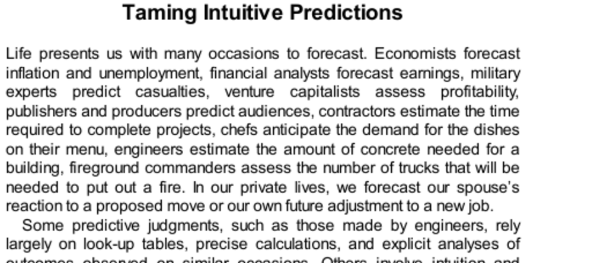

- **Taming Intuitive Predictions**
  - **Examples of forecasting in daily and professional life**
    - Forecasting occurs in diverse domains such as economics, military, venture capital, and personal life.  
    - Some predictions rely on precise calculations, while others depend on intuitive System 1 processes.  
    - Two main varieties of intuition are skill-based expertise and heuristic substitution.  
    - Skilled intuition arises from rapid recognition of familiar cues; heuristic intuition substitutes simpler questions for complex ones.  
    - For more, see [Sources of Power by Gary Klein](https://www.amazon.com/Sources-Power-Origins-Expertise-Studies/dp/0262523054).

- **Nonregressive Intuitions**
  - **Intuitive prediction process explained by example of Julie’s GPA**
    - System 1 associates evidence with outcomes and searches for causal links and relevant norms.  
    - Prediction involves substitution of an easier question and intensity matching, producing extreme predictions.  
    - Intuitive judgments often confuse evaluation of evidence with prediction of actual future outcomes.  
    - This failure to adjust for regression to the mean generates systematically biased predictions.  
    - For related concepts, consult [Thinking, Fast and Slow](https://en.wikipedia.org/wiki/Thinking,_Fast_and_Slow) by Daniel Kahneman.

  - **Experiments on descriptive evaluations vs. actual outcome predictions**
    - Participants give similar percentile rankings for evidence and for predicted academic performance, revealing substitution.  
    - Military officer grading predictions closely match internal evaluation scales without accounting for actual future performance variance.  
    - This shows failure to separate performance evaluation from unbiased future prediction.  
    - Overconfidence and nonregressive intuition lead to biased forecast patterns.  
    - Further reading: [Judgment Under Uncertainty: Heuristics and Biases](https://psycnet.apa.org/record/1974-28526-000) by Tversky and Kahneman.

- **A Correction for Intuitive Predictions**
  - **Method for unbiased prediction using regression to the mean**
    - Outcome prediction requires accounting for correlation between evidence and target variable (e.g., reading age and GPA).  
    - Applying a proportional adjustment based on estimated correlation (e.g., 30%) produces moderated predictions closer to the mean.  
    - This principle applies broadly to predicting quantitative outcomes like academic grades or business profits.  
    - Corrected predictions reduce systematic bias and improve accuracy over nonregressive intuitive predictions.  
    - See [Regression Toward the Mean: Concept and Applications](https://www.statisticshowto.com/regression-toward-the-mean/).

- **A Defense of Extreme Predictions?**
  - **Situations where extreme, overconfident predictions may be justified**
    - Some contexts, like venture capital or conservative banking, tolerate or prefer extreme predictions for strategic reasons.  
    - Extreme language may provide comfort despite the modest validity of supporting evidence.  
    - Rational agents understand prediction uncertainty and consider ranges or probabilities, avoiding unwarranted extreme certainty.  
    - Overestimation can serve psychological or strategic needs but should be recognized as self-delusion if chosen.  
    - Additional resource: [Overconfidence Bias in Decision Making](https://www.investopedia.com/terms/o/overconfidence-bias.asp).

  - **Choosing between candidates with differing information bases**
    - Smaller sample sizes (less information), as with Kim’s case, imply greater uncertainty and require stronger regression toward the mean.  
    - More abundant information (like Jane’s record) reduces the need for regression adjustment.  
    - Intuitive impressions tend to favor more extreme but less reliable evidence, often requiring conscious correction.  
    - Similar problems occur in investment decisions between well-assessed and more uncertain candidates.  
    - For deeper insight, see [The Law of Small Numbers](https://en.wikipedia.org/wiki/Law_of_small_numbers_(fallacy)).

- **A Two-Systems View of Regression**
  - **System 1 tendencies vs. System 2 challenges in prediction**
    - System 1 naturally produces extreme, overconfident predictions matching perceived evidence intensity.  
    - Regression to the mean is counterintuitive and difficult for System 2 to grasp and communicate.  
    - System 2 requires training to correctly moderate System 1 outputs and understand non-causal nature of regression.  
    - Causal misinterpretations of regression are common despite statistical evidence.  
    - Recommended reading: [Cognitive Reflection Test and Dual-Process Theory](https://en.wikipedia.org/wiki/Dual_process_theory).

- **Speaking of Intuitive Predictions**
  - **Practical examples of applying regression correction in judgments**
    - Recognizing likely regression prevents overoptimism in startup success predictions and consumer judgments.  
    - Favoring descriptions backed by larger, more reliable data pools reduces risk of fluke-based decisions.  
    - Corrective statements encourage cautious, evidence-based forecasting incorporating uncertainty.  
    - Moderate predictions align with rational decision-making frameworks emphasizing balanced risk assessment.  
    - For applied decision heuristics, consider [Nudge: Improving Decisions About Health, Wealth, and Happiness](https://en.wikipedia.org/wiki/Nudge_(book)).
