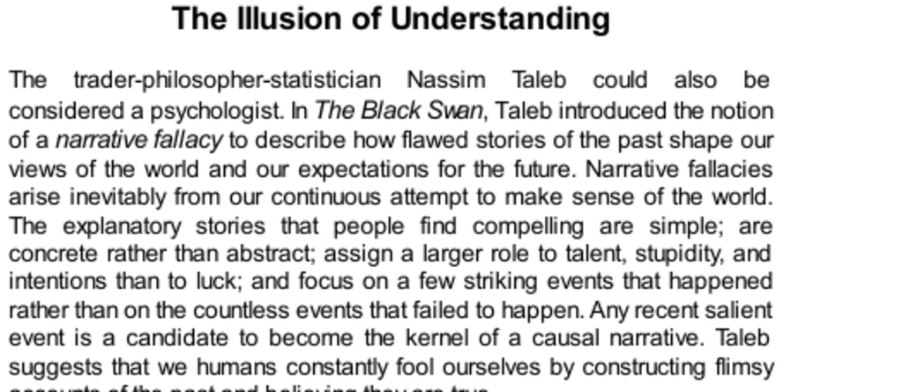

- **The Illusion of Understanding**
  - **Narrative Fallacy and Human Understanding**
    - Humans create simple, concrete stories to explain complex past events.  
    - Those stories assign greater roles to skill and intention than to luck.  
    - Narrative fallacies arise from ignoring non-events and overemphasizing recent, striking incidents.  
    - See Nassim Taleb’s *The Black Swan* for foundational concepts.  
  - **The Google Success Story**
    - The story of Google’s rise exaggerates the role of skill, underestimating luck.  
    - Initial decisions are described favorably but omit many alternative outcomes.  
    - The halo effect adds an aura of inevitability and invincibility to success narratives.  
    - The actual learning from such stories is limited due to unpredictability.  
  - **Limitations of Learning from Past Events**
    - The human mind struggles to incorporate non-events and randomness in explanations.  
    - The WY SIATI rule states people treat limited information as if it were complete.  
    - The illusion of understanding the past falsely implies the future is knowable.  
    - [The Art of Thinking Clearly](https://en.wikipedia.org/wiki/The_Art_of_Thinking_Clearly) provides additional insight on cognitive biases.  
  - **Misuse of 'Know' in Predicting Events**
    - Claiming to have "known" an event before it happened is often hindsight bias.  
    - True knowledge requires the event to be both true and knowable beforehand.  
    - Overuse of terms like intuition and premonition fosters false confidence in predictions.  
    - Clarity in language is essential to better assess beliefs and expectations.  

- **The Social Costs of Hindsight**
  - **Hindsight Bias Mechanism**
    - People update beliefs to align with outcomes, losing accurate memory of prior uncertainty.  
    - Experiments show people distorted their recalled probabilities after events.  
    - The "I-knew-it-all-along" effect misrepresents the accuracy of original predictions.  
    - See Baruch Fischhoff’s research for empirical evidence.  
  - **Outcome Bias and Its Impacts**
    - Evaluations of decisions focus on outcomes rather than decision quality at the time.  
    - Negative outcomes unfairly result in blaming decision makers for unforeseeable events.  
    - Positive yet risky decisions receive undeserved praise when luck favors outcomes.  
    - This bias leads to unfair liability judgments and distorted accountability.  
  - **Consequences for Professionals and Organizations**
    - Decision makers become risk averse due to fear of retrospective criticism.  
    - Increased litigation prompts defensive practices, often harming original goals.  
    - Public and juror judgments disproportionately blame agents after disasters despite genuine unpredictability.  
    - The Duluth bridge case exemplifies how outcome information skews risk perception.  
    - [Thinking, Fast and Slow](https://en.wikipedia.org/wiki/Thinking,_Fast_and_Slow) offers further analysis of cognitive biases.  

- **Recipes for Success**
  - **Limits of Leadership Influence**
    - CEOs influence firm outcomes, but correlation with success is modest (~0.30).  
    - Strong CEOs outperform weaker ones about 60% of the time, only slightly better than chance.  
    - Business press often overstates CEOs’ predictive control over firm performance.  
  - **Role of Luck and Regression to the Mean**
    - Luck significantly affects perceived success and failure in business stories.  
    - Consistent patterns of successful management practices are often illusions caused by randomness.  
    - Regression to the mean explains why successful firms often regress and vice versa.  
    - [The Halo Effect](https://en.wikipedia.org/wiki/Halo_effect) by Philip Rosenzweig explores these illusions in business.  
  - **Halo Effect in Business Evaluations**
    - CEOs’ reputations shift dramatically when firm outcomes change, independent of actual behavior changes.  
    - The halo effect causes inaccurate causal attributions between leadership traits and firm success.  
    - This effect fosters misleading lessons about what drives business results.  
  - **Critique of Popular Business Literature**
    - Books like *Built to Last* overstate the impact of management practices on firm success.  
    - Empirical studies show negligible long-term differences in profitability attributed to leader qualities.  
    - Readers’ preference for tidy success/failure stories reinforces the illusion of understanding.  
    - These narratives overlook the dominant role of chance and randomness in outcomes.  

- **Speaking of Hindsight**
  - **Common Expressions Illustrating Biases**
    - “The mistake appears obvious, but it is just hindsight” highlights post-event bias awareness.  
    - “Falling for a narrative fallacy” warns against oversimplified success stories.  
    - Outcome bias involves judging decisions solely by results, ignoring decision context.  
    - Successful outcomes do not validate poor decisions, nor do failures necessarily imply errors.  
  - **Practical Cautionary Phrases**
    - Use these phrases to recognize and counter hindsight and outcome biases in judgment.  
    - They serve as reminders to separate actual knowledge from illusions of understanding.  
    - Encouraging critical awareness helps improve decision-making and evaluation.
