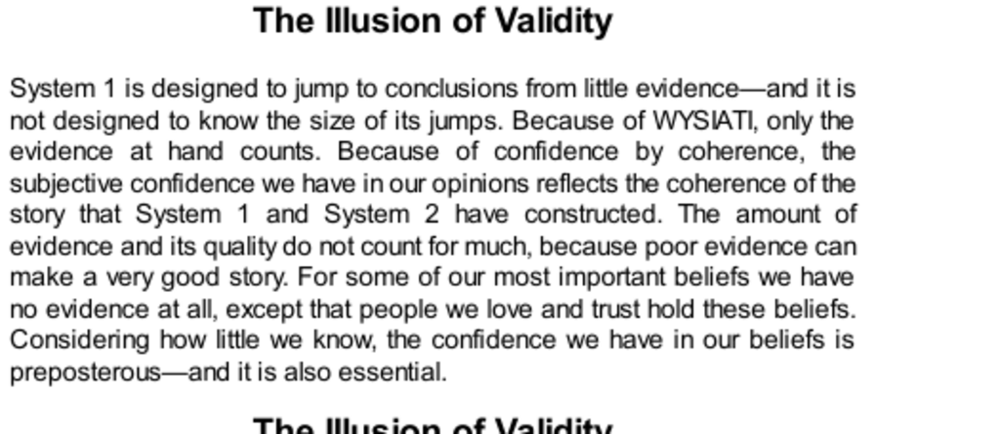

- **The Illusion of Validity**  
  - Many decades ago, leadership skills of soldier candidates were evaluated using an obstacle field exercise.  
  - Observers formed confident but ultimately poor predictions about officer training success from brief, coherent impressions.  
  - Predictions showed negligible accuracy despite high subjective confidence, illustrating the illusion of validity.  
  - The representativeness heuristic and WYSIATI (What You See Is All There Is) explain overconfidence despite weak evidence.  
  - See [Thinking, Fast and Slow](https://en.wikipedia.org/wiki/Thinking,_Fast_and_Slow) for more on cognitive biases.

- **The Illusion of Stock-Picking Skill**  
  - Stock buyers and sellers usually share the same information but differ in opinions, leading to an illusion of skill.  
  - Research shows most individual investors underperform the market, with active trading correlating with worse results.  
  - Professional investors rarely demonstrate persistent skill, with year-to-year fund performance resembling random dice rolls.  
  - Investment firms often reward luck as skill, a fact routinely ignored due to cultural reinforcement and subjective confidence.  
  - For further reading, see [A Random Walk Down Wall Street](https://en.wikipedia.org/wiki/A_Random_Walk_Down_Wall_Street) by Burton Malkiel.

- **What Supports the Illusions of Skill and Validity?**  
  - Cognitive illusions persist despite intellectual acknowledgment of their invalidity, as feelings override reason.  
  - Stock pickers exercise high-level analytical skills but lack awareness of their ignorance about market price incorporation.  
  - Professional cultures sustain unshakable faith in skill illusions through community reinforcement and cognitive ease.  
  - These illusions are deeply embedded and resistant to statistical evidence that contradicts personal impressions.  
  - See [The Psychology of Overconfidence](https://en.wikipedia.org/wiki/Overconfidence_effect) for related cognitive bias information.

- **The Illusions of Pundits**  
  - Experts explaining past events create coherent narratives that falsely imply predictability of future outcomes.  
  - Hindsight bias makes retrospective explanations compelling, increasing overconfidence in forecasts.  
  - Philip Tetlock’s two-decade study found political and economic experts predicted outcomes worse than random chance.  
  - Hedgehogs (one big idea thinkers) were more overconfident and less accurate than foxes (complex thinkers).  
  - For further insight, consult Tetlock’s [Expert Political Judgment](https://books.google.com/books/about/Expert_Political_Judgment.html?id=EhmXb7eA8MwC).

- **It is Not the Experts' Fault—The World is Difficult**  
  - Predictive errors are inevitable due to inherent unpredictability and complexity of real-world situations.  
  - High subjective confidence does not correlate with forecast accuracy and should be distrusted as a reliability indicator.  
  - Short-term trends and behaviors can be predicted, but long-term and complex outcomes like leadership and stock prices resist reliable prediction.  
  - Valid tests may provide modest predictive power (.20 to .30 validity), but expectations for accuracy should be low.  
  - See [The Black Swan](https://en.wikipedia.org/wiki/The_Black_Swan_(book)) by Nassim Taleb for discussion on unpredictability.

- **Speaking of Illusory Skill**  
  - Illustrative quotes summarize key ideas about illusions of validity, skill, coherence, and expert confidence.  
  - These statements emphasize the difference between feelings of confidence and true predictive ability.  
  - They highlight that possessing a coherent story or theory can create false confidence in accuracy.  
  - The fundamental issue is the unpredictability of the expert’s domain, not their training or effort.  
  - Related concepts can be found in [Cognitive Biases](https://en.wikipedia.org/wiki/List_of_cognitive_biases).
