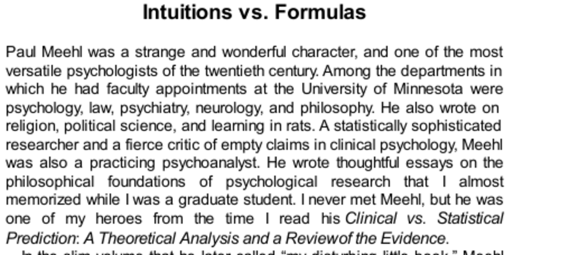

- **Intuitions vs. Formulas**  
  - **Meehl's Clinical vs. Statistical Prediction**  
    - Meehl reviewed 20 studies comparing subjective clinical predictions to simple statistical algorithms.  
    - Algorithms using limited input outperformed clinical judgments in predicting diverse outcomes like student grades and parole violations.  
    - Follow-up research with ~200 studies continues to show about 60% favor algorithms, with none clearly proving expert superiority.  
    - This research includes multiple domains with low-validity environments such as medicine, economics, and criminal justice.  
    - For background, see [Meehl (1954), Clinical vs. Statistical Prediction](https://psycnet.apa.org/record/1954-03032-000).  
  - **Examples of Algorithmic Superiority**  
    - Orley Ashenfelter created a formula predicting Bordeaux wine prices based on weather data, outperforming expert valuations.  
    - The formula's prediction correlates above .90 with actual prices, challenging economic theory assumptions.  
    - The Apgar score uses a simple checklist of 5 variables to assess newborn health and has saved countless infants.  
    - Algorithms consistently give the same output for given input, unlike inconsistent human judgment.  
    - Related examples are detailed in Atul Gawande’s [The Checklist Manifesto](https://www.amazon.com/Checklist-Manifesto-How-Things-Right/dp/0312430000).  
  - **Why Experts Are Inferior to Formulas**  
    - Experts try complex, clever combinations, which reduce validity more often than not.  
    - Humans show 20% inconsistency on repeated judgments in domains like radiology and auditing.  
    - Contextual influences such as priming cause fluctuating judgments over short times.  
    - Meehl’s "broken-leg rule" exemplifies when overriding formulas is appropriate due to rare, decisive events.  
    - See Kahneman’s work on System 1 and System 2 thinking in [Thinking, Fast and Slow](https://en.wikipedia.org/wiki/Thinking,_Fast_and_Slow).  
- **The Hostility to Algorithms**  
  - **Clinical Psychologists' Reaction**  
    - Clinicians resisted Meehl’s findings due to their experience with short-term clinical judgments and lack of feedback on long-term predictions.  
    - The perceived complexity and subtlety of human judgment make mechanical formula superiority seem wrong to practitioners.  
    - Clinical and statistical prediction debates have a moral dimension emphasizing humanistic qualities versus mechanical quantification.  
    - Meehl reports clinical critics labeling algorithms as artificial and sterile, while clinical methods are seen as holistic and genuine.  
    - For historical perspective, see [Meehl (1954)](https://psycnet.apa.org/record/1954-03032-000).  
  - **Broader Psychological Resistance**  
    - People prefer "natural" or organic options over artificial ones, even against evidence of equivalence.  
    - The wine community reacted angrily to Ashenfelter’s formula, calling it absurd and dismissing it as uninformed judgment.  
    - Emotional responses to errors differ between algorithmic and human mistakes, affecting moral judgments.  
    - The increasing use of algorithms in daily decisions (e.g., music recommendations, credit limits) may reduce hostility over time.  
    - See [The New York Times coverage](https://www.nytimes.com) on reactions to predictive formulas.  
- **Learning from Meehl**  
  - **Designing Interviews Based on Meehl's Principles**  
    - An Israeli army interview system focused on objectively rating six separate personality traits rather than holistic judgments.  
    - Ratings relied on factual questions about pre-enlistment life, avoiding halo effects and increasing prediction validity.  
    - The final recruit fitness score was computed by a fixed formula without interviewer discretion.  
    - A disciplined intuition score was also collected and combined equally with trait scores, improving accuracy.  
    - For practical insights, see Meehl’s guidelines in [Clinical vs. Statistical Prediction](https://psycnet.apa.org/record/1954-03032-000).  
  - **Long-term Impact and Implementation**  
    - The updated interview system remained largely unchanged decades later and continued to show good predictive power.  
    - The lesson is to value but not blindly trust intuition, pairing it with structured, objective information collection and formulaic combination.  
    - This experience illustrates how expert judgment should be integrated with formulaic methods for improved outcomes.  
- **Do It Yourself**  
  - **Applying Meehl and Dawes's Approach to Hiring**  
    - Identify 4-6 independent traits crucial for job success and phrase factual questions to assess each trait objectively.  
    - Score each trait sequentially on a 1-5 scale to avoid halo bias.  
    - Sum trait scores to rank candidates; resist intuitive overrides ("broken-leg" exceptions) for consistent decisions.  
    - This approach improves selection validity compared to unstructured interviews relying on global impressions.  
    - For deeper study on improper linear models, see Robyn Dawes’s [The Robust Beauty of Improper Linear Models in Decision Making](https://doi.org/10.1037/1082-989X.1.1.1).  
- **Speaking of Judges vs. Formulas**  
  - **Supporting Quotes on Algorithmic Decision-Making**  
    - Formulas should be considered to replace human judgment where possible.  
    - Simple weighted combinations often outperform complex human reasoning.  
    - Deciding weights in advance reduces overvaluation of subjective impressions during interviews.  
    - This highlights the importance of consistent, pre-specified decision criteria.  
    - For foundational debates, see Meehl’s original text and modern reviews in [Gigerenzer & Goldstein (1996)](https://doi.org/10.1037/0033-2909.119.1.60).
