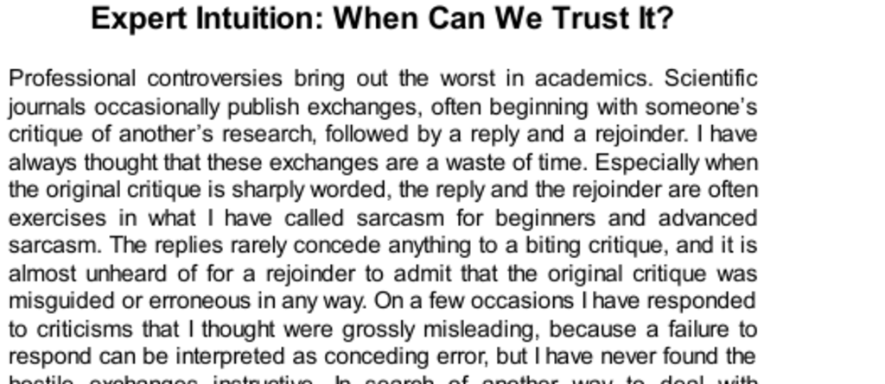

- **Expert Controversies and Adversarial Collaborations**
  - **Hostile exchanges in academic critiques**
    - Scientific journals often feature critiques, replies, and rejoinders that rarely concede errors.
    - Sharp critiques and sarcastic replies hinder productive academic discourse.
    - Responding to misleading criticisms may be necessary to avoid misinterpretation.
    - For alternative dispute resolution, adversarial collaborations with moderation are suggested.
    - Further reading: [How Scientists Disagree](https://www.nature.com/articles/nature24203)
  - **Collaboration between Kahneman and Klein**
    - Klein represents Naturalistic Decision Making (NDM) which opposes heuristics and biases.
    - Both collaborated to map the boundary between valid and flawed intuition.
    - The project lasted several years and culminated in a jointly authored article.
    - Their intellectual differences did not prevent productive agreement on core issues.
    - Further reading: [Naturalistic Decision Making](https://psycnet.apa.org/record/2007-17107-004)

- **Marvels and Flaws of Intuition**
  - **Gladwell's Blink and expert intuition**
    - The kouros story illustrates experts' gut feelings without explicit reasoning.
    - Klein and Kahneman agree a systematic search for cues can validate intuition.
    - Intuition can fail dramatically, illustrated by mistaken election of President Harding.
    - Subjective confidence must be tempered by awareness of situational validity.
    - Further reading: [Blink by Malcolm Gladwell](https://www.gladwell.com/blink/)

- **Intuition as Recognition**
  - **Recognition-Primed Decision (RPD) Model**
    - Fireground commanders generate a single option by pattern recognition and mentally simulate it.
    - The process engages both System 1 (automatic recognition) and System 2 (deliberate simulation).
    - Intuition is redefined as recognition based on cues activating memory.
    - This model extends Herbert Simon’s foundational definition of intuition.
    - Further reading: [Recognition-Primed Decision Making](https://doi.org/10.1037/0003-066X.55.5.462)

- **Acquiring Skill**
  - **Emotional and experiential learning**
    - Learned fears and hopes can be acquired rapidly from singular or verbal experiences.
    - Intuitive knowledge in professionals often derives from repeated experience and discussion.
  - **Developing expertise through prolonged practice**
    - Expertise entails thousands of hours of deliberate practice (e.g., 10,000 hours in chess).
    - Skills aggregate many miniskills and complex pattern recognition abilities.
    - Expertise development parallels learning to read, recognizing complex patterns rather than individual elements.
    - Further reading: [10,000-Hour Rule](https://www.101formulas.com/10000-hours-to-mastery/)

- **The Environment of Skill**
  - **Differences in expert domains affect trust in intuition**
    - Klein focused on firefighters and nurses with regular, predictable environments.
    - Kahneman studied clinicians and political forecasters facing irregular, low-validity contexts.
    - Experts may overestimate the reliability of their intuition when unaware of task limitations.
    - Subjective confidence arises from cognitive ease and coherence, which do not ensure accuracy.
    - Further reading: [Illusion of Validity](https://en.wikipedia.org/wiki/Illusion_of_validity)

- **Feedback and Practice**
  - **Role of feedback in skill acquisition**
    - Immediate, clear feedback aids rapid learning of intuitive skills (e.g., braking on curves).
    - Delayed or ambiguous feedback complicates learning in complex professional tasks.
  - **Variability of expertise within professions**
    - Professionals excel in some tasks but may be novices in others within the same domain.
    - Rapid feedback correlates with intuitive reliability (e.g., anesthesiologists vs. radiologists).
    - Lack of feedback on long-term outcomes limits learning of accurate intuition for forecasting.
    - Further reading: [Importance of Feedback in Expertise](https://psycnet.apa.org/record/2001-15010-001)

- **Evaluating Validity**
  - **Distinguishing valid and invalid intuitions**
    - Valid intuition requires a regular environment and opportunity for prolonged learning.
    - Subjective confidence is unreliable as a predictor of intuition accuracy.
    - Heuristics can produce confident but incorrect answers by substituting unintended questions.
  - **Final conclusions by Klein and Kahneman**
    - Expert intuition should be evaluated based on environmental regularity and experience, not confidence.
    - Many intuitive errors arise due to zero-validity or wicked environments that mislead learning.
    - Long-term collaborative efforts revealed more agreement on principles than expected despite emotional differences.
    - Further reading: [Thinking, Fast and Slow by Kahneman](https://en.wikipedia.org/wiki/Thinking,_Fast_and_Slow)
