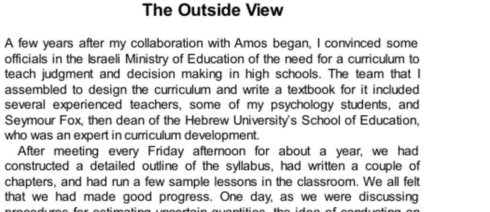

- **The Outside View**
  - The author and his team initially estimated two years to complete a curriculum and textbook for judgment and decision making in high schools.  
  - Seymour Fox, a curriculum expert, revealed that about 40% of similar teams failed to finish and those who succeeded took 7 to 10 years.  
  - The team's initial inside view estimate conflicted with base-rate statistics, which they failed to properly integrate into their forecast.  
  - The project ultimately took eight years and was delivered after the author's departure, never used by the Ministry of Education.  
  - Further reading: [The Outside View and Planning Fallacy](https://en.wikipedia.org/wiki/Planning_fallacy)  

- **Drawn to the Inside View**
  - The inside view focuses on the specifics of the current project, relying on immediate evidence and plans to forecast outcomes.  
  - Such forecasts ignore unpredictable events ("unknown unknowns") that are likely to occur in complex projects.  
  - Seymour initially made two different judgments: one inside-view estimate and one outside-view summary he was familiar with but did not apply.  
  - People generally prefer the inside view because it feels more tangible, often disregarding relevant statistical information from similar cases.  
  - Further reading: [Inside vs Outside View in Decision Making](https://hbr.org/2007/03/what-experts-think)  

- **The Planning Fallacy**
  - Planning fallacy describes the tendency to make forecasts unrealistically close to best-case scenarios.  
  - Examples include the Scottish Parliament building cost overruns and consistent overestimation of public transportation ridership.  
  - Planners and decision makers often underestimate costs and completion times due to optimism and do not improve forecasts despite accumulating evidence.  
  - Cost overruns can result from deliberate underestimation to get project approval, with clients often unable to foresee escalating costs.  
  - Further reading: [Planning Fallacy – Kahneman & Tversky](https://psycnet.apa.org/record/1979-32115-001)  

- **Mitigating the Planning Fallacy**
  - Bent Flyvbjerg emphasizes framing forecasting problems to incorporate all available distributional information.  
  - The method of reference class forecasting uses statistical data from similar completed projects as a baseline prediction.  
  - The three-step process is: identify a reference class, obtain relevant statistics, and adjust the baseline for project-specific factors.  
  - Statistical forecasts guide decision makers in setting realistic budgets and anticipating overruns, though budget reserves may encourage contractor opportunism.  
  - Further reading: [Reference Class Forecasting Explained](https://www.pnas.org/content/109/50/19319)  

- **Decisions and Errors**
  - Optimistic bias in forecasting leads executives to underestimate costs and risks of projects, resulting in delusional decision-making.  
  - This bias causes pursuit of initiatives unlikely to meet budgets, deadlines, or expected returns.  
  - Over-optimism influences risk-taking beyond rational economic models, contributing to phenomena like litigation and failed businesses.  
  - Further reading: [Behavioral Economics and Risk Taking](https://behavioraleconomics.com/resources/mini-encyclopedia-of-be/risk/)  

- **Failing a Test**
  - The author acknowledges personal responsibility for failing to incorporate the outside view and for ineffective leadership.  
  - Despite awareness of the planning fallacy, the team ignored the 40% failure rate and prolonged the project due to sunk costs and a lack of open discussion.  
  - The outside view was easier to ignore than confront, resulting in a lack of rational decision-making and no further realistic forecasting attempts.  
  - Further reading: [Sunk Cost Fallacy](https://www.sciencedaily.com/releases/2011/10/111003130501.htm)  

- **Speaking of the Outside View**
  - Common admonitions include urging decision makers to consider base rates instead of focusing only on unique case details.  
  - Warnings about the planning fallacy highlight inherent risks and unforeseeable failure modes in projects.  
  - Recognition of sunk-cost fallacy explains people's reluctance to admit failure despite clear evidence.  
  - The outside view promotes objective baseline judgments informed by relevant statistics instead of subjective scenarios.  
  - Further reading: [Decision Making with Base Rates](https://www.ncbi.nlm.nih.gov/pmc/articles/PMC4321753/)
