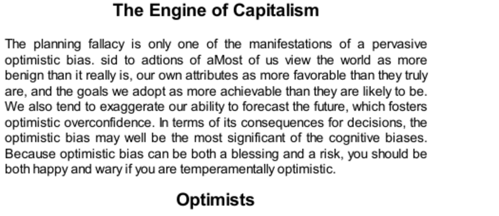

- **The Engine of Capitalism**
  - **Optimists**
    - Optimism is largely inherited and part of a general disposition for well-being.  
    - Optimists show greater resilience, better health, reduced depression risk, and longer lifespan.  
    - Optimists tend to be more influential as entrepreneurs, leaders, and risk takers.  
    - Their success reinforces their confidence and optimism, leading to risk-taking behavior.  
    - For further reading, see [The Optimism Bias](https://en.wikipedia.org/wiki/Optimism_bias).  
  - **Entrepreneurial Delusions**
    - Many entrepreneurs overestimate their odds of success, often ignoring relevant statistics.  
    - Persistence despite negative evaluations is common among optimistic inventors but leads to financial losses.  
    - Overconfidence contributes to risky decisions in business mergers and acquisitions.  
    - CEOs with high personal stock ownership tend to take excessive risks and may harm company value.  
    - Related resource: [Why Entrepreneurs Are Optimistic](https://hbr.org/2009/03/why-entrepreneurs-are-optimistic).  
  - **Competition Neglect**
    - Entrepreneurs and decision makers underestimate the impact of competitors and external factors.  
    - WYSIATI (What You See Is All There Is) causes focus on own plans, neglecting others' actions.  
    - The above-average effect inflates self-assessment relative to others across various skills.  
    - Competition neglect leads to excess market entry, often resulting in losses for individual firms.  
    - See also [Competition Neglect and Planning Fallacy](https://www.jstor.org/stable/10.1086/523523).  
  - **Overconfidence**
    - CFOs show poor accuracy and extreme overconfidence in financial forecasting and confidence intervals.  
    - Overconfidence is reinforced by social and professional pressures valuing certainty over admitting ignorance.  
    - Expert overconfidence appears in medicine, business, and finance, often leading to costly errors.  
    - Overconfident CEOs take excessive risks and tend to underperform post-award or recognition.  
    - For more, refer to [Overconfidence Effect](https://en.wikipedia.org/wiki/Overconfidence_effect).  
  - **The Premortem: A Partial Remedy**
    - The premortem technique involves imagining failure and identifying causes before committing to a decision.  
    - It mitigates groupthink and uncovers overlooked risks, improving decision quality.  
    - Overconfidence training in individuals shows limited success; organizational approaches like premortems are more effective.  
    - The technique fosters critical thinking before finalizing plans, reducing bias effects.  
    - Further reading: [Premortem Assessment](https://hbr.org/2007/09/premortem-assessment-time-well-spent).  
  - **Speaking of Optimism**
    - Overconfidence and competitor neglect cause underestimation of obstacles and overestimation of knowledge.  
    - Premortem sessions are advised to identify neglected threats and counteract biased optimism.  
    - These quotes summarize characteristic biases impacting entrepreneurial and organizational decisions.  
    - Related source: [Cognitive Bias and Optimism](https://www.psychologytoday.com/us/basics/cognitive-bias).
