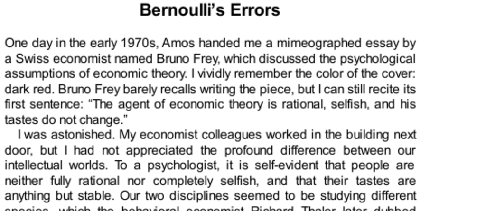

- **Bernoulli’s Errors**
  - **Introduction to Psychological Assumptions in Economics**
    - Economic theory traditionally assumes agents are rational, selfish, and have stable tastes.
    - Psychologists consider humans as less rational and more influenced by changing information and social context.
    - The contrast between economists' "Econs" and psychologists' "Humans" highlights fundamental disciplinary differences.
    - For more on behavioral economics, see [Behavioral Economics Overview](https://en.wikipedia.org/wiki/Behavioral_economics).
  - **Studying Choices Under Risk**
    - Simple gambles model decision making under uncertainty and serve as a basic experimental tool.
    - Expected utility theory, derived by von Neumann and Morgenstern, prescribes rational choice rules using axioms.
    - Psychologists aimed to describe actual human choices without assuming rationality.
    - The exploration led to the development of Prospect Theory, which modifies expected utility theory.
    - Further information available at [Prospect Theory](https://en.wikipedia.org/wiki/Prospect_theory).
  - **Psychophysics and the Utility of Wealth**
    - Psychophysics studies the relation between physical stimuli and subjective perception, often logarithmic.
    - Bernoulli proposed utility as a logarithmic function of wealth to explain risk aversion.
    - People prefer sure amounts to gambles of higher expected value due to diminishing marginal utility.
    - Bernoulli’s approach explained insurance purchasing and risk preferences centuries ago.
    - See also [Psychophysics](https://en.wikipedia.org/wiki/Psychophysics) for foundational concepts.
  - **Bernoulli’s Error: Ignoring Reference Dependence**
    - Bernoulli’s theory assumes utility depends solely on absolute wealth, implying equal happiness at equal wealth.
    - Real happiness depends on changes relative to reference points, not just current wealth.
    - Examples of Jack & Jill and Anthony & Betty illustrate differing risk attitudes due to different reference points.
    - Bernoulli’s theory cannot account for risk-seeking behavior when facing losses or varying reference points.
    - For more on reference-dependence, see [Reference-Dependent Preferences](https://en.wikipedia.org/wiki/Reference-dependent_preferences).
  - **Theory-Induced Blindness and Longevity of Expected Utility Theory**
    - The persistence of Bernoulli’s flawed model is attributed to theory-induced blindness among scholars.
    - Scholars often rationalize contradictions to a theory instead of rejecting foundational assumptions.
    - Disbelieving an entrenched theory is cognitively demanding and unusual.
    - This explains the slow progress in correcting expected utility theory despite contrary evidence.
    - Additional reading can be found at [Theory-Induced Blindness](https://hbr.org/2011/09/theory-induced-blindness).
