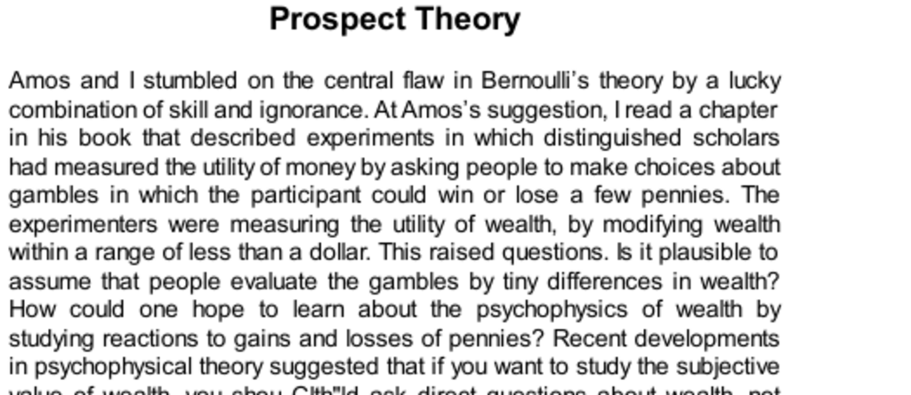

- **Prospect Theory**
  - **Flaws in Bernoulli’s Theory**
    - Utility of wealth was traditionally measured by small changes in money, which is unrealistic for assessing true subjective value.  
    - Utility should be assessed based on direct questions about wealth, not small gains or losses.  
    - Amos and Kahneman adopted Markowitz's idea that utilities attach to changes of wealth rather than states.  
    - Theory-induced blindness delayed recognition of these flaws despite obvious contradictions.  
    - For further reading, see [Markowitz's Portfolio Selection](https://www.jstor.org/stable/2975974).  
  - **Difference Between Gains and Losses**
    - Bernoulli's utility theory allowed gains and losses to differ only by sign, ignoring loss aversion.  
    - People are generally risk averse with gains but risk seeking when facing losses.  
    - Problem examples reveal risk preferences reverse depending on gain or loss framing.  
    - This difference challenges prior models that ignored separate treatment of gains and losses.  
  - **Reference Point and Its Role**
    - Outcomes are evaluated relative to a reference point, not absolute wealth.  
    - The reference point can be the status quo, expectations, or entitlements.  
    - Identical final wealth states can produce different choices due to shifting reference points.  
    - Utility functions lacking a moving reference point fail to explain observed behaviors.  
  - **Three Cognitive Features of Prospect Theory**
    - Evaluation is relative to a neutral reference point or adaptation level.  
    - Diminishing sensitivity applies to both gains and losses, reducing perceived differences as amounts grow.  
    - Loss aversion means losses have a stronger psychological impact than gains of equal size.  
    - These principles align with intuitive sensory effects and evolutionary survival advantages.  
    - For deep dives, see [Kahneman & Tversky’s 1979 paper](https://www.jstor.org/stable/1914185).  
  - **Loss Aversion**
    - Mixed gambles often lead to rejection despite positive expected value, due to stronger fear of losses.  
    - Typical loss aversion ratio ranges between 1.5 and 2.5, meaning losses weigh about twice as much as gains.  
    - Professional traders exhibit reduced emotional loss aversion when adopting a "trader's mindset."  
    - Loss aversion grows with stake size but can be infinite if the loss threatens survival or lifestyle.  
  - **Risk Attitudes and Mixed Gambles**
    - Loss aversion causes risk aversion in mixed gambles with both gains and losses.  
    - Diminishing sensitivity leads to risk seeking when comparing certain smaller losses to probable larger losses.  
    - The value function in prospect theory is S-shaped, with steeper slope for losses at the reference point.  
  - **Critique of Bernoulli’s Utility Based on Rabin’s Theorem**
    - Rabin’s theorem proves small-stakes loss aversion leads to implausible behavior under utility theory.  
    - People reject small favorable bets but utility theory predicts they should reject large highly favorable gambles too.  
    - This discrepancy further undermines expected utility theory in explaining loss aversion.  
    - See [Rabin’s 2000 paper](https://www.jstor.org/stable/2698563) for mathematical details.  
  - **Blind Spots of Prospect Theory**
    - Prospect theory assumes a fixed reference point with zero value, which can't handle disappointment when outcomes change expected reference points.  
    - The theory assigns the same value to identical outcomes across very different gambles, ignoring emotional context.  
    - Prospect theory and utility theory fail to incorporate regret and disappointment because they evaluate options independently.  
    - Regret theory models are acknowledged but less influential due to fewer distinguishing predictions and greater complexity.  
    - For regret theory, see [Loomes & Sugden (1982)](https://www.jstor.org/stable/1914186).  
  - **Educational and Practical Considerations**
    - Prospect theory is often excluded from introductory economics due to complexity and focus on rational agents.  
    - Basic economic models assume rationality to build foundational concepts and provide workable predictions.  
    - The failure of rationality modeled in prospect theory is relevant only in contexts influenced by emotions and short-term judgments.  
  - **Summary Statements About Prospect Theory and Loss Aversion**
    - Extreme loss aversion can cause rejection of clearly favorable opportunities.  
    - Emotional responses to trivial gains and losses can contradict rational evaluations, especially among the wealthy.  
    - Weighting losses about twice as much as gains is considered a normal behavioral pattern.
