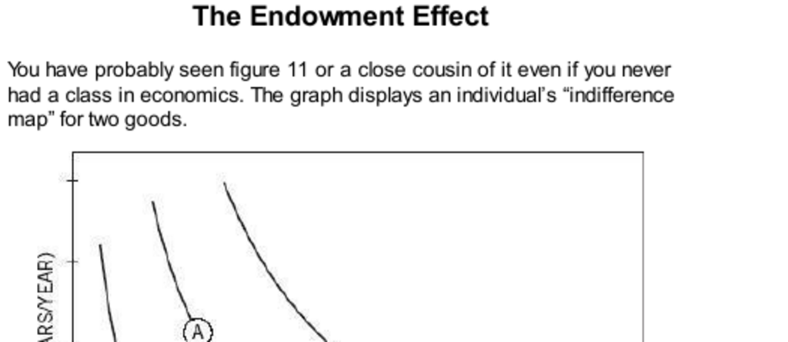

- **The Endowment Effect**
  - **Indifference Curves and Reference Points**
    - Indifference curves show combinations of income and vacation days that provide equal utility.
    - The curves assume stable preferences that depend only on current states, ignoring reference points.
    - Loss aversion biases choices toward maintaining the status quo due to stronger negative responses to losses than positive responses to gains.
    - Reference points represent current holdings and strongly influence evaluation of alternatives.
    - See [Indifference Curves on Investopedia](https://www.investopedia.com/terms/i/indifferencecurve.asp) for foundational concepts.
  - **Prospect Theory and Loss Aversion**
    - Prospect theory introduces reference points and asserts losses loom larger than corresponding gains.
    - Changing the reference point causes preferences to shift, contradicting standard economic theory.
    - Loss aversion explains reluctance to switch jobs or trade goods even when objectively equal alternatives exist.
    - The value function is steeper for losses than gains, reinforcing the endowment effect.
    - Reference: Kahneman and Tversky’s original [Prospect Theory paper](https://www.jstor.org/stable/1914185).
  - **Behavioral Economics Origins and Richard Thaler’s Contribution**
    - Richard Thaler observed the endowment effect through Professor R’s reluctance to sell wine at expected market prices.
    - Endowment effect arises because owning a good increases its perceived value due to loss aversion.
    - Thaler linked prospect theory’s loss-averse value function to explain this anomaly.
    - The endowment effect is strongest for goods held “for use” rather than “for exchange.”
    - For more, see Thaler’s book [Misbehaving](https://www.amazon.com/Misbehaving-Behavioral-Economics-Richard-Thaler/dp/039335279X).
  - **Experimental Demonstrations**
    - Experiments showed market tokens (held for exchange) follow standard theory, while coffee mugs (held for use) display the endowment effect.
    - Sellers price items much higher than Buyers or Choosers, demonstrating reluctance to give up owned goods.
    - Loss aversion is linked to automatic emotional responses as confirmed by brain imaging studies.
    - The approximate 2:1 ratio of selling to buying prices aligns with loss aversion coefficients found in other economic domains.
    - See Vernon Smith’s work on experimental economics, e.g., [Nobel Prize Lecture](https://www.nobelprize.org/prizes/economic-sciences/2002/smith/lecture/).
  - **Further Evidence and Variability of the Endowment Effect**
    - Endowment effect is reduced or eliminated when goods are viewed as intended for exchange rather than personal use.
    - Trading experience diminishes reluctance to trade, as demonstrated by John List’s research on baseball card traders.
    - Physical possession before trading increases endowment effect visibility, highlighting the role of psychological ownership.
    - Cultural differences affect the size of the endowment effect, with notable discrepancies between U.S. and U.K. student samples.
    - For related experiments, see John List’s [research on market experience](https://www.nber.org/papers/w17937).
  - **Thinking Like a Trader and Poverty Effects**
    - Traders learn to evaluate goods in terms of willingness to trade rather than ownership, reducing the endowment effect.
    - The poor do not show the endowment effect because they are consistently “in the losses” and perceive money as reducing loss rather than generating gain.
    - Poor individuals face choices framed as balancing losses of alternative goods, making costs salient losses.
    - Cultural and emotional attitudes toward spending influence the subjective experience of losses.
    - See the study on poverty and decision-making by [Haushofer and Fehr (2014)](https://www.sciencedirect.com/science/article/pii/S014067361362174X).
- **Speaking Of The Endowment Effect**
  - **Common Expressions and Observations**
    - The endowment effect manifests as reluctance to trade or concede in negotiations due to loss aversion.
    - Price increases reduce demand disproportionately compared to price decreases boosting demand.
    - Homeowners tend to price homes relative to their purchase price, not just current market conditions, due to loss aversion.
    - The emotional reaction to spending money can label individuals as “misers” who perceive every expenditure as a loss.
    - For related behavioral observations, see [Behavioral Economics: The Basics](https://www.behavioraleconomics.com/resources/mini-encyclopedia-of-be/endowment-effect/).
