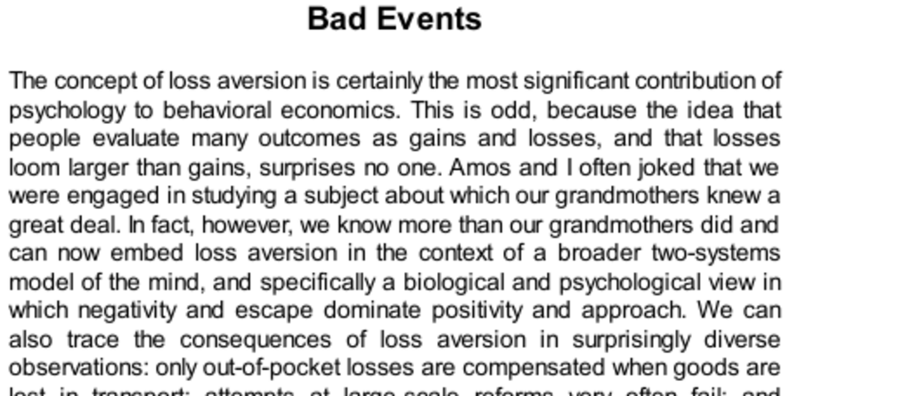

- **Bad Events**
  - **Negativity Dominance**
    - The amygdala responds intensely and rapidly to threatening stimuli, even when not consciously recognized.  
    - Threatening images and words provoke stronger and faster brain reactions than positive ones, reflecting evolutionary survival mechanisms.  
    - The brain prioritizes bad news to improve chances of survival, an effect absent for good news of comparable rapidity.  
    - Social and emotional negativity dominates positive experiences, influencing impression formation and relationship dynamics.  
    - For further reading, see [Bad Is Stronger Than Good](https://doi.org/10.1177/1745691617693050).  
  - **Goals are Reference Points**
    - People view goals as reference points, experiencing failure to reach them as losses and exceeding them as gains.  
    - Loss aversion makes the motivation to avoid failure stronger than the drive to surpass goals.  
    - Studies show golfers putt more effectively when avoiding a bogey than when aiming for a birdie due to loss aversion.  
    - Economic behaviors can be explained by reference points where achieving but not exceeding goals shapes effort.  
    - More information can be found in the work of Devin Pope and Maurice Schweitzer on loss aversion in golf.  
  - **Defending the Status Quo**
    - Loss aversion creates resistance to change in negotiations, making concessions painful and agreements difficult.  
    - Existing agreements set reference points that make proposed changes seem like losses, intensifying negotiation challenges.  
    - Defenders, whether animals or institutions, fight harder to prevent losses than to acquire gains.  
    - Reforms often include protective clauses for current stakeholders due to loss aversion's conservative influence.  
    - For deeper insight, see [Behavioral Economics and Negotiation](https://www.jstor.org/stable/2534587).  
  - **Loss Aversion in the Law**
    - Public perceptions of fairness distinguish sharply between losses imposed and foregone gains allowed.  
    - The status quo wage, price, or rent sets an entitlement reference point that should not be unfairly infringed.  
    - Firms may reduce wages during profit threats without being deemed unfair but are criticized for exploiting market power.  
    - Consumers penalize merchants who raise prices unfairly by reducing future purchases significantly.  
    - Altruistic punishment of unfair behavior activates brain pleasure centers, reinforcing social fairness mechanisms.  
    - Legal compensation typically covers actual losses, not lost potential gains, aligning with loss aversion principles.  
    - More details are available in research by Richard Thaler and colleagues on fairness and loss aversion.  
  - **Speaking of Losses**
    - Loss aversion explains why those facing losses resist changes more than those potentially gaining from them.  
    - Negotiators often misunderstand each other's perceptions of concession pain due to the asymmetry of losses.  
    - Reference points influence fairness perceptions in rent increases and profit protection in pricing.  
    - Awareness that negotiations involve allocating gains rather than losses can ease agreement.  
    - For further context, see [Negotiation and Loss Aversion](https://hbr.org/2016/01/how-loss-aversion-affects-negotiations).
