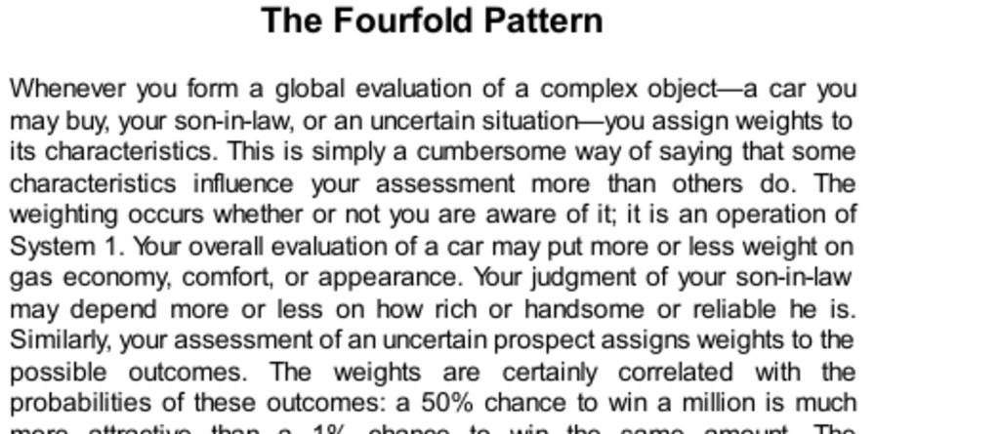

- **The Fourfold Pattern**
  - **Assigning Weights to Characteristics and Outcomes**
    - Global evaluations assign different weights to various characteristics whether consciously or subconsciously by System 1.
    - Weights reflect how some features influence overall judgment more than others, including attributes of uncertain prospects.
    - The process of weighting is automatic and not always deliberative.
    - For further insight on unconscious weighting: [Thinking, Fast and Slow](https://en.wikipedia.org/wiki/Thinking,_Fast_and_Slow).

  - **Changing Chances**
    - Expected value theory weights outcomes by their probabilities, but this does not fully capture human perception.
    - Examples show different psychological impacts of identical probability increases at various probability levels (0–5%, 5–10%, 60–65%, 95–100%).
    - The possibility effect causes overweighting of very low probabilities, whereas the certainty effect causes underweighting of probabilities near certainty.
    - These effects explain irrational economic behaviors like lottery purchases and insurance decisions.
    - For more on probability weighting: [Prospect Theory](https://en.wikipedia.org/wiki/Prospect_theory).

  - **Allais’s Paradox**
    - Maurice Allais demonstrated that human choices often violate the axioms of expected utility theory.
    - In presented choices, people prefer inconsistent options that reveal the certainty effect.
    - The paradox challenges the rational-agent model by showing psychological influences on decision-making.
    - Attempts to rationalize these inconsistencies have generally failed, prompting psychological explanations instead.
    - For details on Allais’s work: [Allais Paradox](https://en.wikipedia.org/wiki/Allais_paradox).

  - **Decision Weights**
    - Decision weights differ from probabilities especially at the extremes: improbably outcomes are overweighted, and nearly certain outcomes are underweighted.
    - Example: a 2% chance may carry a decision weight over four times its probability.
    - Neuroscience findings support that brain responses to probability changes follow similar patterns as decision weights.
    - Extremely rare events are often ignored or overweighted based on attention and worry.
    - For neuroscience perspectives: [Neural Basis of Decision Making](https://www.nature.com/articles/nrn1092).

  - **Fourfold Pattern of Preferences**
    - Combines value assigned to gains/losses with decision weights to produce a fourfold pattern of risk attitudes.
    - Top left: risk aversion for large gains with substantial probability due to certainty effect.
    - Bottom left: risk seeking in gains with very low probability because of the possibility effect.
    - Top right: risk seeking in large losses with high probability, driven by diminishing sensitivity and certainty effect.
    - Bottom right: risk aversion in losses with low probability due to possibility effect.
    - The pattern explains behaviors like lottery buying, insurance purchase, and gambling under loss.
    - For foundational reading: [Prospect Theory and the Fourfold Pattern](https://doi.org/10.2307/1914185).

  - **Gambling in the Shadow of the Law**
    - The fourfold pattern explains plaintiff and defendant risk preferences in civil suits depending on case strength.
    - Plaintiffs with strong cases tend to be risk averse; defendants with weak cases tend to be risk seeking.
    - In frivolous litigation, plaintiffs overweight small chances to win leading to aggressive demands, while defendants seek cautious settlements.
    - Long-run analysis shows systematic deviations from expected value can be costly for organizations handling multiple such cases.
    - Experimental and real-world data support these behavioral predictions.
    - For applied legal decision research: [Guthrie’s Legal Decision-Making Studies](https://digitalcommons.law.uga.edu/fac_artchop/332).

  - **Speaking Of The Fourfold Pattern**
    - Anecdotal examples illustrate overweighting of small probabilities causing risk-averse or risk-seeking behavior.
    - The pattern manifests in everyday choices, such as vacation planning and risk mitigation.
    - Recognition of these patterns aids understanding of common irrationalities in decision contexts.
    - For applied examples and interpretations: [The Psychology of Risk](https://www.apa.org/research/action/risk).
