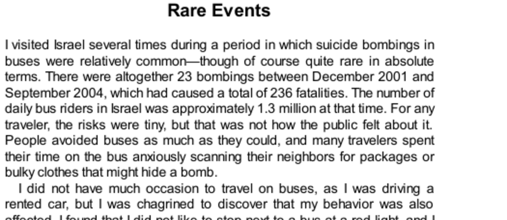

- **Rare Events**
  - **Introduction to Suicide Bombings and Public Perception**
    - Suicide bombings on buses in Israel caused 236 fatalities from 23 incidents between 2001 and 2004.  
    - Despite low actual risk, public fear led to behavioral changes and avoidance of buses.  
    - Emotional response is associative and automatic, driven by vivid and frequent media exposure, overriding rational probability assessment.  
    - Availability cascade intensifies fear by linking specific situations to vivid images of danger.  
    - See [Availability Cascade](https://en.wikipedia.org/wiki/Availability_cascade) for related theory.  
  - **Lottery Tickets and Terrorism: Shared Psychological Mechanisms**
    - Both lottery and terrorism induce vivid fantasies or fear, overweighting negligible probabilities.  
    - Prospect theory states unlikely events are either ignored or overweighted, influenced by emotion and vividness.  
    - Decision weights reflect cognitive ease and emotional response rather than objective probability.  
    - Confirmation bias and focused attention contribute to overweighting unlikely events.  
    - Refer to [Prospect Theory](https://en.wikipedia.org/wiki/Prospect_theory) for foundational concepts.  
  - **Overestimation and Overweighting**
    - People tend to overestimate probabilities of unlikely events and overweight these in decisions.  
    - Cognitive ease and associative memory retrieval bias likelihood judgments towards confirmatory and vivid scenarios.  
    - Probability estimates can exceed 100% when summing over exclusive events due to diffuse alternatives, as shown in NBA playoff studies.  
    - Betting behavior reflects overweighting, leading to guaranteed losses when betting on all possible rare outcomes.  
    - See Fox’s research on basketball probability judgments for empirical examples.  
  - **Vivid Outcomes**
    - Decision weights are less sensitive to probability when outcomes are emotionally vivid, such as kisses or shocks versus money.  
    - Physiological responses to potential negative outcomes often do not correlate with actual probability.  
    - Providing explicit monetary value does not increase sensitivity to probability for vivid non-monetary outcomes.  
    - Vivid mental representations reduce the influence of probability in decisions, enhancing both possibility and certainty effects.  
    - Related reading: [Affective Psychology of Risk](https://psychology.uchicago.edu).  
  - **Vivid Probabilities**
    - Denominator neglect causes people to focus on numerators (winning marbles) while ignoring denominators, leading to poor probability assessments.  
    - Frequency formats (e.g., "1 in 100,000") create more vivid images and higher perceived risk than abstract probabilities (e.g., 0.001%).  
    - Professionals are also influenced by format, doubling risk evaluation differences in clinical decisions.  
    - Format effects are used in rhetoric and legal contexts to sway judgments by evoking vivid personal images.  
    - See Paul Slovic's work on risk perception for in-depth studies.  
  - **Decisions from Global Impressions**
    - In choice from experience, rare events are often underweighted or neglected because they do not stand out in pooled memories.  
    - System 1 generates holistic emotional impressions that guide decisions rather than explicit probability calculations.  
    - Availability and overweighting occur primarily when rare events are brought to focal attention through description.  
    - Neglect of rare events explains public underreaction to rare but significant risks.  
    - Hertwig and Erev’s research on rare event neglect provides detailed analysis.  
  - **Speaking of Rare Events**
    - Risk perception follows a cycle: initial exaggeration and overweighting followed by neglect over time.  
    - Presenting risks as frequencies rather than probabilities exploits denominator neglect to increase perceived threat.  
    - Communication format and vividness are deliberately used in public and legal discourse to amplify or minimize perceived risk.  
    - The framing of rare but vivid risks affects funding, policy, and decision-making.  
    - For more, see discussions of risk communication best practices at [WHO Risk Communication](https://www.who.int/risk-communication).
