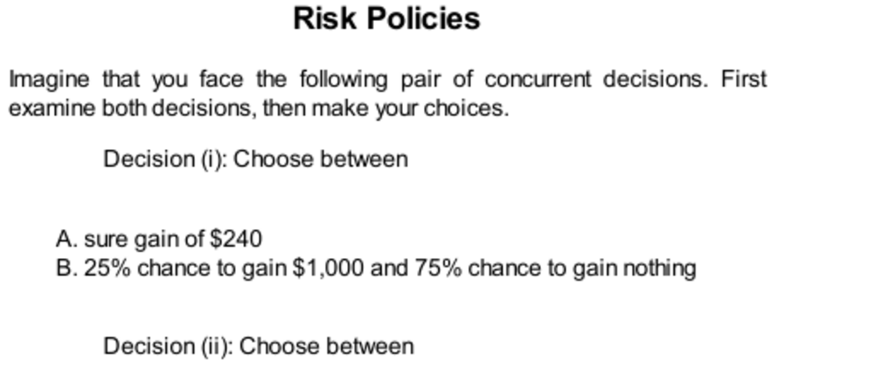

- **Risk Policies**
  - **Decision Pair Problem**
    - Many people prefer a sure gain ($240) over a gamble with higher expected value but risk (25% chance to win $1,000).
    - Conversely, people prefer to gamble to avoid a sure loss rather than accept a certain loss ($750).
    - This reveals risk aversion for gains and risk seeking for losses, driven by intuitive emotional reactions (System 1).
    - Majority preferences (73%) favor the combination of sure gain and risky loss avoidance, despite inconsistencies revealed by combined evaluation.
    - For further reading, see [Prospect Theory](https://en.wikipedia.org/wiki/Prospect_theory).
  - **Broad vs Narrow Framing**
    - Narrow framing treats each decision separately and often leads to inconsistent preferences.
    - Broad framing considers all decisions together, leading to superior, logically consistent outcomes.
    - Humans naturally tend toward narrow framing due to mental effort aversion and cognitive limitations.
    - Broad framing reduces costs caused by risk aversion in gains and risk seeking in losses.
    - For more, consult [Thinking, Fast and Slow](https://en.wikipedia.org/wiki/Thinking,_Fast_and_Slow).
  - **Samuelson’s Problem**
    - A single gamble with mixed losses and gains may be rejected due to loss aversion even when favorable.
    - Aggregating multiple independent gambles reduces perceived risk and increases willingness to accept.
    - Loss aversion is modeled by weighting losses twice as much as gains in subjective evaluation.
    - Bundling gambles attenuates loss aversion’s impact, increasing expected value of acceptance.
    - Additional details available in Rabin and Thaler’s critique of utility theory [Risk Aversion and Expected Utility Theory](https://www.jstor.org/stable/10.1086/261651).
  - **Adopting a Risk Policy**
    - Risk policies aggregate many decisions to overcome biases from narrow framing and loss aversion.
    - Common risk policies include taking high deductibles or avoiding extended warranties.
    - Risk policies operate like an outside view, focusing on statistical outcomes in many similar situations.
    - Combining an outside view with risk policies counters planning fallacy optimism and loss aversion caution.
    - For practical applications, see [Nudge: Improving Decisions About Health, Wealth, and Happiness](https://en.wikipedia.org/wiki/Nudge_(book)).
  - **Speaking of Risk Policies**
    - Risk policies help individuals reduce emotional overreactions to gains and losses.
    - Evaluating portfolios less frequently can reduce loss aversion caused by daily price fluctuations.
    - Organizations often under-take risk because individual loss aversion aggregates up across divisions.
    - Encouraging thinking like a trader and broad framing can improve risk-taking decisions.
    - Further context on risk policies found in [Behavioral Finance](https://en.wikipedia.org/wiki/Behavioral_finance).
