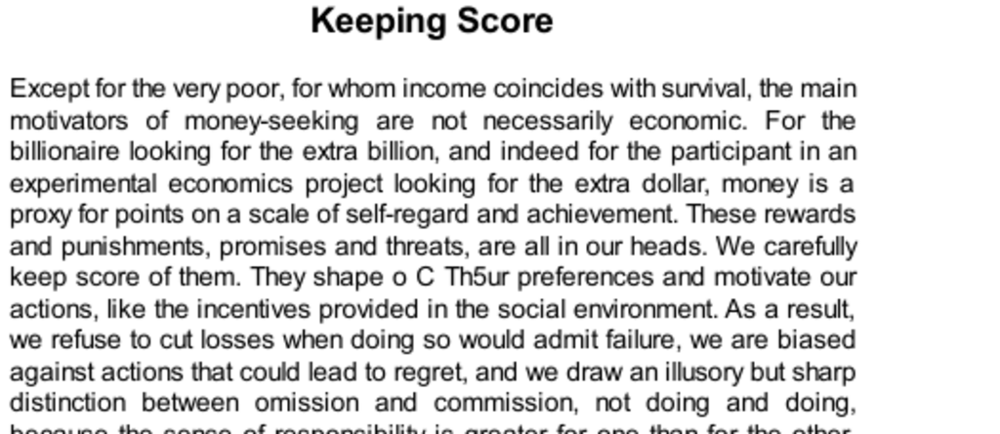

- **Keeping Score**
  - **Mental Accounts**
    - Mental accounts organize financial and non-financial aspects of life into separate categories, influencing spending and self-control.
    - People assign different priorities to funds like spending money, savings, or earmarked funds, affecting their financial decisions.
    - Mental accounting leads to behaviors like avoiding sunk-cost losses and framing decisions narrowly.
    - Examples include golfers focusing hole-by-hole and fans more likely to attend games if they bought tickets.
    - For more, see Richard Thaler's work on [Mental Accounting](https://www.nobelprize.org/prizes/economic-sciences/2017/thaler/lecture/).
  - **Disposition Effect and Sunk-Cost Fallacy**
    - Investors disproportionately sell winning stocks and hold losing ones due to mental accounting and emotional scoring.
    - The sunk-cost fallacy drives individuals and organizations to continue investing in losing projects to avoid admitting failure.
    - Agency problems arise when managers prioritize personal reputations over firm welfare by escalating commitment to failing projects.
    - Educating decision makers about sunk costs reduces this bias, improving economic outcomes.
    - Additional insight is available in research on [Behavioral Finance](https://www.cfainstitute.org/en/research/behavioral-finance).
  - **Regret**
    - Regret results from comparing actual outcomes to what might have been, with stronger feelings when outcomes stem from action instead of inaction.
    - People weigh regret differently based on norms, feeling more regret for atypical behavior and more blame for risk-taking behavior.
    - Anticipated regret biases choices toward conventional, risk-averse options in contexts like investing, consumer behavior, and medical decisions.
    - Default options heavily influence regret, as departing from them increases emotional costs of bad outcomes.
    - Further reading on regret emotions can be found in [Regret Theory](https://www.sciencedirect.com/science/article/pii/S0899825618306460).
  - **Responsibility and Loss Aversion**
    - Losses carry roughly twice the emotional weight of equivalent gains, especially for domains valued beyond money, like health.
    - People exhibit reluctance to engage in transactions involving personal responsibility for negative outcomes, demanding higher compensation.
    - Taboo tradeoffs, such as trading safety for money, lead to incoherent but strong aversion affecting parental and regulatory decisions.
    - The precautionary principle amplifies loss aversion in policy, often hindering innovation by imposing heavy proof burdens for safety.
    - For regulatory perspectives, see Cass Sunstein’s discussion on the [Precautionary Principle](https://www.brookings.edu/research/the-precautionary-principle-in-risk-assessment-and-risk-management/).
  - **Managing Anticipated Regret**
    - Anticipated regret influences many decisions and can be mitigated by consciously considering it before acting.
    - Hindsight bias exacerbates regret; thorough or casual decision-making can reduce this effect.
    - Psychological immune system mechanisms reduce experienced regret relative to anticipated regret.
    - Investors can manage regret by constructing portfolios that minimize it, acknowledging emotional as well as financial outcomes.
    - Daniel Gilbert’s research elaborates on this concept in [The Psychological Immune System](https://www.ncbi.nlm.nih.gov/pmc/articles/PMC2599946/).
  - **Speaking of Keeping Score**
    - Everyday decisions often reflect mental accounting, regret avoidance, and loss aversion, as illustrated by examples from consumer choices to finance.
    - People maintain separate accounts for cash and credit and act to avoid closing accounts at a loss.
    - Regret avoidance influences brand loyalty and high-value purchases.
    - Taboo tradeoffs occur when moral intuitions conflict with financial considerations.
    - These examples demonstrate behavioral economic principles discussed in the chapter.
