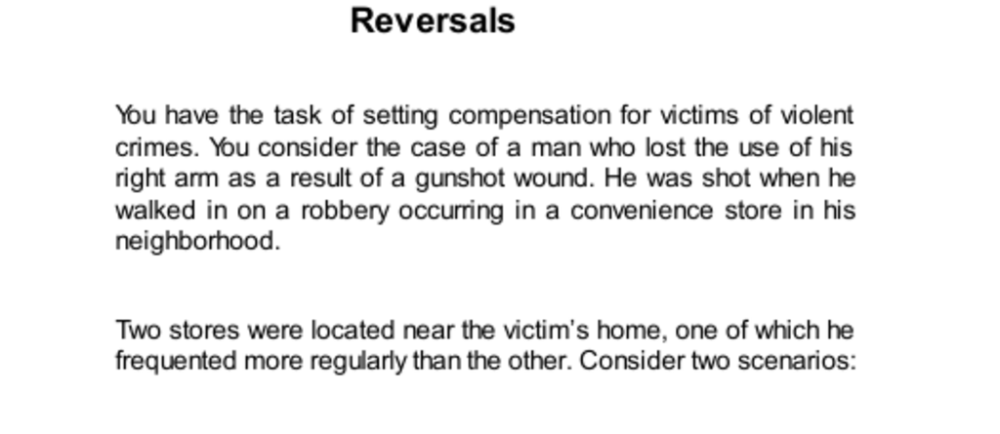

- **Reversals**
  - **Victim compensation scenarios**
    - The injury caused loss of use of a man’s right arm after a shooting during a robbery.
    - Two scenarios differ by location: the regular store vs. the other store for shopping.
    - Joint evaluation leads to agreement that compensation should be equal regardless of location.
    - Single evaluation shows higher compensation when shot in the less frequented store due to poignancy and counterfactual thinking.
    - Relevant reading: [Judgment under Uncertainty: Heuristics and Biases](https://www.cambridge.org/core/books/judgment-under-uncertainty/07F41C09BF3BDEB9CE87D1E64AD33828)

  - **Psychological mechanisms in single vs. joint evaluation**
    - System 1 emotional responses dominate single evaluations.
    - System 2 reasoning appears in joint evaluation, suppressing emotional biases.
    - The contrast highlights inconsistency in moral intuitions and judgments across contexts.
    - Joint evaluation allows careful scrutiny of relevant factors, such as legitimacy of poignancy.
    - Further reading: [Thinking, Fast and Slow](https://en.wikipedia.org/wiki/Thinking,_Fast_and_Slow)

- **Challenging Economics**
  - **Preference reversals in bets**
    - Bet A is riskier but offers higher rewards; Bet B is safer with smaller rewards.
    - People prefer Bet B in choice but assign a higher selling price to Bet A in isolation.
    - Preference reversals arise from salience differences and framing effects between single and joint evaluations.
    - System 1 influences isolated valuations; System 2 dominates comparative choices.
    - Additional resource: [Preference Reversals in Behavioral Economics](https://www.sciencedirect.com/science/article/abs/pii/S0167268107001209)

  - **Economists’ response to psychological findings**
    - Early economists attempted to discredit psychological experiments on preference reversals.
    - Experiments by Grether and Plott largely confirmed psychological results, challenging traditional preference theory.
    - Preference theory’s coherence assumption is violated by context-dependent choice.
    - Findings increased economists’ openness to psychological insights despite theoretical resistance.
    - Further reading: [The Journal of Political Economy, Grether & Plott (1979)](https://www.journals.uchicago.edu/doi/10.1086/260929)

- **Categories**
  - **Norm-based evaluations and category context**
    - Judgments depend on category norms, e.g., height norms vary by age.
    - Coherent preferences appear within categories; incoherence arises when comparing across categories.
    - Single evaluation adapts measures relative to category norms; joint evaluation reveals inconsistencies.
    - Examples include preferences between fruits vs. between food types like apples and steak.
    - Recommended reading: [Categorization and Judgment in Cognitive Psychology](https://psycnet.apa.org/record/2007-12629-009)

  - **Donation valuation based on category salience**
    - Single evaluation leads to higher donations for dolphins than farmworkers due to likeability and category framing.
    - Joint evaluation highlights “human vs. animal” distinction, reversing donation preferences.
    - Emotional System 1 responses produce intensity matching in single evaluation.
    - Joint evaluation activates System 2, leading to more consistent and morally relevant assessments.
    - See also: [Prospect Theory and Valuation](https://www.sciencedirect.com/science/article/abs/pii/016726819190020T)

  - **Evaluability hypothesis and dictionary example**
    - Secondhand dictionaries differ by number of entries and condition.
    - In single evaluation, condition dominates due to low evaluability of entry count.
    - Joint evaluation reveals the superior importance of entry count, reversing preference.
    - Evaluability hypothesis explains why some attributes only influence joint but not single evaluation.
    - Further resource: [The Evaluability Hypothesis by Christopher Hsee](https://www.jstor.org/stable/4132391)

- **Unjust Reversals**
  - **Punitive damage assessments in legal mock juries**
    - Jurors award larger damages for financial loss than for personal injury in single evaluation.
    - Joint evaluation comparisons increase awards to injury victims, surpassing financial awards.
    - Emotional sympathy emerges in joint evaluation, modifying initial anchoring bias on financial loss.
    - Legal systems often restrict joint evaluation, favoring less stable single evaluations.
    - Related reading: [Cass Sunstein on Behavioral Law and Economics](https://www.hup.harvard.edu/catalog.php?isbn=9780674007597)

  - **Incoherence in administrative penalties**
    - Penalties vary widely between U.S. government agencies for comparable offenses.
    - Variation reflects political and historical influences rather than global fairness standards.
    - Within-agency penalties are coherent; cross-agency comparisons reveal incoherence.
    - Broader framing exposes inconsistencies otherwise unnoticed.
    - Further reading: [Administrative Law and Penalty Structures](https://www.oxfordhandbooks.com/view/10.1093/oxfordhb/9780199230457.001.0001/oxfordhb-9780199230457-e-5)

- **Speaking of Reversals**
  - **Quotes illustrating the importance of joint evaluation**
    - BTU unit comprehension improved through comparison of air-conditioning units.
    - Performance judgments depend on relative comparison to other examples.
    - Broadened evaluation frames lead to more reasonable and stable decisions.
    - Single-case evaluations are prone to emotional System 1 biases.
    - Recommended reading: [The Wisdom of Crowds by James Surowiecki](https://en.wikipedia.org/wiki/The_Wisdom_of_Crowds)
