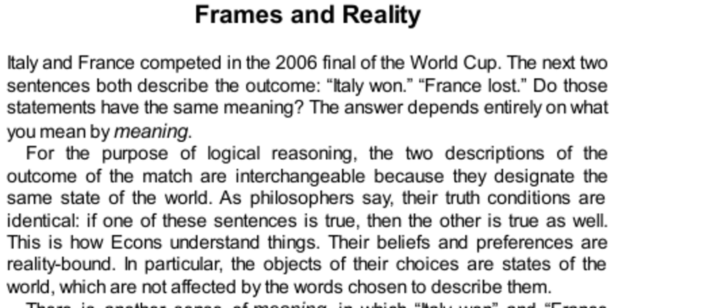

- **Frames and Reality**
  - The phrases "Italy won" and "France lost" are logically equivalent but evoke different emotional associations.
  - Logical meaning depends on identical truth conditions, while emotional meaning depends on associative reactions.
  - Emotional framing explains why humans are less reliably rational than purely logic-bound agents (Econs).
  - See [Truth Conditions (Stanford Encyclopedia of Philosophy)](https://plato.stanford.edu/entries/meaning-truth-conditions/).

- **Emotional Framing**
  - Framing effects occur when different formulations of the same problem unjustifiably influence beliefs and preferences.
  - Two logically equivalent gambles framed as "losing" versus "cost of a lottery ticket" yield different acceptance rates.
  - The amygdala activates for emotionally congruent framing; the anterior cingulate engages during conflict and self-control.
  - Rational decision-makers show frontal brain activity combining emotion and reasoning; emotional framing affects even experts.
  - Medical professionals are as susceptible to framing effects as laypeople despite training.
  - See [Neuroeconomics and Framing Effects (UCL study)](https://www.ucl.ac.uk/news/2007/mar/neuroscience-explains-why-people-vary-decision-making).

- **Empty Intuitions**
  - The "Asian disease problem" demonstrates how risk preferences reverse under positive (lives saved) versus negative (deaths) framing.
  - Framing alters moral intuitions and preferences, revealing that preferences relate to descriptions, not objective outcomes.
  - Public health officials are also vulnerable to framing effects in life-or-death decisions.
  - Thomas Schelling’s child exemption example shows framing-based contradictions in moral judgments about tax policies.
  - Moral intuitions depend on arbitrary frames rather than substantive realities.
  - See [Prospect Theory (Kahneman & Tversky)](https://doi.org/10.2307/1914185) and [Schelling's Choice and Consequence](https://www.hup.harvard.edu/catalog.php?isbn=9780674267321).

- **Good Frames**
  - Different problem framings can produce more rational decisions when they promote inclusive mental accounting.
  - The sunk-cost fallacy explains why lost tickets versus lost cash frames lead to different ticket-buying behaviors.
  - The "MPG Illusion" shows that miles per gallon (mpg) is a misleading fuel efficiency metric compared to gallons per mile.
  - Organ donation rates vary drastically due to opt-in versus opt-out default framing; defaults exploit System 2 laziness.
  - Policy implications demonstrate that framing can determine major social outcomes, undermining rational-agent assumptions.
  - See [The MPG Illusion (Larrick & Soll, Science, 2008)](https://science.sciencemag.org/content/320/5883/1591) and [Nudge (Thaler & Sunstein)](https://www.penguinrandomhouse.com/books/293184/nudge-by-richard-h-thaler-and-cass-r-sunstein/).

- **Speaking of Frames and Reality**
  - Emotional framing improves feelings by adjusting how outcomes are described, such as emphasizing money kept instead of lost.
  - Changing reference points alters perceived value, encouraging better decision-making attitudes.
  - Mental accounting guides emotional responses by categorizing losses into specific or general accounts.
  - Default options influence decisions significantly, as shown in opt-in/opt-out mailing list choices.
  - Framing effects highlight the influence of presentation rather than substance on human choices.
