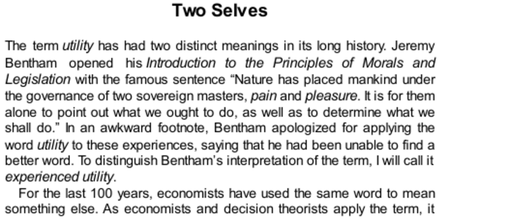

- **Two Selves**
  - **Distinct meanings of utility**
    - Jeremy Bentham defined utility as experienced pleasure and pain, termed experienced utility.
    - Economists use utility to mean "wantability," called decision utility.
    - Expected utility theory focuses on rational rules governing decision utility, ignoring hedonic experience.
    - Rational agents are assumed to want what they will enjoy and enjoy what they choose.
    - Further reading: [Expected Utility Theory](https://plato.stanford.edu/entries/rationality/#ExpectedUtilityTheory)
  - **Experienced Utility**
    - Experienced utility quantifies actual feelings of pleasure or pain over time.
    - The injections puzzle highlights that reducing two painful injections is valued differently depending on prior number but should be equally valuable.
    - Experienced utility can be measured by counting equally painful events, independent of prior occurrences.
    - Decision utility may be inconsistent with experienced utility, leading to decision-making errors.
    - Further reading: [Prospect Theory](https://en.wikipedia.org/wiki/Prospect_theory)
  - **Experience and Memory**
    - Francis Edgeworth proposed a "hedonimeter" to measure moment-to-moment pleasure or pain, integrating over time.
    - Pain profiles of colonoscopy patients showed pain varied, and duration affected total experienced pain.
    - Retrospective pain ratings follow the peak-end rule and duration neglect, ignoring total duration.
    - The peak-end average predicts memory of pain better than total pain duration does.
    - Further reading: [Peak-end rule](https://en.wikipedia.org/wiki/Peak%E2%80%93end_rule)
  - **Conflict between experienced and remembered pain**
    - Peak-end rule prioritizes peak pain and end pain, while duration neglect ignores length of pain episode.
    - Physician decisions can prioritize reducing remembered pain or actual experienced pain, which may conflict.
    - Memories influence future decisions more than actual moment-to-moment experience.
    - Duration neglect and peak-end effects reflect a cognitive illusion that influences memory-based judgments.
  - **Which Self Should Count?**
    - The cold-hand experiment tested conflicting interests of experiencing and remembering selves.
    - Participants preferred to repeat longer trials with less painful endings despite greater total pain.
    - Decision utility aligned with memories shaped by peak-end and duration neglect rather than actual experienced utility.
    - System 1 represents episodes by averages and prototypes rather than integration over time.
    - Further reading: [Cold-pressor test](https://en.wikipedia.org/wiki/Cold_pressor_test)
  - **Biology vs. Rationality**
    - Summing pain over time matches experienced utility, but decisions reflect remembered utility shaped by memory biases.
    - Rats demonstrate duration neglect for pain and pleasure, focusing on intensity rather than duration.
    - Brain stimulation studies show animals prefer intense stimulation irrespective of duration.
    - Human memory evolved to store representative moments rather than integrals of experience.
    - This discrepancy challenges rational agent models assuming consistent preferences.
  - **Speaking of Two Selves**
    - The remembering self dominates judgments about past experiences, like failed marriages or symphonies with bad endings.
    - Duration neglect leads to equal weighting of short negative peaks and longer positive experiences.
    - Memories created by the remembering self govern learning and decisions, overshadowing actual experiences.
    - Further reading: [Daniel Kahneman on Two Selves](https://www.nobelprize.org/prizes/economic-sciences/2002/kahneman/lecture/)
