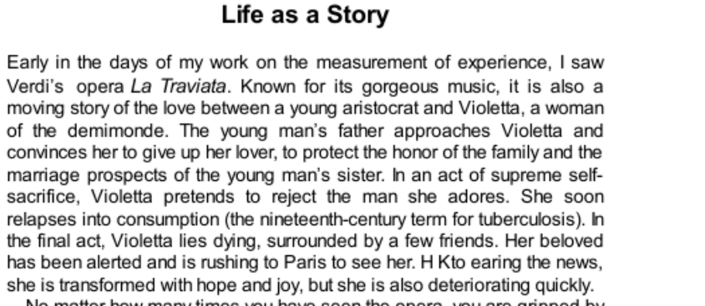

- **Life as a Story**
  - **Tension and significance in La Traviata’s ending**
    - The last 10 minutes of La Traviata captivate audiences due to the tension about the lover's arrival before Violetta's death.  
    - The emotional impact centers on significant moments, not the total duration of life lived.  
    - Duration neglect explains why the reunion's length is less important than its occurrence before the end.  
    - For related narrative theory, see [Narrative Theory and Experience](https://plato.stanford.edu/entries/narrative/).  
  - **Narrative importance in life and death**
    - People focus on meaningful story elements, such as reconciliation at death, rather than merely emotions.  
    - Stories affect how others perceive both the living and the dead, influencing emotions like pity and humiliation.  
    - Individuals care deeply about shaping their life stories to portray themselves as worthy protagonists.  
    - Additional reading on life narratives: [Life Stories and Identity](https://www.apa.org/pi/lifespan/resources/publications/identity).  
  - **Research by Ed Diener on duration neglect**
    - Experiments showed that doubling a fictitious character Jen’s life span had no effect on perceived life desirability or happiness.  
    - Adding less happy years paradoxically lowered overall happiness evaluations due to substitution of average for summed experience.  
    - Both younger and older participants exhibited these effects, demonstrating robustness across ages.  
    - For empirical studies on duration neglect, see [Duration neglect in retrospection](https://www.ncbi.nlm.nih.gov/pmc/articles/PMC2815214/).  
  - **Exceptions: labor pains and vacation benefits**
    - Duration appears to matter only because the end quality changes with length, e.g., exhaustion after long labor or resting benefits after long vacations.  
    - The key factor is the progressive change in experience and how the episode concludes.  
    - This explains apparent contradictions to duration neglect in everyday life.  
    - See [Experience and Memory in Pain](https://www.ncbi.nlm.nih.gov/pmc/articles/PMC2644909/).  

- **Amnesic Vacations**
  - **Memory versus experience in vacation choice**
    - Tourists often prioritize creating memorable stories over enjoying real-time experiences.  
    - Picture-taking serves the remembering self but may reduce enjoyment for the experiencing self.  
    - Memorability often dictates how vacations are planned and evaluated.  
    - For tourism psychology, see [Psychology of Travel and Tourism](https://www.sciencedirect.com/science/article/abs/pii/S0160738315000765).  
  - **Research on remembering self’s role in vacation decisions**
    - Intention to repeat vacations is driven entirely by the final evaluation, not average daily experience.  
    - People choose based on memory rather than the quality of the ongoing experiencing self.  
    - This mimics findings from experiments on memory and choice under duration neglect.  
    - See [Memory and Choice in Vacation Experience](https://link.springer.com/article/10.1007/s11482-012-9158-8).  
  - **Thought experiment: vacations with erased memories**
    - Eliminating memories of a vacation drastically lowers its perceived value for most people.  
    - Some still choose places where they had past pleasure but others would avoid the vacation entirely.  
    - Painful experiences may be chosen only if their memory justifies the suffering endured.  
    - Related study on memory and utility: [Memory-based Preferences](https://www.sciencedirect.com/science/article/abs/pii/S0167268111001000).  
  - **Thought experiment: painful operation with amnesia**
    - People generally show indifference to real-time suffering if they will not remember it afterward.  
    - The remembering self is identified as the true self, distancing from the experiencing self’s pain.  
    - This reveals a disjunction between current pain and retrospective evaluation.  
    - For a discussion of the remembering self and suffering, see [The Remembering Self vs. Experiencing Self](https://www.ted.com/talks/daniel_kahneman_the_riddle_of_experience_vs_memory).  

- **Speaking of Life as a Story**
  - **Narrative integrity and protective behavior**
    - Individuals attempt to preserve a coherent and honorable life story against events that threaten it.  
  - **Duration neglect in personal decisions**
    - Willingness to engage extensively in fleeting encounters exemplifies neglect of overall duration.  
  - **Conflict between memory construction and present enjoyment**
    - Overemphasis on creating memories can detract from experiencing enjoyment in the moment.  
  - **Effects of Alzheimer’s on narrative and experiencing selves**
    - Alzheimer’s patients may lose narrative coherence but retain sensitivity to pleasant sensory experiences.  
  - For narrative identity and illness, see [Narrative and Dementia](https://journals.sagepub.com/doi/10.1177/0891988711422527).
