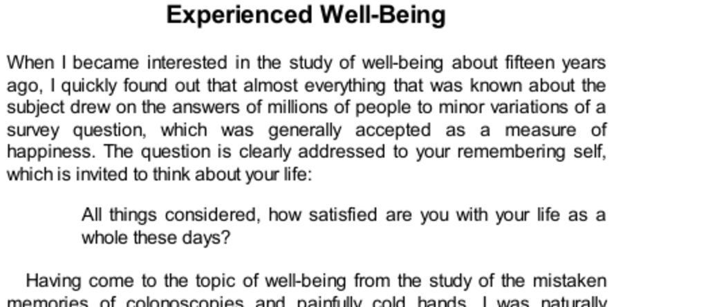

- **Introduction to Well-Being and Remembering Self**
  - The global life satisfaction question targets the remembering self, assessing overall life judgments.
  - The remembering self is shown to be an error-prone witness to actual experiential well-being.
  - The experiencing self focuses on ongoing engagement, time spent in enjoyable activities, and minimal neutral states.
  - Mihaly Csikszentmihalyi’s concept of flow exemplifies deeply engaging and enjoyable experiences.
  - Further reading: [Flow: The Psychology of Optimal Experience](https://en.wikipedia.org/wiki/Flow_(psychology))

- **Measuring Experienced Well-Being**
  - Continuous recording of experience is impractical; experience sampling via smartphone notifications was developed.
  - The Day Reconstruction Method (DRM) approximates experience sampling by reconstructing detailed episodes from the previous day.
  - Participants rate feelings on scales and identify activities and social context during each episode.
  - DRM enables duration-weighted measures of affect, correlating experience sampling with reliable retrieval of emotions.
  - Further reading: [Experience Sampling Method](https://en.wikipedia.org/wiki/Experience_sampling_method)

- **Emotional States and the U-Index**
  - Positive and negative emotions coexist, but episodes are classified as pleasant or unpleasant based on comparative ratings.
  - The U-index measures the percentage of time spent in unpleasant emotional states.
  - American women spent about 19% of waking time in unpleasant states, higher than French (16%) and Danish women (14%).
  - A minority experiences most emotional distress; half reported entire days free of unpleasant episodes.
  - Further reading: [The U-Index in Well-Being Research](https://scholar.harvard.edu/dkahneman/publications)

- **U-Index by Activities and Temporal Patterns**
  - Activity-specific U-index values reveal higher unpleasantness during commuting, work, and childcare.
  - Weekdays show higher U-indices than weekends due to less disliked activities and work stress on weekends.
  - American women found time with children less enjoyable than housework; French women spend less time but enjoy it more.
  - Cultural and structural factors (e.g., child care availability) influence experienced well-being by activity.
  - Further reading: [Time Use and Happiness](https://www.timeuse.org/)

- **Situational Influences on Momentary Mood**
  - Current mood depends more on immediate situation than global factors like job satisfaction.
  - Positive influences include socializing with coworkers; negative factors include loud noise, time pressure, and presence of a boss.
  - Attention concentration on the current activity strongly affects emotional experience.
  - Multitasking dilutes pleasure, as shown by differences between American and French women’s eating experiences.
  - Further reading: [Attention and Emotion](https://www.ncbi.nlm.nih.gov/pmc/articles/PMC2992694/)

- **Implications for Individuals and Society**
  - Individuals may improve well-being by reorganizing time to reduce commuting and increase enjoyable activities.
  - Social policies enhancing transportation, child care, and social opportunities can efficiently lower societal U-index.
  - National surveys combining time use and experienced well-being can inform effective policy design.
  - Alan Krueger contributed to incorporating experienced well-being measures into national statistics.
  - Further reading: [Well-being and Public Policy](https://www.oecd.org/statistics/measuring-well-being-and-implementing-the-oecd-better-life-initiative-9789264191655-en.htm)

- **National and Global Surveys of Experienced Well-Being**
  - Large-scale surveys in the U.S., Canada, Europe, and the Gallup World Poll now routinely measure experienced emotions.
  - Quality of daily experience strongly influenced by health and social contacts with friends and relatives.
  - Happiness is fundamentally linked to spending time with loved ones.
  - Fine-grained analyses confirm situational factors as primary determinants of moment-to-moment well-being.
  - Further reading: [Gallup World Poll](https://www.gallup.com/analytics/318875/gallup-world-poll.aspx)

- **Comparing Experienced Well-Being and Life Evaluation**
  - The Gallup Cantril Self-Anchoring Striving Scale measures evaluative life satisfaction separate from momentary experience.
  - Education raises life evaluation but not experienced well-being; it may increase stress.
  - Ill health strongly reduces experienced well-being more than life evaluation.
  - Parenthood increases daily stress and anger but has lesser impact on life satisfaction.
  - Religious participation reduces stress and increases positive affect but does not lessen depression or worry.
  - Further reading: [Subjective Well-Being](https://en.wikipedia.org/wiki/Subjective_well-being)

- **Income and Happiness**
  - Severe poverty drastically worsens experienced well-being and magnifies stress from illness, divorce, and loneliness.
  - Income beyond approximately $75,000 annually shows no increase in experienced well-being, despite enabling more pleasures.
  - Higher income correlates with higher life satisfaction but may reduce sensitivity to everyday pleasures.
  - Experimental evidence suggests that priming thoughts of wealth reduces pleasure from small experiences.
  - The distinction underscores differences between evaluative life judgments and actual lived experience.
  - Further reading: [Does Money Buy Happiness?](https://www.scientificamerican.com/article/does-money-buy-happiness/)

- **Policy and Practical Recommendations on Experienced Well-Being**
  - Policy should prioritize reducing human suffering by lowering society’s U-index.
  - Depression and extreme poverty are key targets to reduce emotional distress.
  - Individuals can increase happiness by controlling time use to focus on enjoyable activities.
  - Increasing income beyond satiation level buys more pleasurable experiences but diminishes enjoyment of simple pleasures.
  - Further reading: [Policy Implications of Well-Being Research](https://www.nber.org/papers/w23405)
