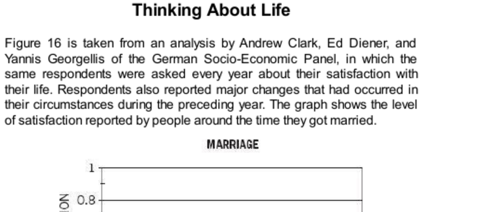

- **Thinking About Life**
  - **Life Satisfaction and Marriage**
    - Life satisfaction rises sharply around the time of marriage but declines steeply afterward.  
    - The surge in satisfaction is likely influenced by the salience of the marriage event in respondents’ minds rather than a sustained increase in happiness.  
    - Responses to global life satisfaction questions often rely on heuristics and substitutions by System 1.  
    - Marriage changes life activities with both positive and negative effects, resulting in little net change in experienced well-being.  
    - For further insight, see [Marriage and Well-being Studies](https://scholar.google.com/scholar?q=marriage+well-being).  
  - **Genetics, Goals, and Life Satisfaction**
    - Well-being is partly inherited and correlated with temperament as shown by twin studies.  
    - Life goals set in youth strongly influence later income and life satisfaction.  
    - Financial aspirations at age 18 predict actual income and satisfaction with income decades later.  
    - Difficult-to-attain goals tend to predict greater adult dissatisfaction.  
    - For more on goal setting and well-being, consult [The Power of Goals](https://www.apa.org/pubs/journals/releases/amp-a0034719.pdf).  
  - **Definition of Well-Being**
    - Well-being must incorporate both experienced feelings and the importance of personal goals.  
    - Neither an exclusive focus on experienced well-being nor only reflective satisfaction is adequate.  
    - A hybrid model of well-being considers both the “experiencing self” and the “remembering self.”  
    - For deeper understanding, review Kahneman’s work on “Two Selves” ([Kahneman, 2011](https://www.aeaweb.org/articles?id=10.1257/jep.25.1.3)).  

- **The Focusing Illusion**
  - **Heuristics and Global Life Evaluation**
    - People answer life satisfaction questions using heuristics and mental shortcuts influenced by current mood and salient events.  
    - The focusing illusion causes people to exaggerate the importance of aspects of life they are currently thinking about.  
    - Examples include mood influenced by finding a dime and dating frequency influencing happiness responses.  
    - See [Heuristics and Biases](https://en.wikipedia.org/wiki/Heuristics_in_judgment_and_decision-making) for further study.  
  - **Climate and Happiness: The California Example**
    - Despite widespread beliefs, Californians are not measurably happier than residents of colder climates.  
    - Students in California and the Midwest differ in attitudes to climate but not in life satisfaction.  
    - The mistaken belief in California’s superior happiness is traced to the focusing illusion on climate.  
    - Long-term residents rarely think about climate when evaluating their global life satisfaction.  
    - For elaboration, see [Focusing Illusion Studies](https://scholar.google.com/scholar?q=focusing+illusion).  
  - **Misestimates of Mood in Paraplegics and Lottery Winners**
    - People overestimate the proportion of time paraplegics spend in a bad mood, especially long after the accident.  
    - Those familiar with paraplegics provide more accurate estimates, reflecting observed adaptation and withdrawal of attention from the condition.  
    - Adaptation to chronic conditions involves decreased attention, except in persistent pain, noise, or severe depression.  
    - Similar patterns appear in mood judgments about lottery winners shortly and long after winning.  
    - See [Adaptation and Hedonic Treadmill](https://positivepsychology.com/hedonic-treadmill/) for background.  
  - **Miswanting and Long-Term Evaluations**
    - Miswanting describes errors due to faulty affective forecasting, often caused by the focusing illusion.  
    - People tend to overvalue initial excitement of material goods (e.g., cars) and undervalue enduring social activities.  
    - Time and attention are key factors influencing the accuracy of affective forecasts about future well-being.  
    - For more, consult [Gilbert & Wilson on Affect Forecasting](https://www.ncbi.nlm.nih.gov/pmc/articles/PMC2791912/).  

- **Time and Time Again**
  - **Representation of Episodes by the Remembering Self**
    - The remembering self evaluates episodes based on critical moments like beginnings, peaks, and ends, neglecting duration.  
    - Duration neglect distorts memories and decisions based on past experiences.  
    - Prospect theory illustrates this by focusing on transition reactions rather than sustained states.  
    - Affective forecasting and the focusing illusion similarly neglect time and adaptation.  
    - For detailed theory, see [Prospect Theory](https://www.princeton.edu/~kahneman/docs/Publications/prospect_theory.pdf).  
  - **Complexity of the Concept of Happiness**
    - Happiness is a multifaceted concept with no single definition or measurement.  
    - Scientific understanding reveals complexities that challenge simple conclusions.  
    - Both experienced well-being and reflective life evaluations are necessary to fully understand happiness.  
    - For comprehensive discussions, see [The Happiness Hypothesis](https://www.amazon.com/Happiness-Hypothesis-Finding-Modern-Ancient/dp/0465028020) by Jonathan Haidt.  

- **Speaking of Thinking About Life**
  - **Practical Illustrations of Key Psychological Concepts**
    - Buying a fancy car can be a misforecast of future happiness (error of affective forecasting).  
    - Short-term moods affect immediate satisfaction responses (e.g., bad mood affects job satisfaction reports).  
    - Questions can evoke thoughts of recent events, distorting evaluations (e.g., recent divorce).  
    - Larger houses may not increase happiness long term due to focusing illusion.  
    - Splitting time between two cities may reflect miswanting by undervaluing time costs.  
    - For practical applications, see [Behavioral Economics in Everyday Life](https://behavioraleconomics.com/resources/mini-encyclopedia-of-be/).
