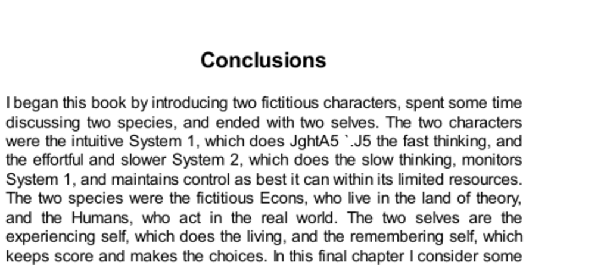

- **Conclusions**
  - **Two Selves**
    - The two selves are the experiencing self, which lives moment-to-moment, and the remembering self, which evaluates and makes choices based on memory.  
    - The remembering self displays duration neglect and follows the peak-end rule, often leading to choices that neglect the length of experiences.  
    - Duration-weighted well-being treats all moments equally, including their lasting effects and importance over time.  
    - Policy implications include medical treatment priorities and the challenge of balancing interests of the two selves.  
    - For more, see [The Paradox of Choice](https://en.wikipedia.org/wiki/The_Paradox_of_Choice) by Barry Schwartz.  
  - **Econs and Humans**
    - Econs represent perfectly rational agents with internally consistent beliefs and preferences, unlike Humans who deviate due to psychological biases.  
    - Rationality per economists is coherence, not reasonableness aligned with reality, leading to unrealistic expectations for human behavior.  
    - Behavioral economics advocates libertarian paternalism, allowing freedom while gently guiding decisions using nudges like default options.  
    - Examples include Save More Tomorrow and government units like the UK’s Nudge Unit implementing behavioral insights.  
    - More details in [Nudge: Improving Decisions about Health, Wealth, and Happiness](https://en.wikipedia.org/wiki/Nudge_(book)) by Thaler and Sunstein.  
  - **Two Systems**
    - The mind operates with two systems: System 1 (fast, automatic, intuitive) and System 2 (slow, effortful, reflective).  
    - System 1 generates most thoughts and actions, including errors and skills, while System 2 monitors and can correct but is lazy.  
    - Common biases originate from System 1 but thorough engagement of System 2 can reduce errors.  
    - Organizations improve decisions by applying systematic checks and encouraging critical review and error identification.  
    - See [Thinking, Fast and Slow](https://en.wikipedia.org/wiki/Thinking,_Fast_and_Slow) by Daniel Kahneman for extended analysis.
