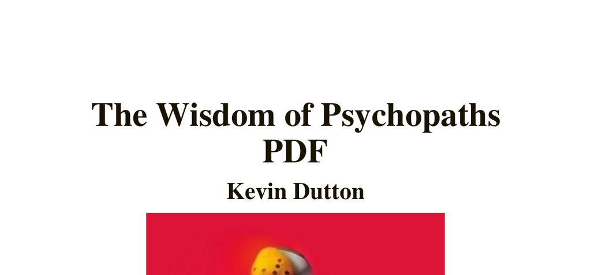

- **Chapter 1: Scorpio Rising**  
  - Explores the nature of psychopathy through the fable of the scorpion and the frog.  
  - Highlights that psychopaths can have normal brain structures but vastly different behaviors.  
  - Discusses Robert Hare’s findings on emotional word processing differences in psychopaths.  
  - Presents the concept of "psychopath radar" as an evolved human survival mechanism.  
  - Examines moral decision-making differences in psychopaths using trolley problem scenarios.  
  - Further reading: [Psychopathy Checklist-Revised (PCL-R)](https://en.wikipedia.org/wiki/Hare_Psychopathy_Checklist)  

- **Chapter 2: Will the Real Psychopath Please Stand Up?**  
  - Introduces complexities in identifying psychopathy beyond simplistic questionnaires.  
  - Explains the Big Five personality traits and their relation to psychopathic profiles.  
  - Differentiates psychopathy from Antisocial Personality Disorder focusing on emotional processing.  
  - Demonstrates a psychopathy spectrum where some individuals succeed socially without criminality.  
  - Discusses cognitive processing theories on emotional experience in psychopaths.  
  - Further reading: [Big Five Personality Traits](https://en.wikipedia.org/wiki/Big_Five_personality_traits)  

- **Chapter 3: Carpe Noctem**  
  - Details the William Brown lifeboat incident as a case study of moral and ethical dilemmas under pressure.  
  - Presents research linking higher psychopathic trait scores to more decisive, individualistic ethical decisions.  
  - Analyzes the role of groupthink in collective decision failures, contrasted with independent decision-making benefits.  
  - Highlights historical incidents, such as the Challenger disaster, illustrating the dangers of conformity.  
  - Further reading: [Groupthink](https://en.wikipedia.org/wiki/Groupthink)  

- **Chapter 4: The Wisdom of Psychopaths**  
  - Describes the author’s personal experiences with a diagnosed psychopath named Johnny to illustrate traits.  
  - Explores the Dark Triad traits (narcissism, Machiavellianism, psychopathy) correlating with social and reproductive success.  
  - Presents studies showing psychopathic traits can improve decision-making under high stress.  
  - Identifies that many business leaders exhibit moderate psychopathy traits aiding competitiveness and leadership.  
  - Discusses psychopaths’ adeptness at deception due to emotional detachment and social cue awareness.  
  - Further reading: [Dark Triad Personality Traits](https://en.wikipedia.org/wiki/Dark_triad)  

- **Chapter 5: Make Me a Psychopath**  
  - Examines rising societal psychopathy linked to youth violence, media desensitization, and cultural shifts.  
  - Contrasts historical decreases in violence with modern increases in narcissism and empathy decline ("Generation Me").  
  - Introduces "neurolaw," addressing genetic and environmental influences affecting criminal culpability.  
  - Explores psychopathy prevalence and advantages in high-pressure leadership roles.  
  - Describes an experiment using TMS to temporarily induce psychopathic traits and its moral implications.  
  - Further reading: [Neurolaw](https://en.wikipedia.org/wiki/Neurolaw)  

- **Chapter 6: The Seven Deadly Wins**  
  - Reports findings from the Great British Psychopath Survey showing CEOs and lawyers with highest psychopathy levels.  
  - Suggests psychopathy can act as a "medicine" providing resilience when moderated.  
  - Presents complex personalities of psychopaths from Broadmoor hospital, highlighting creative yet ruthless problem-solving.  
  - Demonstrates that assertiveness and ruthlessness can lead to effective solutions in difficult situations.  
  - Further reading: [Psychopathy in Leadership](https://hbr.org/2016/01/when-psychopaths-govern)  

- **Chapter 7: Supersanity**  
  - Portrays life as a thrilling adventure embracing risk, linking psychopathic traits to fearless living and evolutionary advantages.  
  - Compares psychopaths to spiritually enlightened figures like Saint Paul, showing overlaps in fearlessness and purposeful action.  
  - Discusses psychopathic focus amid emotional distractions contributing to success in sports and other high-pressure fields.  
  - Connects mindfulness concepts with psychopathic present-moment awareness and clarity.  
  - Highlights research showing psychopaths can exhibit unexpected altruism under certain contexts.  
  - Further reading: [Mindfulness](https://en.wikipedia.org/wiki/Mindfulness)
