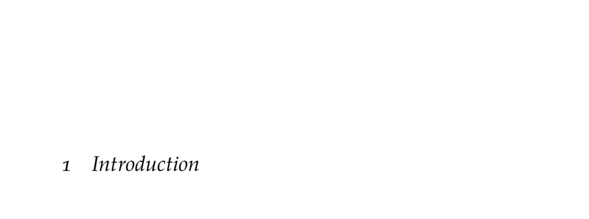

- **Introduction**
  - **Decision Making**
    - Agents act based on environment observations in an observe-act loop.
    - Uncertainty arises from outcome, model, state, and interaction sources.
    - Core focus is on agents achieving objectives under uncertainty via computational approaches.
    - [Artificial Intelligence: A Modern Approach](https://aima.cs.berkeley.edu/)
  - **Applications**
    - Applications include aircraft collision avoidance, automated driving, breast cancer screening, financial portfolio allocation, and distributed wildfire surveillance.
    - Each application involves different sources of uncertainty and decision-making challenges.
    - Examples highlight the importance of safety, prediction, and resource management.
    - Refer to Appendix F for additional examples.
  - **Methods**
    - Methods include explicit programming, supervised learning, optimization, planning, and reinforcement learning.
    - Planning uses known models; reinforcement learning learns policies without prior models.
    - Each method differs in automation level and applicability depending on problem complexity.
    - [Reinforcement Learning: An Introduction](http://incompleteideas.net/book/the-book-2nd.html)
  - **History**
    - Decision making roots trace from ancient automata myths to modern computational theories.
    - Contributions span economics (utility theory), psychology (reinforcement learning), neuroscience (neural networks), computer science (symbolic and connectionist AI), engineering (robotics), mathematics (probability theory), and operations research (optimization).
    - Foundations include works by Bentham, Turing, Koopman, and Simon.
    - [The Quest for Artificial Intelligence](https://mitpress.mit.edu/books/quest-artificial-intelligence)
  - **Societal Impact**
    - Decision algorithms contribute to energy management, biodiversity protection, medical diagnostics, urban planning, transportation, and autonomous systems.
    - Challenges include data bias, adversarial vulnerability, fairness, and legal responsibility.
    - Algorithms can be misused but also help counter misinformation.
    - [Artificial Intelligence for Social Good: A Survey](https://arxiv.org/abs/2001.01818)
  - **Overview**
    - The book is structured into five parts covering probabilistic reasoning, sequential problems, model uncertainty, state uncertainty, and multiagent systems.
    - Each part builds upon one of the four main uncertainty sources discussed.
    - Emphasis is on theory, algorithms, and applications to real-world decision making.
    - Readers are guided from single decision reasoning to complex multiagent interactions.
- **Probabilistic Reasoning**
  - Represents uncertainty with probability distributions.
  - Covers model construction, inference, and parameter/structure learning from data.
  - Introduces utility theory and maximum expected utility for rational decision making.
  - Combines utility theory with graphical models to form decision networks.
  - [Bayesian Networks and Decision Graphs](https://www.springer.com/gp/book/9781447126123)
- **Sequential Problems**
  - Addresses making a sequence of decisions in stochastic environments with known models.
  - Introduces Markov decision processes (MDPs) as the formal framework.
  - Discusses exact and approximate solution methods including offline and online algorithms.
  - Covers policy search techniques and real-world validation approaches.
  - [Markov Decision Processes: Discrete Stochastic Dynamic Programming](https://bookstore.siam.org/socdmpp/)
- **Model Uncertainty**
  - Considers learning optimal behavior when transition and reward models are unknown.
  - Focuses on reinforcement learning principles such as exploration-exploitation trade-off and delayed rewards.
  - Discusses generalization from limited experience and key reinforcement learning algorithms.
  - Addresses challenges unique to model uncertainty.
  - [Reinforcement Learning: An Introduction](http://incompleteideas.net/book/the-book-2nd.html)
- **State Uncertainty**
  - Extends to partial observability modeled by partially observable Markov decision processes (POMDPs).
  - Utilizes belief distributions over states updated via past observations and actions.
  - Presents exact and approximate solution methods for POMDPs.
  - Emphasizes reasoning under uncertainty about current environment state.
  - [POMDPs: Theory, Algorithms and Applications](https://www.springer.com/gp/book/9780387759697)
- **Multiagent Systems**
  - Introduces multiple agents making decisions, highlighting interactive environments.
  - Covers simple games, Markov games (multi-state, multi-agent), and partially observable Markov games (POMGs).
  - Discusses decentralized POMDPs emphasizing cooperative multiagent teams.
  - Explores reinforcement learning algorithms for multiagent settings amid policy uncertainties.
  - [Multiagent Systems: Algorithmic, Game-Theoretic, and Logical Foundations](https://www.cambridge.org/core/books/multiagent-systems/23F9616693CCA56A7ABE332AA1617208)
