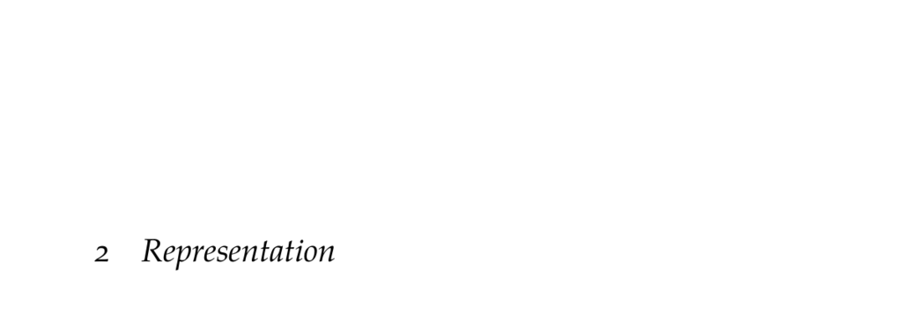

- **Representation**
  - **Degrees of Belief and Probability**
    - Uncertainty comparison uses operators indicating more, equal, or less plausibility between propositions.
    - Universal comparability and transitivity assumptions enable plausibility representation by real-valued functions.
    - Subjective probability axiomatization leads to probability values between 0 and 1.
    - For comprehensive treatment, see [Probability Theory: The Logic of Science](https://bayes.wustl.edu/etj/prob/book.pdf).
  - **Probability Distributions**
    - Discrete distributions assign probabilities to distinct values via a probability mass function summing to 1.
    - Continuous distributions use probability density functions integrating to 1; also represented by cumulative distribution functions.
    - Mixture models combine multiple probability distributions to form flexible, multimodal models.
    - See [Introduction to Probability](https://athenasc.com/probbook.html) for an introduction.
    - Gaussian, truncated Gaussian, and mixture models are elaborated with examples.
  - **Joint Distributions**
    - Joint distributions cover multiple variables and can be represented via tables or factors.
    - Number of parameters grows exponentially with variables unless independence or conditional independence reduces complexity.
    - Decision trees and factor representations can compactly encode repeated or sparse distributions.
    - For continuous variables, multivariate Gaussian and uniform distributions are common joint distributions.
  - **Conditional Distributions**
    - Conditional probability defines distributions over variables given evidence; satisfies normalization constraints.
    - Bayes’ rule relates joint and conditional probabilities.
    - Various conditional models include discrete tables, conditional Gaussians, linear Gaussians, conditional linear Gaussians, sigmoid/logit models, and deterministic variables.
  - **Bayesian Networks**
    - Bayesian networks represent joint distributions with directed acyclic graphs and conditional probability distributions per node.
    - The chain rule decomposes the joint distribution into a product of local conditional distributions.
    - Parameter savings arise from conditional independence assumptions encoded in the graph structure.
    - Practical implementation outlined with an example satellite-monitoring network.
    - See [Probabilistic Graphical Models: Principles and Techniques](https://mitpress.mit.edu/books/probabilistic-graphical-models) for more details.
  - **Conditional Independence**
    - Conditional independence generalizes independence by asserting variables are independent given evidence variables.
    - D-separation criteria determine which variables are conditionally independent given observed evidence.
    - Markov blanket defines the minimal set of nodes rendering a variable conditionally independent of all others.
    - Violations of conditional independence assumptions risk poor modeling.
    - For algorithmic details, consult [Probabilistic Graphical Models](https://mitpress.mit.edu/books/probabilistic-graphical-models).
  - **Summary**
    - Probability axioms formalize representation of uncertainty.
    - Probability distributions vary for discrete and continuous cases; mixture models increase flexibility.
    - Joint and conditional distributions allow modeling of multiple variables efficiently.
    - Bayesian networks exploit graphical structure and conditional independence assumptions to reduce parameters.
    - Conditional independence can be tested via d-separation and Markov blankets.
