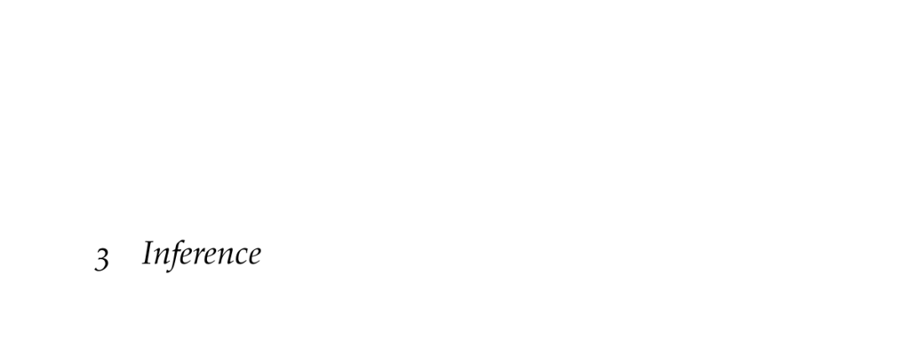

- **3 Inference**
  - Inference determines the distribution of unobserved variables given observed evidence using probabilistic representations.
  - Exact inference methods are introduced, alongside approximate inference algorithms to address computational challenges.
- **3.1 Inference in Bayesian Networks**
  - Inference computes the posterior distribution of query variables conditioned on observed evidence.
  - Exact inference uses conditional probability, marginalization, and factor operations like product, marginalization, and conditioning.
  - The factor product combines distributions over variables, marginalization sums out variables, and conditioning enforces evidence.
  - Exact inference can be computationally expensive due to factor product size.
- **3.2 Inference in Naive Bayes Models**
  - Naive Bayes models assume conditional independence of observed features given the class variable.
  - The joint distribution factorizes as a product of the class prior and conditional distributions of features.
  - Classification is often done by computing posterior class probabilities and selecting the class with highest posterior value.
- **3.3 Sum-Product Variable Elimination**
  - Variable elimination interleaves marginalizing hidden variables and applying factor products for efficient inference.
  - The method reduces computation by eliminating variables early to avoid large factors.
  - The order of variable elimination deeply affects computational efficiency and is generally NP-hard to optimize.
- **3.4 Belief Propagation**
  - Belief propagation uses message passing and the sum-product algorithm to compute marginal distributions efficiently in tree-structured networks.
  - For networks with cycles, junction tree algorithms or loopy belief propagation offer exact or approximate solutions.
  - Loopy belief propagation may lack convergence guarantees but often performs well in practice.
  - Further reading: [Factor Graphs and the Sum-Product Algorithm](https://ieeexplore.ieee.org/document/910572)
- **3.5 Computational Complexity**
  - Inference in Bayesian networks is NP-hard as shown by reduction from 3SAT problems.
  - Constructing Bayesian networks from 3SAT formulae results in inference problems with probabilistic satisfiability conditions.
  - Because exact inference is computationally demanding, approximate inference methods are necessary.
  - Complexity classes and NP-hardness are reviewed in [Artificial Intelligence, vol. 42, no. 2–3, 1990](https://doi.org/10.1016/0004-3702(90)90060-9).
- **3.6 Direct Sampling**
  - Direct sampling approximates inference by drawing samples from the joint distribution and counting those consistent with evidence.
  - Sampling uses a topological sort to sequentially sample variables conditioned on parent assignments.
  - This method may discard many samples inconsistent with observed evidence, which is inefficient.
- **3.7 Likelihood Weighted Sampling**
  - Likelihood weighted sampling generates weighted samples consistent with evidence, improving efficiency by avoiding sample rejection.
  - Weights are products of conditional probabilities at observed nodes.
  - Although it reduces discarded samples, it can still be inefficient if evidence is highly unlikely.
- **3.8 Gibbs Sampling**
  - Gibbs sampling is a Markov chain Monte Carlo method drawing unweighted samples consistent with evidence by iteratively sampling variables conditioned on their Markov blanket.
  - It generates dependent samples but converges to the exact posterior distribution in the limit.
  - Sampling requires burn-in and thinning to ensure sample quality.
  - Further reading: [Bayesian Reasoning and Machine Learning](http://web4.cs.ucl.ac.uk/staff/D.Barber/pmwiki/pmwiki.php)
- **3.9 Inference in Gaussian Models**
  - Exact inference is possible analytically for Gaussian joint distributions using matrix operations.
  - Marginal and conditional distributions of multivariate Gaussians follow closed-form equations involving mean vectors and covariance matrices.
  - Algorithmically, conditioning on evidence updates means and covariances via linear algebraic formulas.
- **3.10 Summary**
  - The chapter covers exact and approximate inference in Bayesian networks and Gaussian models.
  - Efficient exact methods include factor operations, variable elimination, and belief propagation.
  - Approximate methods discussed are direct sampling, likelihood weighted sampling, and Gibbs sampling.
  - Inference complexity drives the development of approximations and specialized analytical solutions.
- **3.11 Exercises**
  - Exercises prompt applying exact inference equations to Bayesian networks with chain rule expansions and marginalization.
  - Additional exercises cover naive Bayes classification, 3SAT Bayesian network representations, topological sorting, likelihood weighting, and Gaussian conditional inference.
  - Worked solutions highlight explicit equations, sampling weight calculations, and Gaussian parameter conditioning.
