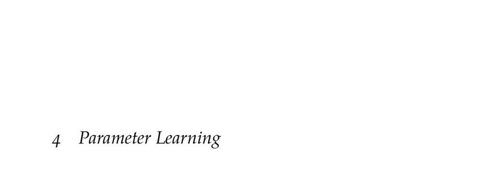

- **4 Parameter Learning**
  - **4.1 Maximum Likelihood Parameter Learning**
    - Maximizes likelihood of observing data by optimizing parameters θ of a distribution.
    - Often assumes samples are independently and identically distributed.
    - Maximizes log-likelihood for numerical stability, equivalent to maximizing likelihood.
    - Includes analytical examples for categorical and Gaussian distributions.
    - See more in [Machine Learning: A Probabilistic Perspective](https://mitpress.mit.edu/books/machine-learning-0).
  - **4.1.1 Maximum Likelihood Estimates for Categorical Distributions**
    - Covers estimation of Bernoulli and categorical distribution parameters via binomial models.
    - Maximum likelihood estimate equals ratio of observed category counts.
    - Uses logarithmic transformation and derivative setting to solve for optimal parameters.
  - **4.1.2 Maximum Likelihood Estimates for Gaussian Distributions**
    - Provides log-likelihood for mean µ and variance σ², solvable via setting derivatives to zero.
    - Maximum likelihood estimates are sample mean and variance.
    - Demonstrates fitting with example airspeed measurement data.
  - **4.1.3 Maximum Likelihood Estimates for Bayesian Networks**
    - Applies maximum likelihood to networks of discrete variables with parent-child dependencies.
    - Parameters θijk correspond to conditional probabilities given parent instantiations.
    - Counts mijk collected from data to produce parameter estimates normalized over categories.
    - Example shows practical calculation with count matrices.
  - **4.2 Bayesian Parameter Learning**
    - Addresses limitations of maximum likelihood, especially with limited data.
    - Models parameters θ as distributions updated via Bayes’ theorem using observed data.
    - Posterior distributions allow quantification of uncertainty and alternative point estimates like mode.
    - Bayesian networks representation depicts conditional independence assumptions.
  - **4.2.1 Bayesian Learning for Binary Distributions**
    - Uses Beta distributions as conjugate prior for Bernoulli parameters, facilitating analytic posteriors.
    - Posterior remains Beta distributed with updated pseudocounts.
    - Mean and mode formulas provided for Beta distribution.
    - Prior choices encode expert knowledge; uniform prior corresponds to Beta(1,1).
  - **4.2.2 Bayesian Learning for Categorical Distributions**
    - Employs Dirichlet distributions as generalization of Beta for categorical variables.
    - Dirichlet prior parameters update with observed counts to produce posterior parameters.
    - Mean and mode calculations provided for Dirichlet distributions.
    - Dirichlet pseudocounts function similarly to observed counts in Bayesian updates.
  - **4.2.3 Bayesian Learning for Bayesian Networks**
    - Extends Dirichlet priors to discrete Bayesian network parameters factorized over variables and parents.
    - Posterior parameters computed via simple addition of prior pseudocounts and data counts.
    - Algorithms presented to initialize uniform priors and calculate posterior parameters.
    - Example illustrates parameter update with add-one smoothing.
  - **4.3 Nonparametric Learning**
    - Contrasts with parametric methods by allowing parameter count to grow with data size.
    - Kernel Density Estimation (KDE) represents density as average over kernel functions centered on data.
    - Gaussian kernel commonly used; bandwidth controls smoothness.
    - Bayesian methods can assist in selecting optimal bandwidth.
  - **4.4 Learning with Missing Data**
    - Missing data complicates parameter learning; discarding incomplete instances may waste data.
    - Both maximum likelihood and Bayesian methods must marginalize over missing data.
    - Two approaches to manage missing data: imputation and iterative refinement (EM).
    - Assumes missingness at random, where missingness is independent of missing values conditional on observed data.
    - Refer to [Handbook of Missing Data Methodology](https://www.crcpress.com/Handbook-of-Missing-Data-Methodology/Molenberghs-Fitzmaurice-Kenward-Tsiatis-Verbecke/p/book/9781439815129).
  - **4.4.1 Data Imputation**
    - Imputes missing values by maximizing posterior probability of missing data given observed data.
    - Simple marginal mode imputation replaces missing values with most common observed category or distribution mode.
    - Nearest neighbor imputation uses closest observed instance for imputing missing entries.
    - Imputation using joint probabilistic models provides better estimates via inference or sampling.
    - Illustrated with continuous and discrete variable examples.
  - **4.4.2 Expectation-Maximization**
    - Iterative procedure to update parameter estimates with missing data by alternating expectation and maximization steps.
    - E-step uses current model to infer missing values (or distributions over them).
    - M-step maximizes likelihood using completed data or weighted data.
    - Used for latent variable models like Gaussian mixture models.
    - Not guaranteed to find global optimum; restarts from multiple initial parameters recommended.
    - EM first described in [Dempster et al., 1977](https://www.jstor.org/stable/2984875).
  - **4.5 Summary**
    - Parameter learning infers model parameters from data using maximum likelihood or Bayesian methods.
    - Beta and Dirichlet distributions facilitate Bayesian updates for binary and categorical data.
    - Nonparametric learning adapts model complexity with data quantity.
    - Missing data addressed through imputation and expectation-maximization methods.
  - **4.6 Exercises**
    - Exercise 4.1 derives maximum likelihood estimates for Laplace distribution parameters.
    - Exercise 4.2 computes maximum likelihood parameters of a Bayesian network from data.
    - Exercise 4.3 compares maximum likelihood and Bayesian estimates for a Bernoulli parameter after a single trial.
    - Exercise 4.4 contrasts marginal mode and nearest-neighbor imputation on data with missing values.
    - Exercise 4.5 performs Gaussian posterior mode and sampling imputations for missing values.
