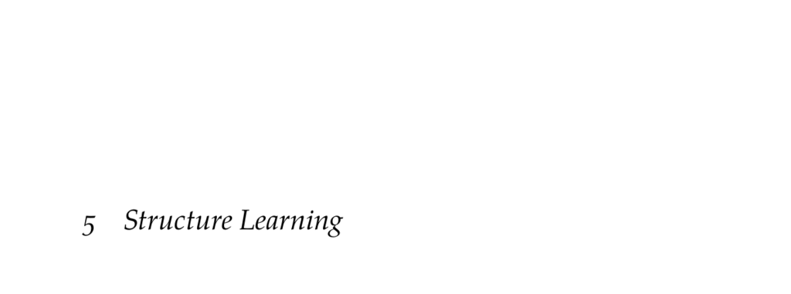

- **5 Structure Learning**
  - **5.1 Bayesian Network Scoring**
    - Computes the Bayesian network score based on posterior probability P(G | D).
    - The Bayesian score balances model complexity with available data.
    - Maximizing the Bayesian score is NP-hard due to the combinatorial explosion of graph structures.
    - [Probabilistic Graphical Models by Koller and Friedman](https://mitpress.mit.edu/books/probabilistic-graphical-models)
  - **5.2 Directed Graph Search**
    - Explores the search space of directed acyclic graphs (DAGs) to find maximum scoring networks.
    - Common methods include K2 algorithm and local search (hill climbing) with variations like simulated annealing and genetic algorithms.
    - The number of DAGs grows superexponentially, making enumeration impossible for many nodes.
    - [Learning Bayesian Networks is NP-Complete, Chickering (1996)](https://ftp.cs.ucla.edu/pub/stat_ser/r511.pdf)
  - **5.3 Markov Equivalence Classes**
    - Defines when two Bayesian networks encode the same conditional independence assumptions.
    - Two DAGs are Markov equivalent if they share the same undirected edges and immoral v-structures.
    - Bayesian scores with BDe priors assign equal scores to Markov equivalent networks.
    - [Learning Bayesian Networks: The Combination of Knowledge and Statistical Data](https://www.jmlr.org/papers/volume2/heckerman95/heckerman95.pdf)
  - **5.4 Partially Directed Graph Search**
    - Uses partially directed graphs (essential graphs) to represent Markov equivalence classes.
    - Search operates in equivalence class space rather than DAG space to avoid local optima caused by equivalent structures.
    - Local graph operations include adding/removing edges, reversing edges, and creating immoral v-structures.
    - [Learning Equivalence Classes of Bayesian-Network Structures, Chickering (2002)](http://jmlr.org/papers/volume2/chickering02a/chickering02a.pdf)
  - **5.5 Summary**
    - Bayesian network structure learning involves maximizing the Bayesian score.
    - Model complexity is balanced based on the data quantity.
    - The structure search problem is NP-hard and superexponentially large.
    - Search methods like K2 and local search are efficient but not guaranteed globally optimal.
  - **5.6 Exercises**
    - Exercises explore graph neighborhood sizes, local search iteration counts, and Markov equivalence representations.
    - Solutions provide analytical reasoning about graph operations and equivalence classes.
    - Illustrates practical aspects of structure learning and search space complexity.
