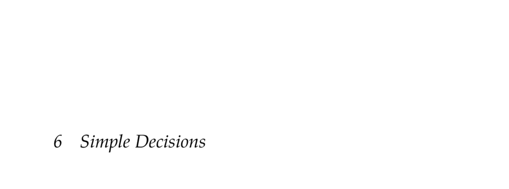

- **6 Simple Decisions**
  - **6.1 Constraints on Rational Preferences**
    - Rational preferences are modeled using completeness, transitivity, continuity, and independence constraints.
    - Preferences are represented by operators indicating preference, indifference, or weak preference.
    - These constraints underpin the existence of a utility function representing rational preferences.
    - The von Neumann-Morgenstern axioms formalize these constraints and are foundational to decision theory.
    - For background, see Schoemaker’s overview [The Expected Utility Model: Its Variants, Purposes, Evidence and Limitations](https://www.jstor.org/stable/2723964).
  - **6.2 Utility Functions**
    - Utility functions assign real values to outcomes reflecting preferences and obey an affine transformation equivalence.
    - The utility of a lottery is the expected utility computed as a weighted sum over outcomes.
    - Example contexts include collision avoidance systems where utilities are assigned to combined alert and collision outcomes.
    - Utility normalization scales utilities so that best and worst outcomes have utilities 1 and 0, respectively.
    - Daniel Bernoulli introduced expected utility theory; see his foundational work [Exposition of a New Theory on the Measurement of Risk](https://www.jstor.org/stable/1909860).
  - **6.3 Utility Elicitation**
    - Utility elicitation infers utility functions from experts by fixing worst and best outcomes and finding indifferent lotteries.
    - Monetary value alone does not linearly represent utility; expected utility theory accounts for risk attitudes.
    - Risk attitudes are categorized as risk neutral, risk seeking (convex utility), or risk averse (concave utility).
    - Common utility functions include exponential, power, and logarithmic utilities to model diminishing marginal utility.
    - See Farquhar’s survey for utility elicitation methods: [Utility Assessment Methods](https://www.jstor.org/stable/2630340).
  - **6.4 Maximum Expected Utility Principle**
    - Rational actions maximize expected utility given probabilistic state models and utility functions.
    - Expected utility is computed as a sum over possible states weighted by conditional probabilities given actions and observations.
    - The maximum expected utility principle guides rational agent decision making.
    - See Peterson’s introductory textbook for theory details [An Introduction to Decision Theory](https://doi.org/10.1017/CBO9780511801861).
  - **6.5 Decision Networks**
    - Decision networks extend Bayesian networks by including decision and utility nodes to represent decision problems compactly.
    - Nodes are classified as chance (random variables), decision (actions), and utility (outcome values); edges denote conditional, informational, or functional dependencies.
    - Solving for optimal decisions involves iterating over possible decision assignments and evaluating expected utility via inference.
    - Techniques including node pruning improve evaluation efficiency.
    - Jensen and Nielsen’s book covers decision networks in depth: [Bayesian Networks and Decision Graphs](https://doi.org/10.1007/978-0-387-68282-2).
  - **6.6 Value of Information**
    - Value of information measures the expected increase in utility from observing additional variables.
    - It quantifies the benefit of obtaining new observations before making decisions.
    - The value of information is never negative and accounts for how observations affect optimal decisions.
    - When observations have costs, those should be considered against the expected information gain.
    - Howard’s seminal work provides foundational theory: [Information Value Theory](https://ieeexplore.ieee.org/document/4082648).
  - **6.7 Irrationality**
    - Human decision making often violates rationality axioms underlying utility theory.
    - Certainty and framing effects cause inconsistencies in preferences, illustrated by classic experiments from Tversky and Kahneman.
    - Prospect theory models these deviations more accurately than expected utility theory.
    - Decision support systems must carefully elicit utility functions given these human biases.
    - For more, see Kahneman and Tversky’s original paper [Prospect Theory: An Analysis of Decision Under Risk](https://doi.org/10.2307/1914185).
  - **6.8 Summary**
    - Rational decision making combines probabilistic beliefs with utility preferences to maximize expected utility.
    - Decision networks enable representation and solution of decision problems with uncertainties and utilities.
    - Value of information guides observation and decision processes by quantifying the utility gain of data.
    - Despite normative models, humans do not always behave rationally, leading to practical challenges.
  - **6.9 Exercises**
    - Exercises cover utility normalization, lottery indifference probability calculations, affine transformations, risk aversion proofs, expected utility calculations, and value of information computations.
    - They reinforce theoretical concepts with applied decision scenarios including umbrella usage and puppy feeding.
    - Solutions provide step-by-step computations and reasoning for utility and decision analysis.
