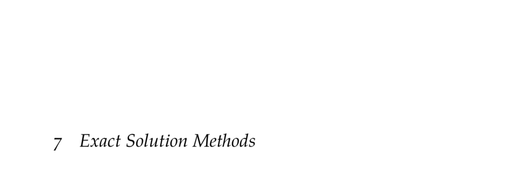

- **7 Exact Solution Methods**
  - Introduces Markov decision processes (MDPs) for sequential decision problems with uncertain effects.
  - Covers model specification of stochastic dynamics and utility of system evolution.
  - Discusses assumptions for exact solutions and previews approximation methods.
  - References foundational works by R. E. Bellman and M. L. Puterman for further study.

- **7.1 Markov Decision Processes**
  - Defines MDPs with states, actions, rewards, and the Markov assumption.
  - Explains stationary MDPs with time-invariant transition and reward functions.
  - Describes representation via decision networks and dynamic decision diagrams.
  - Includes an aircraft collision avoidance example framed as an MDP.
  - Introduces discount factor and average reward formulations for infinite horizon problems.
  - Specifies policies, including deterministic and stationary policies.
  - References dynamic programming as a technique for finding optimal policies.
  - For comprehensive treatment, see [Puterman, Markov Decision Processes (2005)](https://www.wiley.com/en-us/Markov+Decision+Processes%3A+Discrete+Stochastic+Dynamic+Programming-p-9780471727828).

- **7.2 Policy Evaluation**
  - Describes computing value function Uπ for a given policy π.
  - Presents iterative policy evaluation via lookahead updates.
  - States convergence to exact value function under sufficient iterations.
  - Provides matrix form solution using linear equations for exact evaluation.
  - Highlights computational complexity and implementation details.
  - Further reading: [Policy Evaluation in MDPs](https://web.stanford.edu/class/cs234/).

- **7.3 Value Function Policies**
  - Explains extracting a greedy policy from a given value function.
  - Defines action value function Q(s,a) and advantage function A(s,a).
  - Notes storage tradeoffs between U and Q representations.
  - Summarizes policy extraction via maximizing lookahead over actions.
  - See [Sutton & Barto, Reinforcement Learning](http://incompleteideas.net/book/the-book.html) for more.

- **7.4 Policy Iteration**
  - Iteratively alternates between policy evaluation and policy improvement.
  - Guarantees convergence to an optimal policy in finite iterations.
  - Demonstrates policy iteration progression via hex world example.
  - Notes modified policy iteration approximates evaluation to save computation.
  - Reference: Puterman (2005) for policy iteration algorithms.

- **7.5 Value Iteration**
  - Directly iterates on the value function using Bellman backups.
  - Starts with any bounded value function and applies max over actions.
  - Proves convergence to unique optimal value function.
  - Introduces termination criteria using Bellman residual bounds.
  - Explains impact of discount factor on convergence speed.
  - Example 7.2 illustrates discount factor effects.
  - Further reading: Bellman (1957) Dynamic Programming.

- **7.6 Asynchronous Value Iteration**
  - Updates only a subset of states per iteration for computational efficiency.
  - Gauss-Seidel variant updates states sequentially in place.
  - Convergence guaranteed if all states updated infinitely often.
  - State update ordering critically affects convergence rate.
  - See Example 7.3 for ordering impact.
  - Refer to [Bertsekas, Dynamic Programming and Optimal Control](http://web.mit.edu/dimitrib/www/dpchapter.html).

- **7.7 Linear Program Formulation**
  - Formulates MDP optimal policy problem as a linear program.
  - Minimizes sum of state utilities subject to Bellman inequality constraints.
  - Converts max constraints into multiple linear inequalities.
  - Solves polynomial time problem with standard LP solvers.
  - Highlights practical efficiency of value iteration despite LP approach.
  - For background, see [Vanderbei, Linear Programming (2014)](https://link.springer.com/book/10.1007/978-1-4614-7636-8).

- **7.8 Linear Systems with Quadratic Reward**
  - Extends exact solution methods to continuous state/action MDPs with linear dynamics.
  - Defines linear dynamics via matrices Ts and Ta plus Gaussian disturbance.
  - Specifies quadratic reward functions with negative (semi)definite matrices Rs and Ra.
  - Solves Linear–Quadratic Regulator (LQR) problem analytically via Riccati recursion.
  - Presents closed-form solution for optimal policies over finite horizons.
  - See [Bertsekas, Dynamic Programming and Optimal Control Volume I](http://web.mit.edu/dimitrib/www/dpchapter.html) for detailed coverage.
  - Example 7.4 demonstrates finite-horizon LQR policy computation.

- **7.9 Summary**
  - Reinforces that finite MDPs with bounded rewards are exactly solvable by dynamic programming.
  - Reviews policy evaluation, policy iteration, and value iteration methods.
  - Notes linear programming and continuous linear–quadratic formulations as alternative approaches.

- **7.10 Exercises**
  - Contains theoretical and practical exercises on discounted returns, policy evaluation complexity, value iteration convergence, policy extraction, linear–quadratic problems, and more.
  - Exercises provide proofs, complexity analyses, and application examples.
  - Encourages direct engagement with core concepts introduced in the chapter.
  - Solutions provide stepwise reasoning and use supporting mathematical properties.
