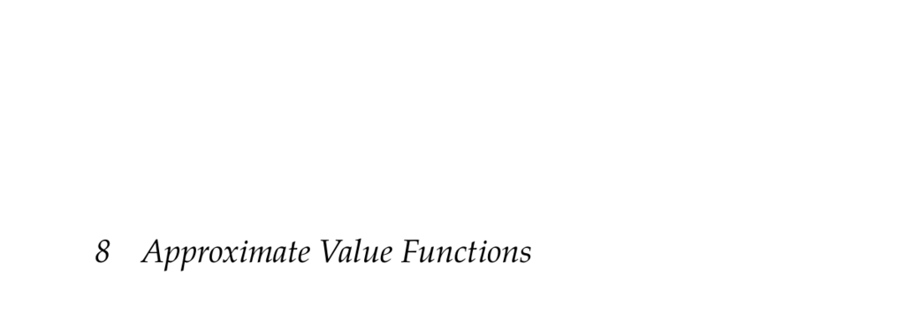

- **Approximate Value Functions**
  - **Parametric Representations**
    - Value functions are represented parametrically as \(U_{\theta}(s)\) with parameter vector \(\theta\).
    - Actions can be extracted by maximizing expected returns computed via Bellman backups or by approximating the Q-function \(Q_{\theta}(s, a)\).
    - Approximations involve selecting a finite set of states \(S\), using grids or biased sampling towards important states.
    - An iterative algorithm alternates between dynamic programming backups at \(S\) and fitting the parametric value function.
    - For further study: W. B. Powell, *Approximate Dynamic Programming: Solving the Curses of Dimensionality*.
  - **Nearest Neighbor**
    - Uses the value of the nearest or k-nearest states in \(S\) to approximate \(U_{\theta}(s)\).
    - Requires a distance metric \(d(s, s')\); uses weighted averages of neighbor values to construct piecewise constant approximations.
    - Computation can be accelerated with data structures like kd-trees.
    - Nearest neighbor approximations result in locally piecewise constant value functions.
  - **Kernel Smoothing**
    - Employs a kernel function \(k(s, s')\) to weight utilities of states in \(S\), producing smooth approximations.
    - Common kernels include inverse distance and Gaussian kernels with smoothing parameter \(\sigma\).
    - Kernel smoothing provides smoothness absent in nearest neighbor methods.
    - It has been applied to discrete and continuous problems, e.g., hex world and mountain car.
  - **Linear Interpolation**
    - Extends one-dimensional linear interpolation to multidimensional grids via bilinear or multilinear interpolation.
    - Interpolation weights vertices proportionally to the distance or area opposing the sample point.
    - Requires utilities at \(2^d\) vertices for \(d\)-dimensional interpolation.
    - Algorithmic implementations handle interpolation efficiently on structured grids.
  - **Simplex Interpolation**
    - Decomposes grid cells into \(d!\) simplexes to reduce interpolation complexity from \(2^d\) points to \(d+1\) points.
    - Uses Coxeter-Freudenthal-Kuhn triangulation to maintain continuity across simplex boundaries.
    - Weights are computed by sorting coordinates and expressing the state as a convex combination of simplex vertices.
    - Provides computational efficiency and continuity advantages in high-dimensional interpolation.
  - **Linear Regression**
    - Represents \(U_{\theta}(s)\) or \(Q_{\theta}(s, a)\) as linear combinations of nonlinear basis functions \(\beta(s)\) or \(\beta(s, a)\).
    - Fitting involves minimizing squared error over states in \(S\) using matrix operations involving the Moore-Penrose pseudoinverse.
    - Increasing basis function complexity improves fit but risks poor generalization.
    - Examples include polynomial and sinusoidal basis functions; see also [*The Elements of Statistical Learning*](https://web.stanford.edu/~hastie/ElemStatLearn/).
  - **Neural Network Regression**
    - Uses neural networks to approximate value functions without explicit basis functions.
    - The network input is the state vector; output is the scalar utility estimate.
    - Training requires minimizing prediction error via optimization methods such as gradient descent.
    - Backpropagation efficiently computes gradients for parameter updates.
    - See appendix D for a review of neural networks.
  - **Summary**
    - Approximate value functions enable handling large or continuous state spaces in dynamic programming.
    - Local approximations use values from nearby states; global approximations use parameterized models that decouple parameters from sampled states.
    - Techniques include nearest neighbor, kernel smoothing, linear and simplex interpolation (local), and linear or neural network regression (global).
    - Nonlinear value functions can be represented using linear regression with nonlinear basis or via neural networks.
    - Neural network regression avoids manual basis function design but requires more complex fitting algorithms.
