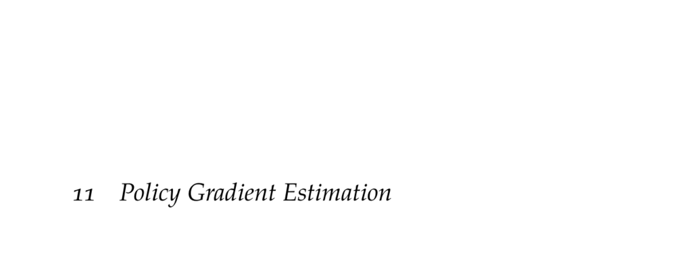

- **Policy Gradient Estimation**
  - **Finite Difference**
    - Finite difference methods estimate gradients by evaluating small changes in function values.
    - The gradient of a multivariate function is approximated by perturbing each parameter independently.
    - In policy optimization, rollout simulations estimate utilities for perturbed policies.
    - High variance arises due to stochastic trajectories; shared random seeds can reduce variance bias.
    - [PEGASUS Algorithm](https://papers.nips.cc/paper/2000/file/b5229d0daf8c90fefd7b40e630a73518-Paper.pdf) is an example that uses random seed sharing.
  - **Regression Gradient**
    - Gradient estimation uses linear regression on random parameter perturbations and corresponding utility differences.
    - More perturbations generally improve gradient estimates; a rule of thumb is twice the number of parameters.
    - Perturbations are sampled uniformly on a hypersphere scaled by a chosen step size.
    - The method is illustrated on a noisy quadratic function demonstrating effective gradient approximation.
    - See section 8.6 for linear regression fundamentals.
  - **Likelihood Ratio**
    - The likelihood ratio trick expresses the gradient of expected utility as an expectation involving the gradient of log policy likelihood.
    - The gradient of trajectory likelihood decomposes into the sum of gradients of log policy at each time step.
    - This method requires only the gradient of the policy distribution, avoiding explicit differentiation of environment dynamics.
    - The approach extends to stochastic policies; deterministic policies require knowledge of transition probabilities.
    - [Likelihood Ratio Method Paper (Williams, 1992)](https://link.springer.com/article/10.1007/BF00992696) provides foundational background.
  - **Reward-to-Go**
    - Reward-to-go replaces total return with the sum of discounted future rewards from each time step, reducing variance.
    - This removes causality-violating terms where future rewards incorrectly influence earlier policy gradient components.
    - The reward-to-go corresponds to the state-action value function Q, linking policy gradient to value functions.
    - Implementations average gradient estimates over multiple rollouts, using future rewards only.
    - Related concepts: state-action value functions and policy evaluation.
  - **Baseline Subtraction**
    - Subtracting a baseline function from reward-to-go reduces variance without biasing the gradient estimate.
    - The baseline is often state-dependent but can be chosen as a constant scalar minimizing variance.
    - Variance-minimizing baselines involve expectations of squared gradient terms and reward-to-go products.
    - Advantage functions (difference between Q and state-value functions) arise naturally from baseline subtraction.
    - Reference for baseline methods: [Peters and Schaal, 2008](https://www.sciencedirect.com/science/article/abs/pii/S0893608007001829).
- **Summary**
  - Finite differences and linear regression provide numerical gradient estimations but suffer from variance and scale sensitivity.
  - The policy gradient theorem yields analytical gradients via the likelihood ratio trick, improving efficiency.
  - Reward-to-go and baseline subtraction techniques significantly reduce variance in gradient estimation.
  - The advantage function encapsulates the concept of baseline-subtracted returns, enhancing policy gradient methods.
