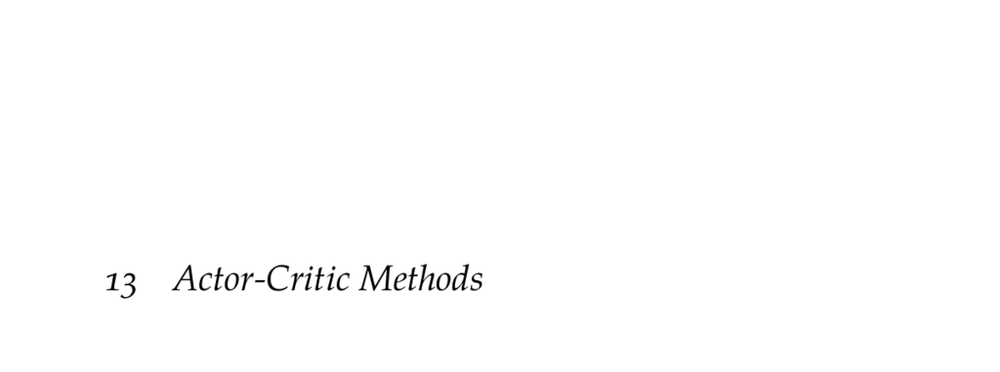

- **13 Actor-Critic Methods**
  - **13.1 Actor-Critic**
    - Actor-critic methods involve an actor represented by a policy πθ parameterized by θ and a critic providing value function estimates Uφ, Qφ, or Aφ parameterized by φ.  
    - The policy gradient is estimated using the advantage function and updated via gradient ascent, while the critic is optimized by minimizing squared temporal difference residual loss.  
    - Rollout trajectories are used to empirically estimate gradients for both the actor and critic.  
    - Actor and critic updates can be unstable due to interdependency; frequent policy updates may improve stability.  
  - **13.2 Generalized Advantage Estimation**
    - Generalized advantage estimation (GAE) balances bias and variance by exponentially weighting temporal difference residuals across multiple time steps with a λ parameter.  
    - GAE interpolates between low-variance biased TD residuals (λ=0) and high-variance unbiased full rollouts (λ=1).  
    - The advantage estimate accumulates discounted temporal difference residuals and has been shown to improve policy and value function convergence.  
    - Original GAE presentation and implementation details can be found in [Schulman et al. (2016) ICLR paper](https://arxiv.org/abs/1506.02438).  
  - **13.3 Deterministic Policy Gradient**
    - Deterministic policy gradients optimize a deterministic policy πθ(s) for continuous actions using a critic Qφ(s,a) to estimate action values.  
    - The critic is trained by minimizing the squared Bellman residual, while the actor is updated using the gradient of Qφ with respect to the policy parameters via the chain rule.  
    - Exploration is introduced by adding zero-mean Gaussian noise to deterministic actions, balancing exploration and exploitation.  
    - Stabilization techniques like experience replay and target networks are beneficial for training.  
    - The foundational work is detailed in [Silver et al. (2014) ICML paper](https://proceedings.mlr.press/v32/silver14.html).  
  - **13.4 Actor-Critic with Monte Carlo Tree Search**
    - This method integrates online planning using Monte Carlo tree search (MCTS) with actor-critic learning for discrete action spaces.  
    - MCTS uses the parameterized policy πθ (a|s) for exploration via an upper confidence bound and constructs an improved policy π_MCTS based on visit counts.  
    - The policy πθ is trained to match π_MCTS via cross entropy loss, while the value function Uφ is fit to the max action value computed by MCTS.  
    - Tree search statistics provide more informed targets for policy and value function updates, improving sample efficiency.  
    - This approach parallels the AlphaGo Zero algorithm as described by [Silver et al. (2017) Nature](https://www.nature.com/articles/nature24270).  
  - **13.5 Summary**
    - Actor-critic methods combine policy optimization with value function estimation using gradient-based updates for both components.  
    - Basic actor-critic uses TD residuals for critic learning; generalized advantage estimation improves variance-bias trade-off.  
    - Deterministic policy gradients enable continuous action optimization with deterministic policies and action-value critics.  
    - Online planning via MCTS can enhance actor-critic learning through improved policy and value estimation.  
  - **13.6 Exercises**
    - Exercises test understanding of actor-critic with MCTS suitability for continuous problems like cart-pole.  
    - Advantage function expressions are analyzed to identify correct forms and interpretations.  
    - The trade-offs between TD residuals and rollout sequences in estimating advantages are discussed.  
    - Gradient calculations for deterministic policy gradients are exemplified using a parameterized Q function.
