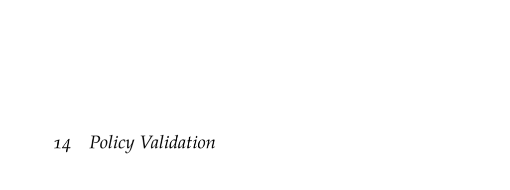

- **Policy Validation**
  - **Performance Metric Evaluation**
    - Defines performance metrics as expectations of trajectory-based functions in Markov decision processes (MDPs).
    - Demonstrates policy evaluation through value functions computed over states to assess metrics like collision probability.
    - Emphasizes accuracy challenges in continuous or large state spaces, often requiring sampling.
    - References policy evaluation algorithms from earlier chapters and risk measures from [A. Ruszczyński, 2010](https://doi.org/10.1007/s10107-010-0366-2).
  - **Rare Event Simulation**
    - Addresses difficulty in estimating rare event probabilities like collisions due to sample inefficiency.
    - Introduces importance sampling as a technique to improve estimator efficiency by sampling from biased proposal distributions.
    - Highlights the optimal proposal distribution depends on the value of the trajectory metric, though often impractical to compute exactly.
    - Includes a tutorial on constructing proposal distributions and compares direct sampling to importance sampling performance.
    - Further reading: [J. A. Bucklew, Introduction to Rare Event Simulation, 2004](https://link.springer.com/book/10.1007/978-0-387-21637-3).
  - **Robustness Analysis**
    - Focuses on evaluating policy sensitivity to discrepancies between planning and real-world models.
    - Suggests stress testing by applying policies on a range of perturbed evaluation models to ensure performance robustness.
    - Recommends using simpler planning models and more complex evaluation models for increased robustness.
    - Discusses robust dynamic programming, which optimizes policies for a set of transition and reward models.
    - Cites G. N. Iyengar's work on robust dynamic programming for formal methods.
  - **Trade Analysis**
    - Explains the examination of competing objectives, such as safety versus operational efficiency.
    - Uses Pareto curves to identify policies that are non-dominated across multiple metrics.
    - Demonstrates how varying policy parameters influences tradeoffs and helps to optimize for acceptable balances.
    - Defines and illustrates Pareto optimality including reference to Vilfredo Pareto.
  - **Adversarial Analysis**
    - Frames policy validation as a game against an adversary choosing worst-case state transitions.
    - Defines adversarial reward combining negative original reward and log-likelihood of state transitions weighted by parameter λ.
    - Converts original MDP into an adversarial MDP with state space equal to the original and action space as the state space.
    - Identifies methods to find most likely failure trajectories, including temporal logic for specifying complex failure conditions.
    - Lists actionable steps after identifying failures, such as changing action spaces, adjusting rewards, or improving solvers.
    - References adaptive stress testing methods in airborne collision avoidance systems.
  - **Summary**
    - Recaps techniques for evaluating policies via dynamic programming or sampling.
    - Highlights confidence measurements including standard error, confidence intervals, and Bayesian approaches.
    - Notes importance sampling's role in efficient rare event probability estimation.
    - Emphasizes the importance of analyzing model uncertainty and robustness.
    - Summarizes trade and adversarial analyses to inform decisions on policy deployment.
