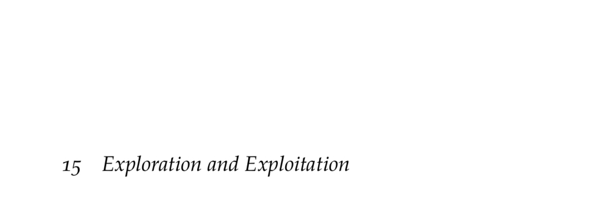

- **Exploration and Exploitation**
  - The exploration-exploitation tradeoff balances exploring the environment with exploiting known knowledge.  
  - Pure exploration builds a comprehensive model but sacrifices reward accumulation.  
  - Pure exploitation continually chooses the currently best action but risks missing better actions.  
  - The chapter introduces challenges via a single-state problem and extends to MDPs with multiple states.  
  - A comprehensive review is available in [Reinforcement Learning: State of the Art](https://link.springer.com/book/10.1007/978-3-642-27645-3).

- **Bandit Problems**
  - Bandit problems model slot machines with multiple independent arms each having an unknown reward probability.  
  - The binary or Bernoulli bandit assumes each arm pays off 1 with probability θ and 0 otherwise.  
  - Bandit problems can be framed as single-state MDPs with multiple actions and probabilistic rewards.  
  - Historical context highlights the difficulty in solving bandit problems during WWII.  
  - See [“Bandit Processes and Dynamic Allocation Indices”](https://www.jstor.org/stable/2984889) for foundational theory.

- **Bayesian Model Estimation**
  - Beta distributions model beliefs over win probabilities for each arm using counts of wins and losses.  
  - With a uniform Beta(1, 1) prior, posteriors update to Beta(w + 1, l + 1) after observations.  
  - The posterior expected win probability is computed analytically using the beta distribution.  
  - Greedy actions maximize expected reward but may miss better options, motivating further exploration.  
  - For more on beta distributions in Bayesian inference, see [Bayesian Data Analysis](https://www.stat.columbia.edu/~gelman/book/).

- **Undirected Exploration Strategies**
  - Undirected exploration chooses non-greedy actions without using past outcome information.  
  - The e-greedy strategy selects a random action with probability e and the greedy action otherwise.  
  - Decaying e over time can reduce exploration as uncertainty decreases.  
  - The explore-then-commit strategy explores uniformly for k steps then commits to greedy actions.  
  - These methods are simple but do not adapt exploration based on accumulating evidence.

- **Directed Exploration Strategies**
  - Directed strategies leverage past information to guide exploration toward promising actions.  
  - Softmax exploration selects actions probabilistically based on exponentiated expected rewards weighted by precision λ.  
  - Quantile exploration chooses the arm with the highest α-quantile of payoff distribution to encourage optimism.  
  - UCB1 exploration balances exploitation with an exploration bonus derived from confidence intervals.  
  - Posterior sampling (Thompson sampling) probabilistically selects actions by sampling from their posteriors.  
  - See [A Tutorial on Thompson Sampling](https://arxiv.org/abs/1707.02038) for detailed coverage.

- **Optimal Exploration Strategies**
  - The optimal policy is computed via dynamic programming over the belief-state space of wins and losses counts.  
  - The Q* value represents expected payoff after taking an action and then acting optimally thereafter.  
  - The recursion updates values based on posterior win probabilities from Beta distributions.  
  - The size of the belief state space grows as O(h^{2n}) making computation expensive for large horizons.  
  - The Gittins allocation index provides an efficient solution for infinite-horizon discounted problems.  
  - Refer to [Multi-Armed Bandit Allocation Indices](https://onlinelibrary.wiley.com/doi/book/10.1002/9781118785200) for advanced techniques.

- **Exploration with Multiple States**
  - In reinforcement learning with multiple states, actions influence stochastic state transitions and rewards.  
  - The simulation loop generalizes bandit sampling to include state transitions, updating models with new state-action-reward observations.  
  - Exploration strategies must use transition observations to inform action selections.  
  - The overall structure of the simulation loop remains consistent across problem formulations.

- **Summary**
  - The core tradeoff in reinforcement learning is balancing exploration of unknown actions with exploitation of known rewards.  
  - Multi-armed bandits are single-state problems with probabilistic rewards used to study this tradeoff.  
  - Beta distributions provide a principled Bayesian way to maintain uncertainty over arm reward probabilities.  
  - Undirected strategies like e-greedy do not adapt exploration to observed data, whereas directed strategies use prior outcomes to better balance exploration and exploitation.  
  - Optimal strategies computed via dynamic programming are often intractable, motivating efficient approximations and indices.

- **Exercises**
  - Exercise 15.1 compares e-greedy, decayed e-greedy, and explore-then-commit strategies, noting parameter effects on performance over different horizons.  
  - Exercise 15.2 compares softmax, quantile, and UCB1 exploration strategies and analyzes how parameters like λ, α, and c affect expected rewards.  
  - Exercise 15.3 requests a real-world example of a multi-armed bandit problem such as article placement for click maximization.  
  - Exercises 15.4–15.9 involve computations and proofs related to posteriors, action selection probabilities, updated Q-values, and state space size complexity.  
  - Solutions include analytical computations and references to foundational papers like [Finite-Time Analysis of the Multiarmed Bandit Problem](https://link.springer.com/article/10.1023/A:1013689704352).
