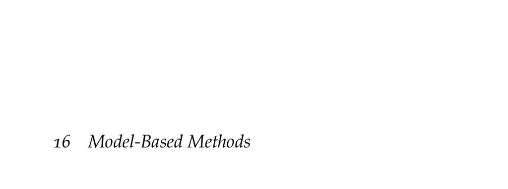

- **16 Model-Based Methods**
  - **16.1 Maximum Likelihood Models**
    - Maximum likelihood estimates use transition counts and reward sums to estimate MDP parameters.
    - Transition probabilities are estimated as the ratio of observed transitions to total transitions for each state-action pair.
    - Reward functions are estimated as the mean reward received from each state-action pair.
    - Prior knowledge can initialize counts to improve early estimates.
    - Refer to [MDP Basics](https://web.stanford.edu/class/psych209/Readings/SuttonBartoIPRLBook2ndEd.pdf) for foundational concepts.
  - **16.2 Update Schemes**
    - Frequent policy updates are computationally expensive but necessary for improving the model.
    - Various update methods include full updates, randomized updates, and prioritized sweeping.
    - Exploration strategies like e-greedy avoid exploitation pitfalls during learning.
    - Prioritized sweeping focuses updates on states with the highest potential value change.
    - See [Prioritized Sweeping RL](https://link.springer.com/article/10.1023/A:1022630832047) for more details.
    - **16.2.1 Full Updates**
      - Full updates recompute the optimal policy after each observed transition using linear programming or value iteration.
      - This method ensures the policy reflects the latest model but is computationally demanding.
    - **16.2.2 Randomized Updates**
      - Bellman backups are performed on recently visited and random states to reduce computation.
      - This yields a balance between computational cost and policy improvement accuracy.
    - **16.2.3 Prioritized Updates**
      - Uses a priority queue to update states most affected by recent changes in model estimates.
      - Updates continue until the queue is empty or a predefined update limit is reached.
      - The priority of a state depends on the magnitude of value changes and the likelihood of transitions leading to it.
  - **16.3 Bayesian Methods**
    - Bayesian reinforcement learning maintains a posterior distribution over transition model parameters.
    - Dirichlet distributions model uncertainty over transition probabilities for each state-action pair.
    - Beliefs update with new data, improving model accuracy and guiding exploration without heuristics.
    - The posterior distribution factorizes as a product of Dirichlet distributions per state-action.
    - Consult [Bayesian RL Survey](https://www.nowpublishers.com/article/Details/MAL-037) for comprehensive coverage.
  - **16.4 Bayes-adaptive MDPs**
    - Bayes-adaptive MDPs represent uncertainty by augmenting the state with a belief over model parameters.
    - The state space becomes the Cartesian product of states and beliefs, often forming a continuous space.
    - Transition functions factor into deterministic belief updates via Bayes' rule and probabilistic state transitions.
    - The Bellman equation extends to incorporate belief states, but exact solution methods are infeasible.
    - Approximate methods or online algorithms are necessary to handle belief-space complexity.
  - **16.5 Posterior Sampling**
    - Posterior sampling draws a model from the current belief and solves the resulting MDP optimally.
    - This method balances exploration and exploitation without heuristic parameters.
    - Posterior sampling mitigates computational complexity by avoiding full belief-space solution.
    - Sampling and planning repeat throughout learning to update the action strategy.
    - See [Posterior Sampling for RL](https://homes.cs.washington.edu/~todorov/papers/psrl_icml_07.pdf) for implementation specifics.
  - **16.6 Summary**
    - Model-based methods learn MDP models through interaction using maximum likelihood or Bayesian estimation.
    - Maximum likelihood requires added exploration strategies; Bayesian methods integrate uncertainty inherently.
    - Frequent replanning can be costly, but prioritized sweeping focuses computation where needed.
    - Bayes-adaptive MDPs formalize model uncertainty but are computationally intensive in practice.
    - Posterior sampling offers a practical alternative by sampling from beliefs rather than solving full adaptive MDPs.
  - **16.7 Exercises**
    - Exercises cover maximum likelihood estimation, prioritized sweeping bounds, parameter counting in Bayesian models, and computing posterior distributions.
    - Solutions illustrate practical application of theoretical concepts in simple domains.
    - Exercises reinforce understanding of model estimation and update methodologies in reinforcement learning.
