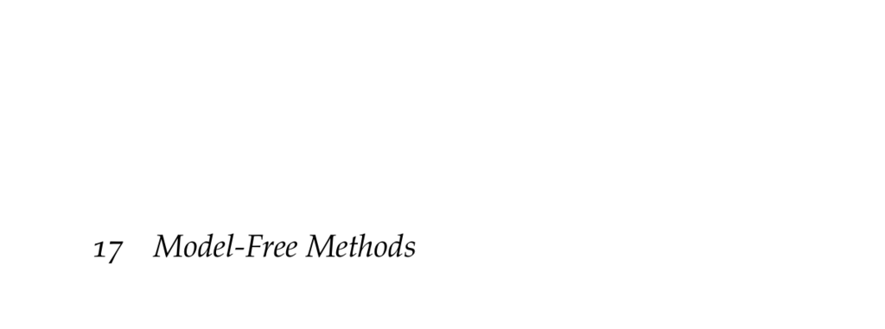

- **17 Model-Free Methods**
  - **17.1 Incremental Estimation of the Mean**
    - Model-free methods estimate the action value function incrementally from samples of a variable.
    - The mean estimate can be updated incrementally using a learning rate α(m), not necessarily 1/m.
    - Convergence requires that ∑α(m)=∞ and ∑α(m)^2<∞.
    - Constant learning rates cause exponential decay of older samples' influence.
    - Further details in [Sutton and Barto, Reinforcement Learning: An Introduction](http://incompleteideas.net/book/the-book-2nd.html).

  - **17.2 Q-Learning**
    - Q-learning incrementally estimates the action value function using an update derived from the Bellman equation.
    - The update uses the reward and maximum future Q-values from the next state.
    - An exploration policy like ε-greedy is necessary for convergence.
    - Q-learning is off-policy because it estimates the optimal policy value regardless of exploration actions.
    - Original work by [Watkins (1989) Ph.D. thesis](https://www.repository.cam.ac.uk/handle/1810/252126).

  - **17.3 Sarsa**
    - Sarsa updates Q-values using the actual action taken in the next state, making it an on-policy method.
    - It uses tuples (s, a, r, s', a') for updates instead of maximizing over possible next actions.
    - Sarsa typically converges more slowly than Q-learning but can be more stable in certain environments.
    - Convergence depends on the exploration strategy used.
    - Inspired by [Rummery and Niranjan (1994) technical report](https://www.repository.cam.ac.uk/handle/1810/252126).

  - **17.4 Eligibility Traces**
    - Eligibility traces allow rewards to propagate backward to preceding states and actions, speeding learning in sparse reward environments.
    - The trace decay parameter λ controls the weighting of past states in updates.
    - Sarsa(λ) updates all prior state-action pairs proportionally to their decayed visit counts.
    - Eligibility traces help overcome slow value propagation in Q-learning and Sarsa.
    - Proposed by Sutton (1988) and Watkins (1989); see [Machine Learning, 1988](https://link.springer.com/article/10.1007/BF00115009).

  - **17.5 Reward Shaping**
    - Reward shaping modifies reward signals during training by adding a shaping function F(s,a,s').
    - To preserve optimal policies, F must be defined as F(s,a,s') = γβ(s') − β(s) for some potential function β(s).
    - Shaping accelerates learning especially in sparse reward domains.
    - Improper shaping can alter the optimal solution.
    - Theory detailed in [Ng et al., ICML 1999](https://dl.acm.org/doi/10.1145/645528.657613).

  - **17.6 Action Value Function Approximation**
    - Function approximation allows reinforcement learning in large or continuous state-action spaces.
    - The action value function Qθ(s,a) is parameterized and differentiable for gradient-based updates.
    - Updates minimize the loss between Qθ and the optimal Q* using stochastic gradient descent.
    - The unknown optimal Q* is approximated using observed rewards and max future Q-values.
    - Recent trends emphasize deep learning for function approximation; see [Graesser and Keng, 2020](https://www.pearson.com/us/higher-education/program/Graesser-Foundations-of-Deep-Reinforcement-Learning/PGM1435566.html).

  - **17.7 Experience Replay**
    - Experience replay stores recent experience tuples to mitigate catastrophic forgetting in function approximation.
    - Sampling from replay memory breaks correlations in experience sequences and increases data efficiency.
    - Batched gradient updates use randomly sampled experience to stabilize learning.
    - Experience replay is critical in deep RL, first popularized in [Mnih et al. (2013) arXiv:1312.5602](https://arxiv.org/abs/1312.5602).
    - Prioritized replay further improves performance as shown by [Schaul et al., ICLR 2016](https://arxiv.org/abs/1511.05952).

  - **17.8 Summary**
    - Model-free methods learn Q-values directly without explicit models of dynamics.
    - Incremental mean estimation underlies temporal difference learning.
    - Q-learning and Sarsa differ in on-policy and off-policy updates.
    - Eligibility traces improve learning speed, especially with sparse rewards.
    - Function approximation and experience replay are essential for practical reinforcement learning.

  - **17.9 Exercises**
    - Exercises cover incremental mean estimation, complexity analysis of Q-learning and Sarsa, eligibility trace behavior, and implementation scenarios.
    - Solutions illustrate algorithm update computations and offer insight into parameter impacts.
    - Exercises reinforce theoretical understanding with practical applications.
    - Useful for deepening grasp of model-free method nuances.
