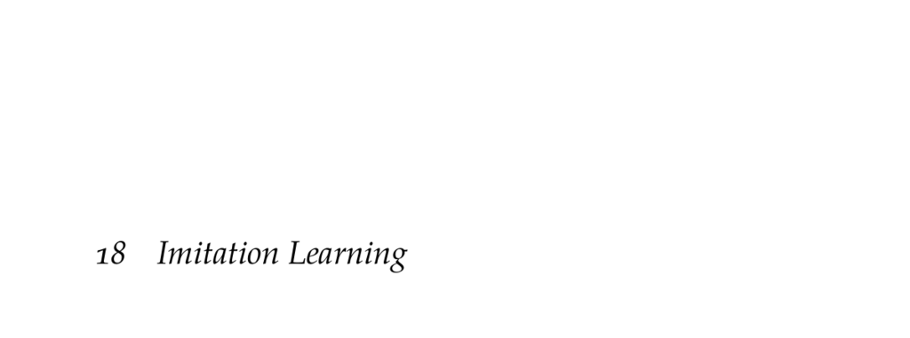

- **18 Imitation Learning**
  - **18.1 Behavioral Cloning**
    - Trains a stochastic policy to maximize the likelihood of expert state-action pairs.
    - Can use discrete models or neural networks to represent the policy πθ (a|s).
    - Behavioral cloning suffers from cascading errors due to limited state coverage in expert data.
    - See [Pomerleau 1991](https://doi.org/10.1162/neco.1991.3.1.88) for foundational work.
  - **18.2 Dataset Aggregation**
    - Alternates between collecting expert labels on states visited by the current policy and retraining.
    - Iteratively builds a dataset covering regions likely encountered during rollouts.
    - Does not guarantee convergence but improves coverage over behavioral cloning.
    - Reference: [Ross et al. 2011](https://proceedings.mlr.press/v15/ross11a.html).
  - **18.3 Stochastic Mixing Iterative Learning**
    - Mixes newly trained policies with previously trained ones using a decaying mixing scalar.
    - Starts with expert policy π(1) = πE and progressively relies less on the expert.
    - Helps improve early rollout quality by retaining expert influence.
    - See [Ross and Bagnell 2010](https://proceedings.mlr.press/v15/ross11a.html) for detailed study.
  - **18.4 Maximum Margin Inverse Reinforcement Learning**
    - Assumes expert optimizes an unknown reward parameterized as a linear function of binary features.
    - Finds reward vector φ whose optimal policies produce feature expectations matching experts.
    - Uses a quadratic program to maximize margins between expert and learned policies.
    - Original formulation in [Abbeel and Ng 2004](https://dl.acm.org/doi/10.1145/1015330.1015430).
  - **18.5 Maximum Entropy Inverse Reinforcement Learning**
    - Resolves ambiguities by modeling the distribution over trajectories as maximum entropy, i.e., least biased.
    - Defines trajectory probabilities proportional to exponentiated rewards normalized over all trajectories.
    - Optimizes reward parameters via gradient ascent on likelihood of expert demonstrations.
    - Gradient requires discounted state visitation frequencies under current policy.
    - Foundational paper: [Ziebart et al. 2008](https://www.aaai.org/Papers/AAAI/2008/AAAI08-186.pdf).
  - **18.6 Generative Adversarial Imitation Learning**
    - Uses adversarial training between a policy πθ and a discriminator Cφ to match expert behavior.
    - The discriminator distinguishes between expert and policy state-action pairs; the policy aims to fool it.
    - Optimization alternates gradient ascent on the discriminator and trust region policy optimization on the policy.
    - Effectively produces a surrogate reward guiding policy learning without explicit reward function.
    - Key resource: [Ho and Ermon 2016](https://papers.nips.cc/paper/2016/file/5ca3e9b122f61f8f06494c97b1afccf3-Paper.pdf).
  - **18.7 Summary**
    - Imitation learning can be done via behavioral cloning, dataset aggregation, inverse reinforcement learning, and adversarial methods.
    - Behavioral cloning maximizes likelihood of expert actions but suffers from error accumulation.
    - Dataset aggregation and SMILe mitigate error by interactive expert querying and mixture policies.
    - Inverse reinforcement learning infers reward functions matching expert feature expectations.
    - Maximum entropy and adversarial approaches address ambiguities in IRL via entropic or discriminator-based learning.
- **18.8 Exercises**
  - **Exercise 18.1**
    - Feature-based softmax policies generalize better due to fewer parameters versus discrete state-action models.
    - Expert demonstrations typically cover only a subset of states.
  - **Exercise 18.2**
    - Cost-sensitive classification allows penalizing different misclassifications unequally via cost functions.
    - Enables use of off-the-shelf classifiers trained to minimize expected cost rather than likelihood.
    - Reference: [Elkan 2001](https://www.cs.waikato.ac.nz/~nlp/costsensitive.pdf).
  - **Exercise 18.3**
    - Multiple policies may have identical feature expectations, causing non-unique solutions in maximum margin IRL.
    - Example: left versus right lane changes with same feature frequencies.
  - **Exercise 18.4**
    - Non-binary features may distort similarity measurement by differing scales and variances.
    - Continuous features can be approximated by discretization into binary sets.
  - **Exercise 18.5**
    - According to maximum entropy, prefer policies with the most uniform distribution over trajectories/states.
    - In the elevator example, the policy with the flattest relative duration distribution is preferred.
  - **Exercise 18.6**
    - The policy optimization in GAIL corresponds to maximizing the surrogate reward: \(\tilde{R}_\phi(s,a) = -\log C_\phi(s,a)\).
    - Allows applying reinforcement learning to optimize policy with discriminator as reward.
  - **Exercise 18.7**
    - Modifying GAIL's discriminator to take entire trajectories enables capturing time-extended behavior features.
    - Useful for modeling dependencies across sequences, e.g., driving style or smoothness.
    - Relevant work: [Kuefler et al. 2017](https://ieeexplore.ieee.org/document/7995927).
