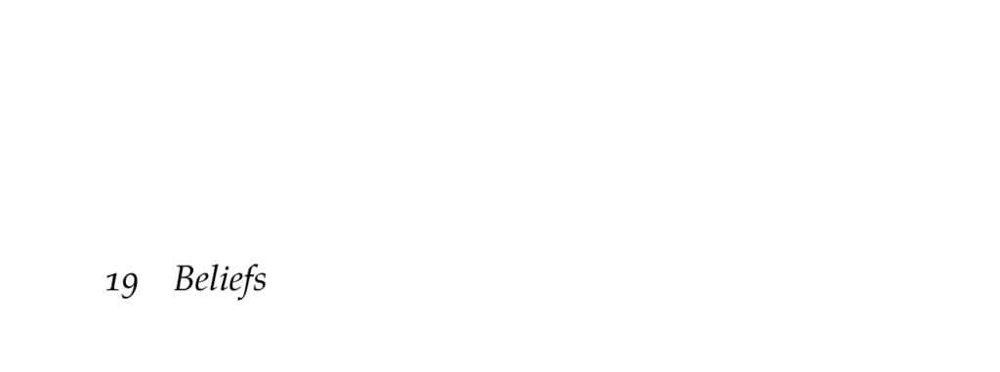

- **19 Beliefs**
  - **Belief Initialization**
    - Beliefs can be parametric, using fixed families like categorical or multivariate normal distributions, or non-parametric using particles sampled from the state space.  
    - Initial beliefs should be diffuse without prior information to avoid poor estimates from overconfident, inaccurate priors.  
    - Informative observations, such as landmark detection, can guide belief initialization by focusing sampling in consistent state space regions.  
    - [Probabilistic Robotics](https://mitpress.mit.edu/books/probabilistic-robotics) offers detailed methods for belief updating in robotics applications.
  - **Discrete State Filter**
    - POMDPs receive imperfect observations used to update discrete beliefs exactly with Bayesian filtering.  
    - Beliefs are represented as categorical distributions (belief vectors) that sum to one and live in a probability simplex.  
    - The update rule combines observation likelihood and transition probabilities weighted by prior belief.  
    - The "crying baby" problem demonstrates discrete belief updates with noisy observations and actions affecting state transitions.
  - **Linear Gaussian Filter**
    - Extends discrete belief filtering to continuous states assuming linear Gaussian transition, observation, and belief models.  
    - The Kalman filter predicts belief mean and covariance then updates using the Kalman gain from observation.  
    - Exact Gaussian updates are possible under these linear–Gaussian assumptions.  
    - The original Kalman filter is foundational, with detailed overviews in [Estimation with Applications to Tracking and Navigation](https://www.wiley.com/en-us/Estimation+with+Applications+to+Tracking+and+Navigation-p-9780470181626).
  - **Extended Kalman Filter (EKF)**
    - The EKF extends the Kalman filter to nonlinear dynamics and observation functions modeled with Gaussian noise.  
    - Nonlinear functions are locally linearized via Jacobians computed at the current belief mean or prediction.  
    - The EKF updates beliefs using analogous Kalman filter equations with linearized matrices.  
    - EKF approximates posterior beliefs as Gaussian but may not preserve true mean and variance nor handle multimodal distributions.  
    - [ForwardDiff.jl](https://github.com/JuliaDiff/ForwardDiff.jl) is used for Jacobian calculations in implementation.
  - **Unscented Kalman Filter (UKF)**
    - UKF is a derivative-free alternative to EKF using deterministic sampling (sigma points) to estimate nonlinear transformations of beliefs.  
    - Sigma points are constructed around the mean and covariance to capture higher-order moments beyond mean and covariance.  
    - The transformed mean and covariance are reconstructed from weighted transformed sigma points.  
    - The method uses parameters such as a spread scalar λ to control sigma point dispersion, with typical λ=2 optimal for Gaussian fourth moments.  
    - For historical context and details, see [Uncented Filtering and Nonlinear Estimation](https://ieeexplore.ieee.org/document/1300169).
  - **Particle Filter**
    - Approximates beliefs by a set of weighted particles, suitable for large discrete or nonlinear continuous state spaces where exact filtering is intractable.  
    - Each particle is propagated through transition dynamics and weighted by observation likelihood before resampling.  
    - Rejection sampling variants resample until particles match observed data but are unsuitable for continuous observations due to zero-probability sampling events.  
    - Particle filters can suffer particle deprivation; mitigation methods include particle injection strategies.  
    - See the tutorial [A Tutorial on Particle Filters for Online Nonlinear/Non-Gaussian Bayesian Tracking](https://ieeexplore.ieee.org/document/978374).
  - **Particle Injection**
    - Particle injection adds random particles from broader distributions, such as uniform over the state space, to prevent particle deprivation.  
    - Adaptive injection algorithms adjust the number of injected particles based on fast and slow exponential moving averages of particle weights.  
    - Parameters control injection sensitivity; recommended values include α_fast=0.1, α_slow=0.001, and injection scaling ν=2.  
    - Injection reduces the risk of losing relevant states at the cost of temporarily reducing belief accuracy.  
    - Original adaptive injection methods are detailed in [An Experimental Comparison of Localization Methods](https://dl.acm.org/doi/10.5555/3174735.3174819).
  - **Summary**
    - POMDPs model state uncertainty requiring belief maintenance over states.  
    - Exact belief updates exist for discrete and linear–Gaussian cases; nonlinear cases use EKF or UKF approximations.  
    - Particle filters approximate beliefs with sets of samples for large or nonlinear problems.  
    - Effective belief tracking strongly depends on accurate transition and observation models.
