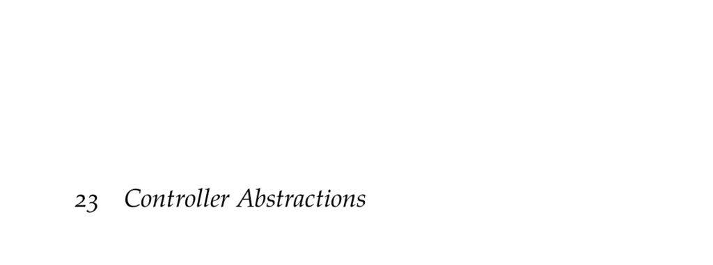

- **23 Controller Abstractions**
  - Introduces controller representations for POMDP policies that maintain internal state.  
  - Controllers improve scalability over belief-point enumeration methods.  
  - Covers algorithms using policy iteration, nonlinear programming, and gradient ascent.  
  - Related resource: [POMDP Controller Representations](https://en.wikipedia.org/wiki/Partially_observable_Markov_decision_process#Finite-state_controller)  

- **23.1 Controllers**  
  - Controllers represent policies as finite graphs whose nodes maintain internal memory.  
  - Actions are chosen by a distribution conditioned on the current controller node.  
  - The successor node distribution depends on the current node, action taken, and observation received.  
  - Controllers generalize conditional plans by allowing stochastic transitions and infinite horizon representation.  
  - Controllers do not require belief maintenance, improving efficiency.  

- **23.2 Policy Iteration**  
  - Policy iteration alternates between policy evaluation and policy improvement steps on controllers.  
  - Improvement adds new deterministic nodes for all combinations of actions and observation successors.  
  - Pruning removes dominated or identical nodes to control exponential growth.  
  - Guarantees non-decreasing policy values and convergence to optimal policy in the limit.  
  - See E. A. Hansen (1998) for foundational work on policy iteration with controllers.  

- **23.3 Nonlinear Programming**  
  - Formulates fixed-size controller optimization as a nonlinear programming problem.  
  - Simultaneously optimizes action selection and successor distributions for all nodes.  
  - The problem enforces Bellman equality constraints and distribution normalization.  
  - Solved as a quadratically constrained linear program (QCLP) using dedicated solvers.  
  - Allows direct search for optimal fixed-size controllers without alternating evaluation/improvement.  

- **23.4 Gradient Ascent**  
  - Applies gradient ascent to optimize fixed-size controllers via explicit gradient computation.  
  - Utilizes Bellman equation reformulation and matrix calculus for gradient derivations.  
  - Updates policy parameters and successor distributions with step sizes, enforcing probability simplex constraints.  
  - Algorithm can get stuck in local optima due to non-convex objective; adaptive methods can improve performance.  
  - Reference: Meuleau et al., 1999 on gradient-based POMDP policy optimization.  

- **23.5 Summary**  
  - Controllers provide compact policies without explicit belief tracking.  
  - Value functions for controller nodes correspond to alpha vectors over belief subsets.  
  - Policy iteration combines evaluation and improvement with pruning for controller optimization.  
  - Nonlinear programming and gradient ascent offer alternative approaches to fixed-size controller learning.  

- **23.6 Exercises**  
  - Exercise 23.1 details advantages of controllers over conditional plans and belief-based methods.  
  - Exercise 23.2 addresses stochasticity limitations of policy iteration on controller optimality.  
  - Exercise 23.3 proves utility invariance under pruning in policy iteration.  
  - Exercise 23.4 proposes an algorithm to identify minimal fixed-size controllers matching larger controllers.  
  - Exercise 23.5 analyzes computational complexity of the gradient ascent step and suggests improvements.
