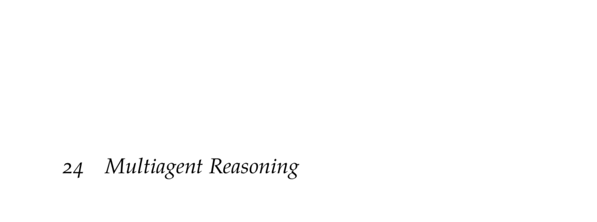

- **24 Multiagent Reasoning**
  - **24.1 Simple Games**
    - Simple games model multiagent reasoning where each agent chooses an action to maximize reward without states or transitions.  
    - The joint action space combines individual actions from all agents, and rewards depend on this joint action.  
    - Examples include the prisoner’s dilemma and rock-paper-scissors.  
    - Policies are represented as mappings from actions to probabilities, with deterministic policies called pure strategies and stochastic ones called mixed strategies.  
    - Further reading: [Shoham and Leyton-Brown, Multiagent Systems](https://cambridge.org)
  - **24.2 Response Models**
    - Describes models for an agent’s best response given fixed policies of other agents.  
    - Defines the best response as a policy that maximizes utility against opponents’ strategies.  
    - Introduces the softmax response, modeling bounded rationality where agents probabilistically choose actions proportional to exponential utility.  
    - Relevant for modeling human-like decision-making in game settings.  
    - Further reading: [Section 6.7 on softmax responses](#)
  - **24.3 Nash Equilibrium**
    - Nash equilibrium is a joint policy where no agent can improve utility by unilaterally deviating.  
    - Every finite-action game has at least one Nash equilibrium, possibly involving mixed strategies.  
    - Computing Nash equilibria is PPAD-complete and generally computationally hard.  
    - Provides a nonlinear program formulation to solve for equilibria in simple games.  
    - Further reading: [Nash, Non-Cooperative Games, 1951](https://www.jstor.org/stable/1969529)
  - **24.4 Correlated Equilibrium**
    - Generalizes Nash equilibrium by allowing correlation between agents’ joint actions via a joint distribution.  
    - Correlated equilibria impose incentive constraints ensuring no agent gains by unilateral deviation.  
    - Includes all Nash equilibria but also allows policies not decomposable into independent strategies.  
    - Correlated equilibria can be computed via linear programming with various objective functions such as utilitarian or egalitarian goals.  
    - Further reading: [Greenwald and Hall, Correlated Q-Learning, ICML 2003](https://icml.cc)
  - **24.5 Iterated Best Response**
    - An approximate method that cycles through agents, updating each agent’s policy to their best response against others.  
    - May converge to Nash equilibria in some game classes but lacks general convergence guarantees.  
    - Computationally efficient heuristic for multiagent policy optimization.  
    - Further reading: [Nisan et al., Algorithmic Game Theory, 2007](https://algorithmicgame theory.org)
  - **24.6 Hierarchical Softmax**
    - Models behavioral game theory by capturing agents’ bounded rationality via levels of reasoning and precision parameters.  
    - Level-0 agents act randomly; higher levels form softmax responses to lower-level opponent models.  
    - Parameters can be learned from data using maximum likelihood or Bayesian methods.  
    - Useful for predicting human behavior in strategic games.  
    - Further reading: [Camerer, Behavioral Game Theory, 2003](https://press.princeton.edu/books/hardcover/9780691119539/behavioral-game-theory)
  - **24.7 Fictitious Play**
    - Learning algorithm where agents estimate opponents’ strategies via empirical frequency counts and best respond to those estimates.  
    - Agents update beliefs from observed joint actions and adjust strategies iteratively.  
    - Does not guarantee convergence in all games but converges in some important classes like potential games.  
    - Variants include smooth fictitious play and Bayesian rational learning.  
    - Further reading: [Brown, Iterative Solution of Games by Fictitious Play, 1951](https://www.jstor.org/stable/2226503)
  - **24.8 Summary**
    - Reviews key points: simple games involve multiple agents optimizing expected reward with multiple solution concepts.  
    - Defines best response, Nash equilibrium, correlated equilibrium, iterative optimization methods, behavioral models, and learning algorithms.  
  - **24.9 Exercises**
    - Provides problems and solutions illustrating infinite action Nash equilibria, multiple equilibria examples, proof of equilibrium properties, and limitations of iterative methods.  
    - Examples include the prisoner’s dilemma, rock-paper-scissors, dating game with correlated equilibria not representable as Nash equilibria, and traveler’s dilemma convergence.  
    - Further reading: [Kochenderfer, Decision Making Under Uncertainty, 2015](https://mitpress.mit.edu/books/decision-making-under-uncertainty)
